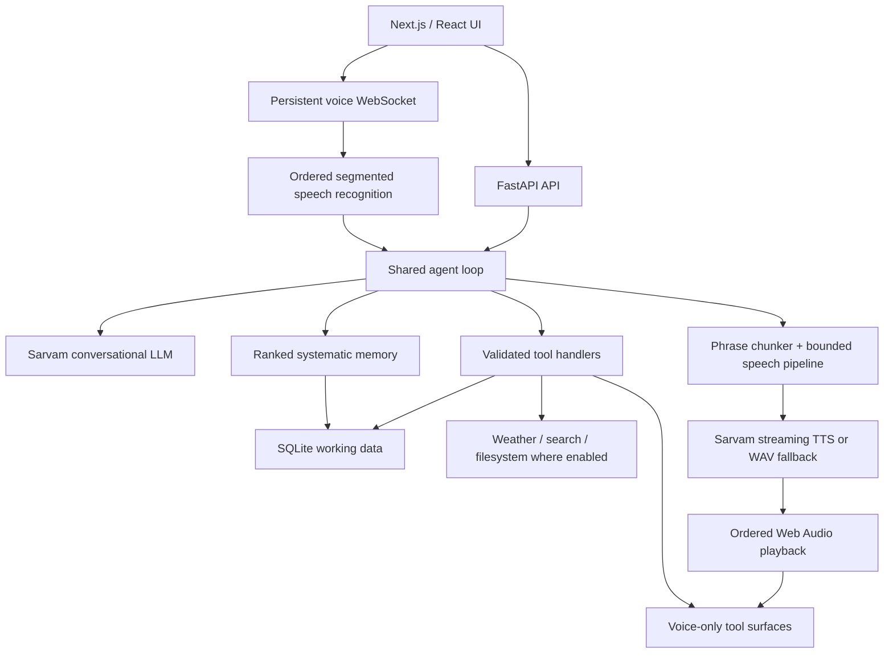

# JARVIS 3

**JARVIS 3.0.0 — Systematic Memory Generation**

A private, voice-first personal command center for Windows, Android, and the web.
It combines conversation, editable tasks, weekly routines and college schedules,
ideas, persistent memories, reminders, location-aware weather, and web research.

Architecture reviewed against the source on **2026-09-10**. Version **3.0.0** is
the generation boundary for the systematic memory architecture: typed memory,
ranked retrieval, temporal validity, review, correction history, action recall and
the readable Markdown vault now operate as one local-first system. See the
[JARVIS 3.0 release note](docs/releases/3.0.0.md).

## Run and build

From the repository root in PowerShell:

```powershell
.\run.ps1 -Setup
# Set SARVAM_API_KEY in backend/.env, then:
.\run.ps1
```

The web UI uses port 3000; FastAPI normally uses `127.0.0.1:8000`.
To run the two processes separately, use separate terminals:

```powershell
cd backend
.\.venv\Scripts\python.exe -m uvicorn main:app --reload --port 8000
```

```powershell
cd frontend
npm run dev
```

Native builds run from `frontend/`:

| Command | Result |
| --- | --- |
| `npm run build:native` | Static web assets in `frontend/out` |
| `npm run desktop` | Tauri development window plus Next development server |
| `npm run desktop:build` | Windows release bundles under `src-tauri/target/release/bundle` |
| `npm run android` | ARM64 Android debug APK through the project build script |
| `npm run android:install` | Build and install on an authorized ADB device |
| `npm run android:run` | Build/install/launch through the project script |

Windows native builds require the Rust/MSVC toolchain. Android additionally requires
Android SDK/NDK/JDK and the pinned Chaquopy dependencies/custom wheel in the project.
Use PowerShell for the native build scripts. Do not run desktop and Android builds
concurrently: they share the Next output directory.

An installed Windows app can be available from Start > JARVIS and
`%LOCALAPPDATA%\JARVIS\app.exe`. This checkout currently has its runnable release
executable at `frontend/src-tauri/target/release/app.exe`; the installer path was
not present during the September 7 restart. The desktop launcher starts the repository's Python
backend if port 8000 is free; it is not a self-contained Python distribution.
`JARVIS_BACKEND_DIR` selects a moved checkout. An already-running backend is reused,
so restart that process when testing backend changes.

An existing installed APK/executable does not automatically receive source edits.
Rebuild/reinstall the relevant native package to update its bundled frontend;
Android also bundles the Python backend. The September 7 Android update includes
the voice pipeline and mobile layout changes. Restarting the existing Windows
release does not update its bundled frontend; a new Windows release was not built.

## Mobile interface

Phones and tablets below 1,024 px use a dedicated navigation bar: Tasks, Schedule,
Voice, Notes, and Chat. The workspace uses a shared JARVIS mark, midnight surfaces,
pale blue actions, editorial headings and a quieter connection/sync area. Inter
is the reading font and Space Grotesk is the heading font; font files are bundled,
with system fallbacks if a font variable is unavailable. `product.css` owns the
workspace design system, with separate rules for compact and wide layouts.

The entire board page scrolls, including its heading. Tasks show actual remaining,
active and overdue counts, plus a focus card with Start/Complete and Edit actions.
Focus takes the first active task in the selected sort order, or the first open
task if none is active; it is a deterministic presentation, not an AI suggestion.
The focus record appears once, with other tasks below. Search or status filters
show the matching list instead. Sorting is also available on phones. Wide layouts
can place the focus beside the list. Failed status changes surface an error.

The daily brief remains expandable. Weekly schedules have a weekday selector on
mobile and a timeline-style agenda; desktop keeps the full week. COLLEGE and
ROUTINE entries repeat weekly. BLOCK entries are concrete sessions with required
start and end times, appear nearest-first, temporarily replace overlapping
ROUTINE time, and expire with a durable deletion when their end passes.

Notes is a page workspace rather than a mixed record feed. Long-term memory,
Temporary memory and Other are always present; every page can be renamed, and
additional permanent pages can be added or removed. Memory views separate active
knowledge, rules, episodes, goals, learned patterns and inferred items awaiting
review. Temporary memories require an expiry and are durably deleted when it
passes. Custom-page deletion moves its entries to Other so deleting a container
never silently destroys its notes.
Chat has a distinct welcome screen, prompt shortcuts, calmer conversation
spacing and a rounded composer.

Record editors keep the title and Save/Delete actions visible while fields
scroll. Schedule fields follow the selected kind: weekly times for routines and
classes, concrete start/end date-times for one-off blocks. Changing which fields
are visible does not erase their draft values. Deletion still requires
confirmation. Connections settings and chat share the mobile spacing and
readable input sizes. Android uses light system-bar icons against the app's dark
canvas, even in system light mode.

Navigation uses native view-transition snapshots where supported, with a CSS
entrance fallback. Controls have brief press feedback; task rows animate position
changes and departures, and editors fade/scale on open and close. Rapid navigation
skips the previous transition. Reduced-motion preferences bypass snapshots and
disable decorative movement. Motion never delays network actions or voice audio.

The voice HUD retains its sphere, voice-only tool surfaces, selected voice/language
and speech pipeline. Its top controls share clearer spacing and larger targets.
A microphone button disables the physical input track and changes to a muted
icon. Pressing it while speaking closes the captured audio as one ordered
utterance immediately, so recognition and the answer begin without waiting for
the silence timer. Unmuting resumes the same voice session.

## Current architecture



| Layer | Main implementation | Responsibility |
| --- | --- | --- |
| UI and navigation | `frontend/src/app/page.tsx`, `components/` | Chat, boards, editors, settings, voice mode |
| Voice presentation | `VoiceMode.tsx`, `three/JarvisCore.tsx`, `surfaces/` | Sphere, floating readouts, staged motion, captions |
| Microphone/session | `frontend/src/lib/realtime.ts` | VAD, WAV segments, endpoint timing, controls, generation filtering |
| Playback | `frontend/src/lib/speechQueue.ts` | Ordered decoding, PCM/WAV scheduling, cancellation, played-packet acknowledgements |
| API/lifecycle | `backend/main.py`, `backend/app/api/` | HTTP/SSE/WebSocket routes, startup/shutdown |
| Agent | `backend/app/llm/agent.py`, `prompts.py` | History, contextual prompt, model events, tool cycles |
| Memory intelligence | `services/memory.py`, `frontend/src/lib/memory.ts` | Markdown records, type/validity/provenance, candidate review, ranked retrieval and named action history |
| Tools | `backend/app/llm/tools.py`, `tools_system.py` | Input validation and actual actions |
| Speech services | `services/speech.py`, `voice_pipeline.py` | Shared pronunciation/pace policy, bounded synthesis and delivery |
| Provider adapters | `backend/app/providers/` | Separate chat, STT, TTS protocols; Sarvam implementations |
| Local persistence | `backend/app/db/` | SQLite WAL, serialized writer, read pool, migrations and CRUD |
| Mobile persistence | `frontend/src/lib/localdb.ts`, `agentBridge.ts` | IndexedDB authority; seed/drain bridge to agent SQLite |
| Sync | `services/sync.py`, `frontend/src/lib/syncClient.ts` | Timestamp-based cross-device replication and tombstones |
| Native shells | `frontend/src-tauri/` | Windows Tauri launcher; Android WebView + Chaquopy Python runtime |
| Optional Sentinel | `native/jarvis-sentinel/` | Windows C++ hotkey/microphone capture; separate HTTP entry point |

The [architecture review](docs/architecture.md) includes the PDF comparison,
protocol details, retained behavior, measurements, and remaining work.

## Conversation and tools

Typed chat uses `POST /api/chat` with SSE events. Voice uses
`/api/voice/session` and the **same agent and tool handlers**. Short typed prompts
use the provider's faster cacheable completion path; prompts of 4,000 characters
or more stream progressively so a large answer does not remain invisible until
the final token. Voice remains incremental. Typed turns have a 240-second
whole-turn ceiling, an 8-second SSE work heartbeat and an 80-second client
inactivity deadline. Every server path emits a terminal event, so a provider or
network stall becomes a visible error instead of leaving “Working…” forever.

The agent places the current question after context/reminders, keeps bounded
history at tool-cycle boundaries, and includes the wider weekly schedule when
needed. Tool results are persisted with their actual roles. Prompts constrain
spoken answers, language, and unsolicited clock replies.

## Systematic memory

Memory is no longer a recency-ordered text dump. Each durable record has one
role: WORKING, EPISODIC, SEMANTIC, PROCEDURAL, PROSPECTIVE or REFLECTIVE. It also
carries active/review/superseded/archive state, confidence, importance, temporal
validity, source, evidence count, tags, pinning and bounded correction history.
Existing memory rows migrate losslessly: their original content remains the
Markdown body and receives conservative type defaults.

The synced `content` value is a full Markdown document with fixed,
YAML-compatible front matter. This preserves compatibility with the existing
Supabase `memories` table and Android IndexedDB store; no remote schema change is
required. Desktop also materializes a readable, generated Markdown vault beside
its SQLite database. The database remains authoritative because it provides
atomic edits, expiry, stable identities, pending writes and deletion tombstones.
The vault is a projection and should be edited through JARVIS.

Retrieval runs locally before every model call. It combines exact phrases,
Unicode token overlap, tags, fuzzy concept similarity, memory type, temporal
validity, confidence, importance, recency and pinning, then applies a diversity
penalty so near-duplicates do not consume the prompt budget. Confidence and
importance rank relevant candidates; they cannot make an unrelated fact enter
the prompt. Active high-importance procedures receive a protected floor. Only
the top eight relevant memories are injected; `search_memory` reaches the rest
and can also retrieve recent named actions.

Explicit “remember this” requests become active immediately. High-signal facts,
preferences, goals and standing rules stated without a save request enter a
30-day review state and do not affect answers until approved. Repeated evidence
raises candidate confidence without creating duplicates. Working memories get
an eight-hour default expiry. Meaningful tool calls enter a local named action
ledger for 90 days, providing episodic recall without putting every click or
animation into long-term memory. Prospective commitments with concrete dates
continue to live in tasks, schedules and reminders rather than being duplicated.

Semantic vectors remain an optional future rank signal. Normal recall does not
depend on a remote embedding request, a native Android vector extension or an
additional provider, preserving offline operation and voice latency.

There are 19 core tools for tasks, schedules, memories/ideas, brief generation,
weather, search/fetch, reminders, notification policy and voice/language selection. Six additional
shell/filesystem tools are offered only when desktop system tools are enabled.
Tool calls remain sequential; destructive actions are not speculated or moved
into parallel execution by the voice pipeline.

Task deletion uses actual matching records and confirmation-count checks. UI
editing resolves stable record UIDs. Voice tool surfaces carry structured
results, including deletion confirmation/receipt data. These handlers and the
surface contract are unchanged by the streaming implementation.

Schedule edits use the current event name or course code plus its current weekday
as identity. A numeric row ID is optional and may only be copied from tool output;
the handler verifies it against the supplied identity before changing anything.
College Block 1–4 maps to 09:30–11:00, 11:10–12:50, 13:40–15:00 and
15:30–17:30. Academic period labels such as “3–4” are never parsed as 03:00–04:00.
Ambiguous or cross-day updates are refused without mutating another class.

## Voice pipeline

1. The client captures mono audio with echo cancellation/noise suppression,
   performs energy-based VAD, retains 320 ms pre-roll, and sends 16 kHz WAV
   segments after 700 ms of silence (or at the clip length limit).
2. An ordered input worker transcribes segments. The socket control loop remains
   available during recognition. Damaged/failed segments invalidate the partial
   utterance so a truncated command cannot be executed.
3. The turn timer uses elapsed time since speech ended: 1,200 ms for a
   complete-sounding transcript and 4,000 ms for ambiguous/incomplete speech.
   Transcription time overlaps that deadline; it does not start another full
   wait. Fresh speech cancels a pending silence timer.
4. The agent streams text into the existing phrase chunker. Two synthesis jobs
   can overlap, each with at most eight buffered output packets. A separate
   sender delivers them in phrase order even while a model/tool is waiting.
5. New clients request `?audio=pcm16`. Speech streams from Sarvam as mono signed
   16-bit little-endian PCM and is relayed in 100 ms packets. At most 20 packets
   remain unacknowledged, approximately two seconds of PCM lookahead. WAV
   fallback packets retain their complete-phrase duration.
6. Web Audio schedules consecutive packets on its audio clock. Captions reveal
   once at the start of their phrase. The current surface presentation listens
   to the existing playback state; its layout/animation is not rewritten here.
7. The microphone stays muted until generation **and** queued playback finish,
   including gaps between packets. The existing optional barge-in switch remains.
   Stop/interrupt discards active audio, pending decoding and reveal timers;
   generation IDs reject obsolete turn events.

`JARVIS_STREAMING_TTS=false` restores the phrase-WAV provider path. Old clients
that do not negotiate PCM also receive WAV. If streaming fails before any audio
for a phrase is emitted, it falls back to WAV; after partial audio, it reports the
failure rather than replaying the phrase. No new Python or npm dependency is
required for this path. Voice/language choices and number pronunciation pass
through the same speech policy as before.

This is an incremental migration, **not yet continuous microphone streaming or
partial ASR**. It does not claim the PDF's 300-800 ms end-to-end target.

## Storage, synchronization, and platform behavior

Desktop uses SQLite as its authoritative store. Android stores user records in
IndexedDB and seeds the embedded SQLite working copy for the agent, then drains
agent mutations back into IndexedDB. Do not swap these authorities or point both
sync engines at the same working copy.

Tasks, schedules, memories, ideas and note pages have stable UIDs, `updated_at`
timestamps, a pending-change queue and deletion tombstones. Local edits are saved
immediately before any network operation. A tombstone dominates copies at or
before its deletion time, so deleted rows cannot reappear after reopening or
syncing. A genuinely newer edit can deliberately recreate a row. The mobile
agent bridge drains before reseeding its disposable SQLite copy and accepts only
strictly newer agent rows, so an old working copy cannot overwrite newer phone
data. Preferences, conversation history, reminders and announcement delivery
have separate storage paths and are not all part of the five-table record mirror.

Mobile exposes a dedicated manual sync action and attempts to publish pending
changes when hidden or closed. The operating system may stop a hidden WebView
before that best-effort network work finishes, so manual sync is the reliable
explicit boundary. Pull conflict handling uses `updated_at`; the newer version
wins. Desktop currently has a backend startup/periodic sync loop when enabled.

The desktop scheduler watches schedules/reminders and queues announcements.
Scheduler and shell/filesystem tools are disabled in client-owned Android mode.
Android receives a native alarm plan whenever the local dashboard changes. Exact
AlarmManager broadcasts notify at weekly COLLEGE/ROUTINE starts, one-off BLOCK
starts, precise task due times, and voice-created reminder times even after the
WebView, Python runtime and app are closed. The plan survives app updates and is
restored after reboot, clock or timezone changes. Android 13+ notification
permission must remain enabled. A remote change must first reach this phone by
manual sync before Android can schedule it.

The persisted notification policy filters that plan before it reaches Android
and also gates the desktop scheduler. Its default is **deadline tasks only**.
JARVIS can independently enable COLLEGE, ROUTINE, one-off Blocks, all reminders
or deadline tasks; disable everything; and allow or mute one named task, schedule
entry or reminder by stable identity. Specific mutes beat allows. An explicit
“remind me” request enables that reminder alone. The phone caches the last policy
so a temporary backend startup delay cannot restore broader alarm defaults.

Reminder creation resolves an unqualified 12-hour time to the next sensible
occurrence. At 16:39, “5:15” becomes 17:15 that day rather than 05:15 in the
past. The tool also receives the user's original time words so explicit AM/PM
wins, and a correction triggers a fresh tool call instead of an argument.
Location comes from client geolocation, a named place, or the location service's
fallback. Weather uses Open-Meteo; search uses DuckDuckGo plus optional Wikipedia
summaries. Existing source availability and location accuracy limits still apply.

## Configuration and diagnostics

See `backend/.env.example` and `backend/app/core/config.py` for the full settings.
Secrets belong in the ignored backend environment or existing device settings;
do not put them in this README or commit them.

| Setting | Purpose |
| --- | --- |
| `SARVAM_API_KEY` | Provider authentication |
| `SARVAM_CHAT_MODEL`, `SARVAM_VOICE_MODEL` | Typed/voice model selection |
| `SARVAM_STT_MODEL`, `SARVAM_TTS_MODEL` | Existing recognition/synthesis models |
| `JARVIS_STREAMING_TTS` | Enable negotiated incremental speech; default true |
| `SARVAM_TTS_PACE`, `SARVAM_TTS_TEMPERATURE` | Existing voice controls |
| `JARVIS_CLIENT_OWNED_DATA` | Android IndexedDB/SQLite bridge mode |
| `JARVIS_DB_PATH` | SQLite location |
| `JARVIS_SYSTEM_TOOLS`, `JARVIS_SCHEDULER_ENABLED` | Desktop capabilities |
| `JARVIS_SYNC_ENABLED`, `JARVIS_SYNC_INTERVAL` | Desktop replication loop |
| `NEXT_PUBLIC_API_BASE` | Optional frontend backend-address override |

Useful routes: `/api/health`, `/docs`, `/api/dashboard`, `/api/chat/history`,
`/api/records/...`, `/api/location`, `/api/voice/config`, `/api/local/...`,
and `/api/announcements/...`. Exact request schemas are exposed by FastAPI.

`GET /api/voice/metrics` reports p50/p90/p99 in milliseconds over the last 100
samples **per stage in the current backend process**. Empty stages mean no
measurements, not zero latency. Stages are recognition, commit-to-first-text,
commit-to-first-audio-sent, TTS-first-packet, and client speech-end-to-playback.
These clocks are measured separately; do not subtract timestamps across devices.
The metrics contain no transcript/audio and reset when the backend restarts.

Android Python logs are in app-private `files/jarvis/jarvis.log` and logcat
(`JarvisPy`). Inspect logs from the installed build being tested. Native assets
and Python code must both be current before attributing a device result to a fix.

## Verification

Focused offline checks for this architecture change:

```powershell
cd backend
.\.venv\Scripts\python.exe -B tests/voice_pipeline_test.py
```

```powershell
cd frontend
npx tsx tests/speechQueue.test.ts
npx tsx --tsconfig tsconfig.json tests/endpointing.test.ts
npx tsc --noEmit --incremental false
npm run build:native
```

Other existing tests cover CRUD, deletion, schedules, sync, languages and tools.
Some files named `latency_test.py`, `segment_test.py` and integration tests make
live provider requests; read their headers before running them. Never create
probe records in the user's real data to test the voice pipeline.

Checks completed on September 7:

- Offline voice pipeline: 12 backend regressions passed; frontend speech queue
  checks passed; 14 endpointing checks and 16 existing audio checks passed.
- Native frontend compilation/type checks passed. Two existing React hook
  dependency warnings remain in Chat and VoiceMode.
- Packaged UI preview used isolated fixtures with real API writes blocked.
  Tasks, schedule, notes, chat and connections were inspected. Widths 320, 360,
  390, 430, 768 and 1,280 px had no horizontal page overflow and loaded Inter.
  The editor retained visible actions at 320 × 500 px and switched schedule
  fields with the selected kind. No browser runtime errors were reported.
- ARM64 debug APK built, installed as an update with `adb install -r`, and launched
  on the connected phone. The phone showed Connected and the redesigned board.
  A subsequent Android-only contrast correction compiled and was installed too;
  its system-bar appearance has not yet been visually confirmed on the device.
  Voice listening/end-to-end latency acceptance is still pending; installation
  and a screen check do not establish voice quality.

Checks completed on September 9:

- Backend lifecycle, scheduler, records and sync suites passed (9, 36, 46 and
  39 checks). Frontend schedule policy and sync suites passed (4 and 39 checks),
  including stale-row resurrection and stale mobile-agent working-copy cases.
- TypeScript validation and the production Next.js build passed. The two existing
  Chat/VoiceMode hook dependency warnings remain warnings, not build failures.
- The 281 MB arm64 debug APK was built, installed over the existing Android app
  with app data preserved, launched, and sampled for startup errors. The embedded
  backend seeded schema-v5 data including `note_pages`; no app crash appeared in
  that startup sample. A subsequent build compiled and installed the native alarm
  receiver and microphone control. Android reports notification, exact-alarm and
  boot permissions granted, the merged manifest contains both receivers, and the
  native alarm-plan preference was created on-device without inspecting its data.
  Actual timed delivery and microphone behavior still need user testing.

A single live streaming TTS probe returned its first 24 kHz PCM packet in about
1,505 ms and the complete short clip in 1,651 ms. This is one transport check,
not a percentile benchmark, a comparison against the old implementation, or a
microphone-to-answer measurement. On-device listening checks remain necessary.

## Maintenance and latest changes

For every app change, update the relevant README sections and append a short
entry here describing the resulting behavior. Update `docs/architecture.md` when
a boundary, protocol, dependency, provider, storage policy or platform behavior
changes. Record checks actually run and distinguish source changes from installed
builds. Repository guidance in `AGENTS.md` makes this part of future agent work;
there is no background process automatically rewriting documentation.

- **2026-09-10 — JARVIS 3.0.0:** Released the systematic-memory work as a full
  generation upgrade and aligned the web package, backend API, Tauri desktop
  package and Android package metadata on version 3.0.0. Replaced recency-dump
  memory injection with a systematic, local-first memory layer. Added typed
  Markdown front matter, lossless legacy
  migration, temporal validity, provenance, confidence/importance, candidate
  review, correction history, duplicate-resistant ranked retrieval, protected
  procedures, eight-hour working memory, 90-day named action episodes and a
  generated desktop Markdown vault. Added role filters and review controls to
  Notes while retaining the existing IndexedDB/SQLite/Supabase ownership and
  tombstone protocol. The isolated memory suite passed 15 checks, records passed
  46, backend sync passed 39, Python compilation, TypeScript and the production
  native web build passed. The frontend sync runner hit a host
  `uv_os_get_passwd` ENOMEM before loading the test. The final JARVIS 3 ARM64 APK
  built successfully, installed over the connected phone with app data preserved,
  launched, and reported Android versionName `3.0.0` with versionCode `3000000`.
  A new desktop executable was not packaged.

- **2026-09-10:** Added recovery for a Sarvam transport timeout before the first
  streamed answer event. This first repair did not address the separate
  speech-recognition stall reported afterward. Voice now reopens the
  provider connection and falls back to the existing retried completion path
  only when nothing has been emitted; an interrupted partial reply is never
  replayed, preventing duplicate speech and duplicate tool execution. Blank
  transport exceptions now identify their failure class in the visible error.
  Python compilation and the two-case offline transport regression check passed.
  The JARVIS 3 ARM64 APK rebuilt, installed with phone data preserved and
  relaunched; the embedded backend reported ready with the repaired provider.

- **2026-09-10:** Bounded the separate audio-recognition stage, which previously
  allowed three 90-second waits before the answer-turn deadline even started.
  Recognition now uses two short transport attempts within a 20-second total
  deadline; the voice input worker adds a 22-second outer deadline. A client
  27-second watchdog cancels abandoned input if the service stops responding.
  Failed recognition clears partial commands, reports an error and resumes
  listening. The voice HUD distinguishes recognition from answer generation.
  Logs record recognition start, transcript length and failed transport phase
  without storing audio or transcript text. All 15 isolated voice-pipeline tests,
  the client recognition-recovery test and TypeScript checking passed. The client
  test required running outside the sandbox after a Windows user-profile lookup
  error. The ARM64 APK built, installed with data preserved and launched. On the
  installed phone, fixture audio returned a transcript over the voice WebSocket
  in 1.10 seconds; speech synthesis returned a valid 62,098-byte WAV in 0.79
  seconds. These are separate transport checks, not a live microphone-to-speaker
  timing or a completed user voice conversation.

- **2026-09-07:** Reviewed the current application and the low-latency reference.
  Added negotiated streaming TTS with legacy WAV fallback, bounded concurrent
  speech stages, playback acknowledgements, generation-safe decoding/cancellation,
  responsive controls during ASR, speech-end-based endpoint timing, and bounded
  latency metrics. Preserved tool/record/sync/UI contracts and half-duplex default.
  Replaced the v1 README and added the architecture review and maintenance guidance.

- **2026-09-07:** Redesigned the mobile boards, navigation, chat, connections and
  editors with readable typography, consistent card spacing, visible editing
  controls, whole-page scrolling and a mobile weekday selector. Aligned tablet
  metadata with the mobile breakpoint, kept long pages from squeezing headings,
  added font fallbacks and kind-dependent schedule fields, and corrected Android
  system-bar contrast. Built and installed the Android update; browser fixture
  checks and a phone startup/screen check completed. Restarted the existing
  Windows release; no new Windows executable was packaged.

- **2026-09-09:** Made Android hand edits immediately IndexedDB-authoritative and
  hardened sync tombstones and the SQLite agent bridge so deleted records stay
  deleted and stale working-copy rows cannot overwrite newer phone data. Added
  recurring COLLEGE/ROUTINE scheduling plus nearest-first one-off BLOCK sessions
  that override routine time and expire after their end. Replaced the mixed
  Notes feed with renameable long-term, temporary, Other and custom pages;
  temporary memory expires durably and custom-page deletion preserves entries.
  Migrated the mirror schema to include expiry, page ownership and `note_pages`,
  built the Android package, installed it over the connected phone and launched it.

- **2026-09-09:** Added an explicit voice-mode microphone toggle. Muting disables
  the input track; muting during speech finalizes and submits the captured words
  as a complete ordered turn immediately. The HUD changes to a muted microphone
  and unmuting resumes capture inside the existing session.

- **2026-09-09:** Added closed-app Android notifications backed by AlarmManager.
  The client copies weekly and one-off schedules, precise task deadlines and
  voice-created reminders into a native persisted plan. Broadcast receivers show
  notifications without the WebView or Python process, repeat weekly entries,
  recover recent missed reminders, restore alarms after reboot/update/time
  changes, and reconcile delivered reminders when JARVIS next opens. Built and
  reinstalled the APK; Android permissions, merged receivers and on-device plan
  persistence were verified without reading personal record contents.

- **2026-09-09:** Fixed bare 12-hour reminder interpretation. The reminder tool
  now deterministically repairs the 16:39 + “5:15” case to 17:15, respects
  explicit AM/PM words, and keeps the past-time refusal for genuinely expired
  requests. Added five isolated regression checks for these cases, rebuilt the
  APK, installed it with existing app data preserved, and launched it.

- **2026-09-09:** Diagnosed the reported schedule conversation from the phone.
  Long DNS retries and a final Sarvam 402 explained the missing/never-ending
  replies; guessed row IDs and academic block labels misread as clock hours caused
  the timetable corruption. Added bounded typed-chat completion, explicit terminal
  events, interrupted-tool-cycle closure, verified name/course-and-weekday schedule
  targeting, and fixed college-block time mapping. Repaired the phone timetable to
  19 classes, removed four obsolete/duplicate rows, and persisted the result in
  Android's authoritative store. Eight isolated schedule-update checks and the
  TypeScript check passed; the ARM64 APK was built, installed with data preserved,
  and a full app restart confirmed 19 classes with no early-hour or duplicate rows.

- **2026-09-09:** Fixed large typed prompts remaining on “Working…”. The reported
  12,529-character turn completed three unintended note writes, then its silent
  final Sarvam request timed out. Large prompts now stream, slow model/tool gaps
  receive SSE heartbeats, the full turn has a bounded 240-second ceiling, and pasted
  context is not auto-saved unless requested. Added executable notification policy
  with deadline-tasks-only defaults, category switches, master off and named-item
  overrides for Android and desktop. Notification-policy checks passed (7),
  scheduler checks passed (36), Python compilation and TypeScript passed. The ARM64
  APK was packaged, installed with data preserved and launched; its live policy
  endpoint reported the expected deadline-tasks-only default.
