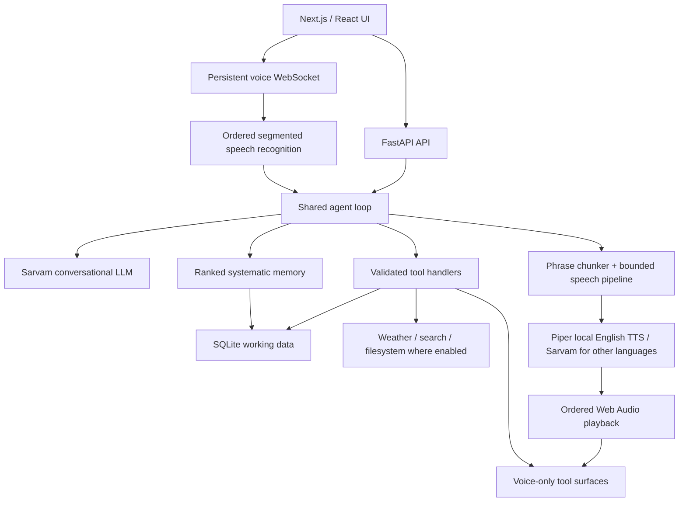

# JARVIS 3

**JARVIS 3.0.0 — Systematic Memory Generation**

A private, voice-first personal command center for Windows, Android, and the web.
It combines conversation, editable tasks, weekly routines and college schedules,
ideas, persistent memories, reminders, location-aware weather, and web research.

Architecture reviewed against the source on **2026-09-10**. Version **3.0.0** is
the generation boundary for the systematic memory architecture: typed memory,
ranked retrieval, temporal validity, review, correction history, action recall and
the readable Markdown vault now operate as one local-first system. See the
[JARVIS 3.0 release note](docs/releases/3.0.0.md).

An open-source variant is being built alongside this app under
[`jarvis-oss/`](jarvis-oss/), replacing the Supabase-backed sync mirror with
SLDT (server-independent encrypted sync over a publicly addressable object
store) and BYOK provider credentials. It does not modify this app or its data
path; see [`jarvis-oss/sldt/README.md`](jarvis-oss/sldt/README.md) for status.

## Run and build

From the repository root in PowerShell:

```powershell
.\run.ps1 -Setup
# Set SARVAM_API_KEY in backend/.env, then:
.\run.ps1
```

The web UI uses port 3000; FastAPI normally uses `127.0.0.1:8000`.
To run the two processes separately, use separate terminals:

```powershell
cd backend
.\.venv\Scripts\python.exe -m uvicorn main:app --reload --port 8000
```

```powershell
cd frontend
npm run dev
```

Native builds run from `frontend/`:

| Command | Result |
| --- | --- |
| `npm run build:native` | Static web assets in `frontend/out` |
| `npm run desktop` | Tauri development window plus Next development server |
| `npm run desktop:build` | Windows release bundles under `src-tauri/target/release/bundle` |
| `npm run android` | ARM64 Android debug APK through the project build script |
| `npm run android:install` | Build and install on an authorized ADB device |
| `npm run android:run` | Build/install/launch through the project script |

Windows native builds require the Rust/MSVC toolchain. Android additionally requires
Android SDK/NDK/JDK and the pinned Chaquopy dependencies/custom wheel in the project.
Use PowerShell for the native build scripts. Do not run desktop and Android builds
concurrently: they share the Next output directory.

An installed Windows app can be available from Start > JARVIS and
`%LOCALAPPDATA%\JARVIS\app.exe`. This checkout currently has its runnable release
executable at `frontend/src-tauri/target/release/app.exe`; the installer path was
not present during the September 7 restart. The desktop launcher starts the repository's Python
backend if port 8000 is free; it is not a self-contained Python distribution.
`JARVIS_BACKEND_DIR` selects a moved checkout. An already-running backend is reused,
so restart that process when testing backend changes.

An existing installed APK/executable does not automatically receive source edits.
Rebuild/reinstall the relevant native package to update its bundled frontend;
Android also bundles the Python backend. The September 7 Android update includes
the voice pipeline and mobile layout changes. Restarting the existing Windows
release does not update its bundled frontend; a new Windows release was not built.

## Mobile interface

Phones and tablets below 1,024 px use a dedicated navigation bar: Tasks, Schedule,
Voice, Notes, and Chat. The workspace uses a shared JARVIS mark, midnight surfaces,
pale blue actions, editorial headings and a quieter connection/sync area. Inter
is the reading font and Space Grotesk is the heading font; font files are bundled,
with system fallbacks if a font variable is unavailable. `product.css` owns the
workspace design system, with separate rules for compact and wide layouts.

The entire board page scrolls, including its heading. Tasks show actual remaining,
active and overdue counts, plus a focus card with Start/Complete and Edit actions.
Focus takes the first active task in the selected sort order, or the first open
task if none is active; it is a deterministic presentation, not an AI suggestion.
The focus record appears once, with other tasks below. Search or status filters
show the matching list instead. Sorting is also available on phones. Wide layouts
can place the focus beside the list. Failed status changes surface an error.

The daily brief remains expandable. Weekly schedules have a weekday selector on
mobile and a timeline-style agenda; desktop keeps the full week. COLLEGE and
ROUTINE entries repeat weekly. BLOCK entries are concrete sessions with required
start and end times, appear nearest-first, temporarily replace overlapping
ROUTINE time, and expire with a durable deletion when their end passes. A fourth
segment, Reminders, lists every pending one-off reminder with add/edit/delete —
the same manual controls as the other three segments, on both platforms.

Notes is a page workspace rather than a mixed record feed. Long-term memory,
Temporary memory and Other are always present; every page can be renamed, and
additional permanent pages can be added or removed. Memory views separate active
knowledge, rules, episodes, goals, learned patterns and inferred items awaiting
review. Temporary memories require an expiry and are durably deleted when it
passes. Custom-page deletion moves its entries to Other so deleting a container
never silently destroys its notes.
Chat has a distinct welcome screen, prompt shortcuts, calmer conversation
spacing and a rounded composer.

Record editors keep the title and Save/Delete actions visible while fields
scroll. Schedule fields follow the selected kind: weekly times for routines and
classes, concrete start/end date-times for one-off blocks. Changing which fields
are visible does not erase their draft values. Deletion still requires
confirmation. Connections settings and chat share the mobile spacing and
readable input sizes. Android uses light system-bar icons against the app's dark
canvas, even in system light mode.

Navigation uses native view-transition snapshots where supported, with a CSS
entrance fallback. Controls have brief press feedback; task rows animate position
changes and departures, and editors fade/scale on open and close. Rapid navigation
skips the previous transition. Reduced-motion preferences bypass snapshots and
disable decorative movement. Motion never delays network actions or voice audio.

The voice HUD retains its sphere, voice-only tool surfaces, selected voice/language
and speech pipeline. Its top controls share clearer spacing and larger targets.
A microphone button disables the physical input track and changes to a muted
icon. Pressing it while speaking closes the captured audio as one ordered
utterance immediately, so recognition and the answer begin without waiting for
the silence timer. Unmuting resumes the same voice session.

## Current architecture



| Layer | Main implementation | Responsibility |
| --- | --- | --- |
| UI and navigation | `frontend/src/app/page.tsx`, `components/` | Chat, boards, editors, settings, voice mode |
| Voice presentation | `VoiceMode.tsx`, `three/JarvisCore.tsx`, `surfaces/` | Sphere, floating readouts, staged motion, captions |
| Microphone/session | `frontend/src/lib/realtime.ts` | VAD, WAV segments, endpoint timing, controls, generation filtering |
| Playback | `frontend/src/lib/speechQueue.ts` | Ordered decoding, PCM/WAV scheduling, cancellation, played-packet acknowledgements |
| API/lifecycle | `backend/main.py`, `backend/app/api/` | HTTP/SSE/WebSocket routes, startup/shutdown |
| Agent | `backend/app/llm/agent.py`, `prompts.py` | History, contextual prompt, model events, tool cycles |
| Memory intelligence | `services/memory.py`, `frontend/src/lib/memory.ts` | Markdown records, type/validity/provenance, candidate review, ranked retrieval and named action history |
| Tools | `backend/app/llm/tools.py`, `tools_system.py` | Input validation and actual actions |
| Computer control | `tools_ui_automation.py`, `tools_browser.py`, `tools_os_control.py` | Windows UI Automation, browser DOM control, OS-level process/clipboard/hotkey control — see [docs/computer-control.md](docs/computer-control.md) |
| Speech services | `services/speech.py`, `voice_pipeline.py` | Shared pronunciation/pace policy, bounded synthesis and delivery |
| Provider adapters | `backend/app/providers/` | Separate chat, STT, TTS protocols; Sarvam implementations |
| Local persistence | `backend/app/db/` | SQLite WAL, serialized writer, read pool, migrations and CRUD |
| Mobile persistence | `frontend/src/lib/localdb.ts`, `agentBridge.ts` | IndexedDB authority; seed/drain bridge to agent SQLite |
| Sync | `services/sync.py`, `frontend/src/lib/syncClient.ts` | Timestamp-based cross-device replication and tombstones |
| Native shells | `frontend/src-tauri/` | Windows Tauri launcher; Android WebView + Chaquopy Python runtime |
| Optional Sentinel | `native/jarvis-sentinel/` | Windows C++ hotkey/microphone capture; separate HTTP entry point |

The [architecture review](docs/architecture.md) includes the PDF comparison,
protocol details, retained behavior, measurements, and remaining work.

## Conversation and tools

Typed chat uses `POST /api/chat` with SSE events. Voice uses
`/api/voice/session` and the **same agent and tool handlers**. Short typed prompts
use the provider's faster cacheable completion path; prompts of 4,000 characters
or more stream progressively so a large answer does not remain invisible until
the final token. Voice remains incremental. Typed turns have a 240-second
whole-turn ceiling, an 8-second SSE work heartbeat and an 80-second client
inactivity deadline. Every server path emits a terminal event, so a provider or
network stall becomes a visible error instead of leaving “Working…” forever.

The agent places the current question after context/reminders, keeps bounded
history at tool-cycle boundaries, and includes the wider weekly schedule when
needed. Tool results are persisted with their actual roles. Prompts constrain
spoken answers, language, and unsolicited clock replies.

## Systematic memory

Memory is no longer a recency-ordered text dump. Each durable record has one
role: WORKING, EPISODIC, SEMANTIC, PROCEDURAL, PROSPECTIVE or REFLECTIVE. It also
carries active/review/superseded/archive state, confidence, importance, temporal
validity, source, evidence count, tags, pinning and bounded correction history.
Existing memory rows migrate losslessly: their original content remains the
Markdown body and receives conservative type defaults.

The synced `content` value is a full Markdown document with fixed,
YAML-compatible front matter. This preserves compatibility with the existing
Supabase `memories` table and Android IndexedDB store; no remote schema change is
required. Desktop also materializes a readable, generated Markdown vault beside
its SQLite database. The database remains authoritative because it provides
atomic edits, expiry, stable identities, pending writes and deletion tombstones.
The vault is a projection and should be edited through JARVIS.

Retrieval runs locally before every model call. It combines exact phrases,
Unicode token overlap, tags, fuzzy concept similarity, memory type, temporal
validity, confidence, importance, recency and pinning, then applies a diversity
penalty so near-duplicates do not consume the prompt budget. Confidence and
importance rank relevant candidates; they cannot make an unrelated fact enter
the prompt. Active high-importance procedures receive a protected floor. Only
the top eight relevant memories are injected; `search_memory` reaches the rest
and can also retrieve recent named actions.

Explicit “remember this” requests become active immediately. High-signal facts,
preferences, goals and standing rules stated without a save request enter a
30-day review state and do not affect answers until approved. Repeated evidence
raises candidate confidence without creating duplicates. Working memories get
an eight-hour default expiry. Meaningful tool calls enter a local named action
ledger for 90 days, providing episodic recall without putting every click or
animation into long-term memory. Prospective commitments with concrete dates
continue to live in tasks, schedules and reminders rather than being duplicated.

Semantic vectors remain an optional future rank signal. Normal recall does not
depend on a remote embedding request, a native Android vector extension or an
additional provider, preserving offline operation and voice latency.

There are 21 core tools for tasks, schedules, memories/ideas, brief generation,
weather, search/fetch, reminders, notification policy and voice/language selection —
including bulk deletion for tasks, schedule entries, and memories/ideas alike, each
gated by a two-step, count-verified confirmation.
Six shell/filesystem tools plus 27 computer-control tools (Windows UI Automation,
browser DOM control, OS-level process/clipboard/hotkey control — see
[docs/computer-control.md](docs/computer-control.md)) are offered only when desktop
system tools are enabled. Tool calls remain sequential; destructive actions are not
speculated or moved into parallel execution by the voice pipeline.

Task deletion uses actual matching records and confirmation-count checks. UI
editing resolves stable record UIDs. Voice tool surfaces carry structured
results, including deletion confirmation/receipt data. These handlers and the
surface contract are unchanged by the streaming implementation.

Schedule edits use the current event name or course code plus its current weekday
as identity. A numeric row ID is optional and may only be copied from tool output;
the handler verifies it against the supplied identity before changing anything.
College Block 1–4 maps to 09:30–11:00, 11:10–12:50, 13:40–15:00 and
15:30–17:30. Academic period labels such as “3–4” are never parsed as 03:00–04:00.
Ambiguous or cross-day updates are refused without mutating another class.

## Voice pipeline

1. The client captures mono audio with echo cancellation/noise suppression,
   performs energy-based VAD, retains 320 ms pre-roll, and sends 16 kHz WAV
   segments after 700 ms of silence (or at the clip length limit).
2. An ordered input worker transcribes segments. The socket control loop remains
   available during recognition. Damaged/failed segments invalidate the partial
   utterance so a truncated command cannot be executed.
3. The turn timer uses elapsed time since speech ended: 1,200 ms for a
   complete-sounding transcript and 4,000 ms for ambiguous/incomplete speech.
   Transcription time overlaps that deadline; it does not start another full
   wait. Fresh speech cancels a pending silence timer.
4. The agent streams text into the existing phrase chunker. Two synthesis jobs
   can overlap, each with at most eight buffered output packets. A separate
   sender delivers them in phrase order even while a model/tool is waiting.
5. New clients request `?audio=pcm16`. Speech streams from Sarvam as mono signed
   16-bit little-endian PCM and is relayed in 100 ms packets. At most 20 packets
   remain unacknowledged, approximately two seconds of PCM lookahead. WAV
   fallback packets retain their complete-phrase duration.
6. Web Audio schedules consecutive packets on its audio clock. Captions reveal
   once at the start of their phrase. The current surface presentation listens
   to the existing playback state; its layout/animation is not rewritten here.
7. The microphone stays muted until generation **and** queued playback finish,
   including gaps between packets. The existing optional barge-in switch remains.
   Stop/interrupt discards active audio, pending decoding and reveal timers;
   generation IDs reject obsolete turn events.

`JARVIS_STREAMING_TTS=false` restores the phrase-WAV provider path. Old clients
that do not negotiate PCM also receive WAV. If streaming fails before any audio
for a phrase is emitted, it falls back to WAV; after partial audio, it reports the
failure rather than replaying the phrase. No new Python or npm dependency is
required for this path. Voice/language choices and number pronunciation pass
through the same speech policy as before.

This is an incremental migration, **not yet continuous microphone streaming or
partial ASR**. It does not claim the PDF's 300-800 ms end-to-end target.

## Storage, synchronization, and platform behavior

Desktop uses SQLite as its authoritative store. Android stores user records in
IndexedDB and seeds the embedded SQLite working copy for the agent, then drains
agent mutations back into IndexedDB. Do not swap these authorities or point both
sync engines at the same working copy.

Tasks, schedules, memories, ideas and note pages have stable UIDs, `updated_at`
timestamps, a pending-change queue and deletion tombstones. Local edits are saved
immediately before any network operation. A tombstone dominates copies at or
before its deletion time, so deleted rows cannot reappear after reopening or
syncing. A genuinely newer edit can deliberately recreate a row. The mobile
agent bridge drains before reseeding its disposable SQLite copy and accepts only
strictly newer agent rows, so an old working copy cannot overwrite newer phone
data. Preferences, conversation history, reminders and announcement delivery
have separate storage paths and are not all part of the five-table record mirror.

Mobile exposes a dedicated manual sync action and attempts to publish pending
changes when hidden or closed. The operating system may stop a hidden WebView
before that best-effort network work finishes, so manual sync is the reliable
explicit boundary. Pull conflict handling uses `updated_at`; the newer version
wins. Desktop currently has a backend startup/periodic sync loop when enabled.

The desktop scheduler watches schedules/reminders and queues announcements.
Scheduler and shell/filesystem tools are disabled in client-owned Android mode.
Android receives a native alarm plan whenever the local dashboard changes. Exact
AlarmManager broadcasts notify at weekly COLLEGE/ROUTINE starts, one-off BLOCK
starts, precise task due times, and voice-created reminder times even after the
WebView, Python runtime and app are closed. The plan survives app updates and is
restored after reboot, clock or timezone changes. Android 13+ notification
permission must remain enabled. A remote change must first reach this phone by
manual sync before Android can schedule it.

The persisted notification policy filters that plan before it reaches Android
and also gates the desktop scheduler. Its default is **deadline tasks only**.
JARVIS can independently enable COLLEGE, ROUTINE, one-off Blocks, all reminders
or deadline tasks; disable everything; and allow or mute one named task, schedule
entry or reminder by stable identity. Specific mutes beat allows. An explicit
“remind me” request enables that reminder alone. The phone caches the last policy
so a temporary backend startup delay cannot restore broader alarm defaults.

Reminder creation resolves an unqualified 12-hour time to the next sensible
occurrence. At 16:39, “5:15” becomes 17:15 that day rather than 05:15 in the
past. The tool also receives the user's original time words so explicit AM/PM
wins, and a correction triggers a fresh tool call instead of an argument.
Location comes from client geolocation, a named place, or the location service's
fallback. Weather uses Open-Meteo; search uses DuckDuckGo plus optional Wikipedia
summaries. Existing source availability and location accuracy limits still apply.

## Configuration and diagnostics

See `backend/.env.example` and `backend/app/core/config.py` for the full settings.
Secrets belong in the ignored backend environment or existing device settings;
do not put them in this README or commit them.

| Setting | Purpose |
| --- | --- |
| `SARVAM_API_KEY` | Provider authentication |
| `SARVAM_CHAT_MODEL`, `SARVAM_VOICE_MODEL` | Typed/voice model selection |
| `SARVAM_STT_MODEL`, `SARVAM_TTS_MODEL` | Existing recognition/synthesis models |
| `JARVIS_STREAMING_TTS` | Enable negotiated incremental speech; default true |
| `SARVAM_TTS_PACE`, `SARVAM_TTS_TEMPERATURE` | Existing voice controls |
| `JARVIS_ENGLISH_TTS` | Engine for English speech: `piper` (local, default) or `sarvam` (cloud). Non-English is always Sarvam. |
| `JARVIS_PIPER_MODEL`, `JARVIS_PIPER_PACE` | Piper voice path (default `models/piper/en_US-ryan-high.onnx`) and global speed nudge |
| `JARVIS_ENGLISH_LLM` | Model for English REPLY TEXT: `gemini` (default, falls back to Sarvam per turn on failure) or `sarvam`. Non-English is always Sarvam's whole stack. |
| `GEMINI_API_KEY`, `GEMINI_MODEL` | Gemini auth and model id (default `gemini-3.5-flash-lite` — see [docs/gemini-chat.md](docs/gemini-chat.md)) |
| `JARVIS_CLIENT_OWNED_DATA` | Android IndexedDB/SQLite bridge mode |
| `JARVIS_DB_PATH` | SQLite location |
| `JARVIS_SYSTEM_TOOLS`, `JARVIS_SCHEDULER_ENABLED` | Desktop capabilities |
| `JARVIS_SYNC_ENABLED`, `JARVIS_SYNC_INTERVAL` | Desktop replication loop |
| `NEXT_PUBLIC_API_BASE` | Optional frontend backend-address override |

Useful routes: `/api/health`, `/docs`, `/api/dashboard`, `/api/chat/history`,
`/api/records/...`, `/api/location`, `/api/voice/config`, `/api/local/...`,
and `/api/announcements/...`. Exact request schemas are exposed by FastAPI.

`GET /api/voice/metrics` reports p50/p90/p99 in milliseconds over the last 100
samples **per stage in the current backend process**. Empty stages mean no
measurements, not zero latency. Stages are recognition, commit-to-first-text,
commit-to-first-audio-sent, TTS-first-packet, and client speech-end-to-playback.
These clocks are measured separately; do not subtract timestamps across devices.
The metrics contain no transcript/audio and reset when the backend restarts.

Android Python logs are in app-private `files/jarvis/jarvis.log` and logcat
(`JarvisPy`). Inspect logs from the installed build being tested. Native assets
and Python code must both be current before attributing a device result to a fix.

## Verification

Focused offline checks for this architecture change:

```powershell
cd backend
.\.venv\Scripts\python.exe -B tests/voice_pipeline_test.py
```

```powershell
cd frontend
npx tsx tests/speechQueue.test.ts
npx tsx --tsconfig tsconfig.json tests/endpointing.test.ts
npx tsc --noEmit --incremental false
npm run build:native
```

Other existing tests cover CRUD, deletion, schedules, sync, languages and tools.
Some files named `latency_test.py`, `segment_test.py` and integration tests make
live provider requests; read their headers before running them. Never create
probe records in the user's real data to test the voice pipeline.

Checks completed on September 7:

- Offline voice pipeline: 12 backend regressions passed; frontend speech queue
  checks passed; 14 endpointing checks and 16 existing audio checks passed.
- Native frontend compilation/type checks passed. Two existing React hook
  dependency warnings remain in Chat and VoiceMode.
- Packaged UI preview used isolated fixtures with real API writes blocked.
  Tasks, schedule, notes, chat and connections were inspected. Widths 320, 360,
  390, 430, 768 and 1,280 px had no horizontal page overflow and loaded Inter.
  The editor retained visible actions at 320 × 500 px and switched schedule
  fields with the selected kind. No browser runtime errors were reported.
- ARM64 debug APK built, installed as an update with `adb install -r`, and launched
  on the connected phone. The phone showed Connected and the redesigned board.
  A subsequent Android-only contrast correction compiled and was installed too;
  its system-bar appearance has not yet been visually confirmed on the device.
  Voice listening/end-to-end latency acceptance is still pending; installation
  and a screen check do not establish voice quality.

Checks completed on September 9:

- Backend lifecycle, scheduler, records and sync suites passed (9, 36, 46 and
  39 checks). Frontend schedule policy and sync suites passed (4 and 39 checks),
  including stale-row resurrection and stale mobile-agent working-copy cases.
- TypeScript validation and the production Next.js build passed. The two existing
  Chat/VoiceMode hook dependency warnings remain warnings, not build failures.
- The 281 MB arm64 debug APK was built, installed over the existing Android app
  with app data preserved, launched, and sampled for startup errors. The embedded
  backend seeded schema-v5 data including `note_pages`; no app crash appeared in
  that startup sample. A subsequent build compiled and installed the native alarm
  receiver and microphone control. Android reports notification, exact-alarm and
  boot permissions granted, the merged manifest contains both receivers, and the
  native alarm-plan preference was created on-device without inspecting its data.
  Actual timed delivery and microphone behavior still need user testing.

A single live streaming TTS probe returned its first 24 kHz PCM packet in about
1,505 ms and the complete short clip in 1,651 ms. This is one transport check,
not a percentile benchmark, a comparison against the old implementation, or a
microphone-to-answer measurement. On-device listening checks remain necessary.

## Maintenance and latest changes

For every app change, update the relevant README sections and append a short
entry here describing the resulting behavior. Update `docs/architecture.md` when
a boundary, protocol, dependency, provider, storage policy or platform behavior
changes. Record checks actually run and distinguish source changes from installed
builds. Repository guidance in `AGENTS.md` makes this part of future agent work;
there is no background process automatically rewriting documentation.

- **2026-09-13 — SLDT stage 2: persistence and the write proxy.** Follows
  directly on the stage-1 entry below. Added
  `jarvis-oss/sldt/src/browserStore.ts` (IndexedDB persistence for the local
  object set, sync cursor, and non-secret identity — never the account
  secret — tested under `fake-indexeddb`, same technique
  `frontend/tests/sync.test.ts` uses for `localdb.ts`) and
  `jarvis-oss/sldt/src/githubClient.ts` (wires the `GitHubStore` abstraction
  to reality: direct unauthenticated reads from GitHub's public Contents
  API, writes routed through a proxy). Built that proxy at
  `jarvis-oss/proxy/` — the one stateless server-side component SLDT's
  design calls for: holds the GitHub PAT, accepts only an allowlisted
  `{path, content, sha, message}` request shape, restricts writes to a
  configured path prefix, rejects path traversal, and logs only field
  shapes/byte lengths, never values. Verified with `npm test` in both
  packages (12 + 15 new assertions, all mocked — no live network calls
  anywhere, no credits spent) and `npx tsc --noEmit` clean in both. **Not
  yet done:** the proxy has not been deployed anywhere and no code has made
  a real request to api.github.com; there is still no UI/app wiring and no
  façade composing persistence + network + sync into one call an app would
  make. See `jarvis-oss/sldt/README.md` and `jarvis-oss/proxy/README.md`.

- **2026-09-13 — Open-source variant scaffolded: SLDT sync core.** Started
  `jarvis-oss/`, a parallel open-source edition of the desktop/Android apps
  that swaps the paid app's Supabase mirror for SLDT — an encrypted sync
  protocol over a publicly addressable, "dumb" object store (GitHub Contents
  API in this stage), with no database or session server. This entry covers
  stage 1 only: `jarvis-oss/sldt/` is a standalone TypeScript library —
  Argon2id identity/key derivation, AES-256-GCM per-object encryption, a
  signed and hash-chained manifest with replay/rollback detection,
  deterministic (revision-then-deviceId) conflict resolution, tombstone
  deletes, and the CAS sync algorithm — with no UI, no proxy server, and no
  wiring into the frontend, desktop, or Android builds yet. Verified with
  `npm test` (5 files, 51 assertions, no network/no credits): first-device
  publish, cross-device pull, concurrent-edit convergence, delete
  propagation including a late-joining device not resurrecting a tombstone,
  wrong-key rejection, and corrupted-ciphertext handling that reports the
  bad object rather than crashing the sync cycle. `npx tsc --noEmit` is
  clean. Nothing in the existing paid app (`backend/`, `frontend/`,
  `native/`) was touched. See [`jarvis-oss/sldt/README.md`](jarvis-oss/sldt/README.md)
  for what's deferred (proxy, UI, BYOK, persistence wiring).

- **2026-09-13 — Desktop backend now survives its own crashes.** JARVIS's
  desktop app already auto-started its Python backend on launch
  (`backend.rs`), but only once — if the backend died mid-session (crash,
  OOM-kill, anything), the window was stuck showing "Backend unreachable"
  until the user closed and reopened the app. `backend::watch()` adds a
  background thread that checks every 3s whether the tracked child process
  is still alive; if not (and nothing else has taken the port — a developer's
  own `--reload` server is still left alone), it restarts the backend
  automatically. Gives up after 5 consecutive failed restarts so a
  genuinely broken environment degrades to the existing error banner instead
  of spinning forever; a restart that stays up for 10s resets that counter.
  The frontend needed no changes — `page.tsx`'s existing self-scheduling
  retry (1.5s/2.5s/4s/8s/15s backoff, `page.tsx:263`) already picks up a
  recovered backend on its own. Verified live, not just compiled: launched
  the actual release `app.exe`, confirmed it auto-started the backend,
  force-killed the backend process mid-session and watched a new one come up
  within seconds without touching the window, then confirmed a graceful
  window close (`CloseMainWindow`, not a hard process kill) still stops the
  backend cleanly with no orphan and no port conflict for the next launch.
  Known remaining gap, unchanged from before this fix: a *hard* kill of the
  whole app itself (Task Manager "End Task", a crash) still orphans the
  backend, since Windows does not kill child processes when a parent is
  force-terminated without a Job Object tying their lifetimes together —
  out of scope for this pass.

- **2026-09-13 — Fixed the multi-second silence after the first sentence in
  Android's on-device English voice.** Root-caused with real on-device
  measurement (not assumption): sherpa-onnx VITS inference on-phone costs
  roughly 40-70ms per character, so a normal ~100+ char follow-on chunk took
  several seconds to synthesize while the short opener chunk ahead of it only
  bought a second or two of playback — and `speechQueue.ts` plays chunks in
  strict arrival order, so a later chunk can never play early even once it
  finishes synthesizing. Two changes, both confirmed by an on-device A/B
  before landing: `JarvisTts.kt`'s `POOL_SIZE` dropped from 3 to 1 — 3-way
  concurrent synthesis measured 30-50% *slower* per character than solo, with
  no playback benefit, since a concurrently-built later chunk still can't
  play out of order; and `realtime.py` gained `NATIVE_TTS_MAX_CHUNK_CHARS`
  (96, same as the opener's merge cap), used in place of the Sarvam-tuned
  320-char `MAX_CHUNK_CHARS` whenever a session negotiates
  `english_tts=client` (Android's native bridge), so every chunk's synthesis
  time stays under the audio duration of the chunk playing ahead of it. Desktop
  Piper and Sarvam are unaffected — the smaller cap only applies on the
  client-TTS code path. Also fixed a real bug in the diagnostic tooling
  itself along the way: `{"type": "turn"}` announces a turn *starting*, not
  finishing (`{"type": "turn_end"}` is the real completion signal) — a
  throwaway harness that got this backwards reported zero audio for every
  turn until corrected. Checks: full backend suite green (`voice_pipeline_test.py`
  gained 3 new offline checks pinning `NATIVE_TTS_MAX_CHUNK_CHARS` and the
  `_split_sentences`/`_bound` custom-cap behavior; two unrelated pre-existing
  failures — `latency_test.py`, a flaky live-network test, and
  `reminder_lead_test.py`, a date-sensitive edge case — reproduced in
  isolation and confirmed unrelated to this change). Built and installed to
  the Android device with both changes; on-device confirmation of the
  combined fix against a real reproduction is the next step, not yet done as
  of this entry.

- **2026-09-12 — Gemini answers English chat, with Sarvam as its own
  fallback.** New `app/providers/gemini.py`: `EnglishChatProvider` tries
  Gemini first for any English reply (typed chat's default, or voice mode
  with English selected), and replays the same request on Sarvam if Gemini
  errors before yielding anything — with a 60s cooldown so an outage doesn't
  make every turn pay Gemini's timeout. Every other language is completely
  unaffected: still Sarvam's whole stack, chosen by `agent.py`'s own
  existing "the text console stays in English" rule. STT stays Sarvam and
  TTS stays Piper/Sarvam regardless of which model wrote the reply text.
  Google Search grounding is sent on every Gemini call alongside this app's
  own tools; a failed grounding attempt retries once without it, so the
  model still has `web_search`/`fetch_url` to reach for — this fired live on
  every test this session, since the project's Gemini key has no meaningful
  grounding quota yet. Verified against the real API before writing any
  provider code (Google's own docs and model names both drifted mid-session
  — `gemini-2.5-flash` already 404s for new keys) and verified through the
  real agent loop afterward: a plain English reply, a full multi-turn tool
  call with Gemini's required `thoughtSignature` correctly persisted and
  replayed, a deliberately broken Gemini falling back to Sarvam cleanly, and
  a Telugu turn confirmed never touching Gemini at all. New:
  `gemini-3.5-flash-lite` measured ~4s total per reply vs Sarvam's typical
  sub-second — the first thing to check if voice responsiveness ever
  regresses. `JARVIS_ENGLISH_LLM=gemini|sarvam`, `GEMINI_API_KEY`,
  `GEMINI_MODEL` in `.env` — see
  [docs/gemini-chat.md](docs/gemini-chat.md). Checks: 18 new offline checks
  in `tests/gemini_provider_test.py` (message translation, error mapping,
  the Sarvam fallback and its cooldown, against a stubbed transport); full
  backend suite green afterward (two existing tests —
  `identity_turn_test.py`, `integration_test.py` — updated to explicitly pin
  Sarvam, since both test Sarvam-specific behavior that a default English
  provider switch would otherwise silently stop exercising).
- **2026-09-12 — A real Reminders section: view, add, edit, delete, on both
  platforms.** `POST`/`GET`/`DELETE /api/reminders` already existed but were
  never wired to any UI; added the missing `PATCH /api/reminders/{id}` and
  built the actual section. Reminders are intentionally not one of the five
  synced record types (each device fires its own alarms off its own local
  backend), so this needed no `RecordsMode` local/backend branching — one
  REST path, identical on desktop and mobile. Placed as a fourth segment
  ("Reminders") inside the existing Schedule view's segmented control rather
  than a new mobile bottom-nav item, since `ScheduleBoard.tsx` is a single
  shared component already rendered on both platforms and mobile's nav is
  already at its documented 5-item cap. Editing the time on a reminder
  un-fires it and clears its `target_at` (the field only means something as
  the real moment an early-notice row stands in for; a manual time edit
  replaces that with a plain exact-time reminder). Checks: 12 new
  `smoke_test.py` checks for the full CRUD cycle plus both validation paths;
  full backend suite green; frontend typecheck and production build clean;
  verified live in the browser end to end (create, edit, delete, empty
  state) — caught and fixed one real issue this way (a stale running backend
  process needed a restart to serve the new route; not a code bug). Ships to
  Android automatically on the next `npm run android:install` — not yet
  installed on-device this pass.
- **2026-09-12 — Bulk delete for schedule entries and memories/ideas.** User
  asked why JARVIS still refused bulk operations on the schedule ("delete
  this block for the whole week") when tasks already had that. It genuinely
  didn't: `update_schedule_event`/`delete_record` only ever acted on one row,
  and a recurring COLLEGE/ROUTINE block is one row per weekday it repeats
  on, so removing it meant a separate confirmation per day. Added
  `bulk_delete_schedule` (filter by kind, name substring, and/or weekday —
  "clear my Study block for the whole week" or "wipe every ROUTINE entry"
  or "clear my Fridays" are each one call) and `bulk_delete_notes` (same
  shape, for memories and ideas — "forget everything about the old
  apartment" or "clear my archived ideas"), both reusing `bulk_delete_tasks`'s
  proven two-step, count-verified confirmation gate exactly (a stated count
  the user agrees to; a mismatched `expect_count` on the confirmed call
  refuses rather than deleting an unagreed set). Also updated the system
  prompt's deletion section, which previously named only `bulk_delete_tasks`
  as the example — the model had no way to know an equivalent existed for
  schedule/notes without being told, which is the concrete reason it kept
  claiming it couldn't. Checks: new dedicated test blocks in `smoke_test.py`
  for both tools (confirmation gating, wrong-count refusal, correct deletion,
  unrelated records surviving, unknown kind/category/status rejected) plus
  offline fixture-DB verification of the exact reported scenario (a 5-day
  recurring block deleted in one call). Full backend suite green.
- **2026-09-12 — Fixed desktop's own credentials handoff silently disabling
  voice mode on every launch.** `POST /api/local/credentials` (built for
  Android, where a packaged APK ships no real `.env` and the client must
  supply its own stored key) started running on desktop too once desktop
  adopted `jarvis_client_owned_data` for its sync architecture earlier the
  same day. Desktop's browser storage has never needed to hold a Sarvam
  key — it always came from `backend/.env` — so it sent an empty one on
  every app launch, and the backend obediently overwrote its correct key
  with blank, disabling voice within seconds every time with no visible
  error. Fixed in `localstore.py`: an empty incoming key is now a no-op
  when a real key is already configured and this isn't Android; a real key
  typed into Settings still works and takes priority; Android's own
  blank-means-clear behavior is unchanged. Verified live by restarting the
  installed app twice and confirming `api_key_configured`/voice `enabled`
  both stay `true` well past the startup handshake (previously flipped to
  `false` within seconds, reproducibly) — and confirmed the "Talk to
  JARVIS" voice launcher, invisible before the fix, now renders. Also
  cleaned up 4 leftover test-fixture rows in live Supabase data from an
  earlier, already-documented test-pollution incident, which the user had
  noticed as unexplained entries in their schedule.
- **2026-09-12 — Fixed `segment_test.py`'s real hang, not just its symptom.**
  User asked to investigate its intermittent test-suite failures. Root cause:
  its websocket loops called Starlette's `WebSocketTestSession.receive_json()`,
  a blocking call with no timeout of its own, inside a
  `while time.time() < deadline` loop — the deadline only gets checked
  *between* calls, so one call that never returns (a live-provider stall)
  hangs forever regardless of the deadline. Confirmed live, not assumed: two
  `segment_test.py` processes were still running, unkilled, ~40 minutes after
  an earlier test run — and their leftover lock on the shared temp SQLite
  file was independently causing every later run to fail immediately with
  `PermissionError` before doing anything, which is why the failure looked
  different (and "flaky") each time. Fixed in the test file only: each
  `receive_json()` call now runs in a bounded worker thread
  (`concurrent.futures`) with a real per-call timeout, a timeout is reported
  as a specific check failure instead of hanging, a locked leftover temp db
  falls back to a fresh path instead of crashing the next run, and the
  script force-exits (`os._exit`) instead of waiting on a thread blocked on
  a socket read that can never be cancelled. Verified by killing the stuck
  processes and running the fixed file twice — both times all 5 checks
  passed and the process count returned to baseline within 2 seconds, no
  orphan left behind.
- **2026-09-12 — Computer control: confirm-then-act gate on `close_app` and
  `browser_submit`.** These are the only two tools tagged `risk="high"` in
  the computer-control layer added earlier the same day — closing a process
  can drop unsaved work instantly with no save prompt, and submitting a form
  can post/search/log in/purchase, the category of action this app's own
  safety rules already require explicit confirmation for. Rather than a new
  UI widget, both reuse the existing two-step shape `run_command` and
  `delete_record` already established: the first call (no `confirmed=true`)
  resolves and describes exactly what would happen — the real process(es)
  `close_app` would kill, or the real element `browser_submit` would submit
  from — and does nothing; only a second call with `confirmed=true` acts. An
  invalid target (no matching process, an ambiguous name, an unknown/stale
  element reference) is refused with a plain error at the first step, before
  ever asking for confirmation. `close_app`'s target resolution was split out
  of the close logic itself (`resolve_close_targets`/`describe_close_targets`
  in `tools_os_control.py`) so the preview and the real close see identically
  resolved targets; `browser_submit` gained its own `describe_element()` in
  `tools_browser.py` for the same reason. Every other `medium`-risk
  computer-control tool (click, type, navigate, toggle, hotkeys, clipboard
  writes, launching an app) still executes immediately — deliberately not
  gated, matching how narrowly `run_command`'s own confirmation list is
  scoped and how a personal assistant needs to feel to actually be usable.
  Checks: an offline script exercising `execute_tool` directly confirmed (a)
  an unconfirmed `close_app` on a real target returns `CONFIRMATION
  REQUIRED` and changes nothing, (b) the same call with `confirmed=true`
  actually terminates the target process, (c) a `close_app`/`browser_submit`
  call with no valid target is a plain error, not a confirmation prompt.
  Full backend suite re-run clean afterward (`smoke_test`,
  `system_tools_test`, `computer_control_test`, and the rest — see
  explanations.md for the complete list).
- **2026-09-12 — Agentic computer control: UI Automation, browser, and OS-level
  automation.** JARVIS can now act on the machine itself, not just its own
  records: click and type into real Windows applications, drive a real browser
  tab, and launch/close processes, read/write the clipboard, and send hotkeys —
  gated by the same `system_tools_enabled` flag as the existing shell tools
  (off on Android). Three new modules under `backend/app/llm/`:
  `tools_ui_automation.py` (pywinauto/Windows UI Automation),
  `tools_browser.py` (Playwright/Chromium DOM), `tools_os_control.py`
  (psutil/pywin32 processes, clipboard, hotkeys, launching). A shared
  `tools_automation_common.py` gives both element-tree modules one reference
  scheme: `ui_inspect`/`browser_inspect` return short-lived `[e1.3]`-style ids
  instead of coordinates, which go stale automatically the moment the UI is
  re-inspected (`StaleReferenceError`) and are rejected outright if never
  issued (`ReferenceNotFoundError`) — the model is told to re-inspect rather
  than silently handed whatever now occupies that slot. Screenshots/vision are
  not the mechanism; every action resolves a real accessibility-tree/DOM
  element by role, name, text, or automation id first. 27 of the ~45 written
  functions are registered as LLM tools (the rest — `ui_scroll`,
  `ui_expand_collapse`, `ui_window_action`, multi-tab browser management, file
  upload — exist and work but aren't wired into the tool list yet, matching
  this codebase's existing discipline against per-turn prompt bloat). Every
  new `ToolSpec` carries a `risk: low|medium|high` field for a future
  permission-confirmation UI; nothing enforces it yet. Full details, example
  tool calls, and limitations: [docs/computer-control.md](docs/computer-control.md).
  New dependencies: `pywinauto`, `pywin32`, `psutil`, `playwright` (run
  `playwright install chromium` once after installing requirements).
  Real bugs found and fixed via live testing during this work, not
  assumed away: `pywinauto`'s `UIAWrapper` has no `.exists()` (fixed liveness
  check to use `.is_visible()`); the default `type_keys()` pacing corrupted
  text on modern Notepad's "Document" control (fixed pacing, added
  post-write verification); Playwright removed `page.accessibility.snapshot()`
  in the installed version, replaced with `locator.aria_snapshot()` plus a
  small regex parser; a clipboard `finally: CloseClipboard()` ran even when
  `OpenClipboard()` itself had failed, producing a masking error — fixed with
  a retry-then-guard helper.
  Checks: `tests/computer_control_test.py` (new, 24 checks against a real
  Notepad, Calculator, and live browser session — launch/inspect/type/verify/
  close, browser navigate/inspect/click/verify-URL-changed, and both
  reference-error scenarios) all pass when no ambiguous same-titled window is
  already open; `smoke_test.py` extended with wiring probes for the new tools.
  Full backend suite otherwise green (`reminder_lead_test`'s pre-existing,
  unrelated failure aside — see explanations.md). **Known limitation, found
  during testing, not fixed**: `SendInput`-based keystroke injection requires
  the target window to be the true OS foreground window; a background/
  automated caller or an ambiguous window-title match onto the wrong window
  can make `ui_set_text`/`ui_click` report a clean, specific failure rather
  than typing into the wrong place — verified this does not affect correctness
  when the target window genuinely has focus. Not yet exercised on a live
  desktop build (backend-only change; the Tauri desktop app spawns this same
  backend from source, so no rebuild should be required, but that has not
  been separately confirmed this pass).
- **2026-09-12 — Desktop is client-owned-data now; the backend sync engine
  is gone:** Desktop's Python backend used to own SQLite directly and sync
  it to Supabase on its own timer (`app/services/sync.py`), with no status
  visible in the UI. Mobile instead lets the WebView's IndexedDB own the
  data and syncs it client-side (`frontend/src/lib/syncClient.ts`), with a
  passive "Syncing…" banner. At the user's request, desktop now adopts
  mobile's architecture instead of just adding a banner to the old engine.
  Before flipping the flag: found that `jarvis_client_owned_data` was also
  standing in for "is this Android" in two unrelated places —
  `system_tools_enabled` (shell/filesystem/network tools) and
  `scheduler_enabled` (reminders) both turned off whenever it was true, for
  reasons that only apply to Android's sandboxed, foreground-only process
  and never applied to desktop. Flipping the flag naively would have
  silently disabled desktop's reminders and tool access. Fixed by
  introducing a separate `jarvis_android` flag (set only by
  `jarvis_server.py`, Android's own entry point) and rekeying those two
  properties on it instead — verified with two updated tests
  (`scheduler_test.py`, `system_tools_test.py`) that now explicitly assert
  a client-owned-data desktop keeps both, while Android still loses them.
  `main.py`'s lifespan already had the right conditional
  (`if settings.jarvis_client_owned_data: ...backend sync disabled`) — no
  backend startup code needed touching beyond removing the now-dead branch
  that used to start the old engine.
  `app/services/sync.py` trimmed from a full push/pull engine (482 lines,
  its own 32-check test suite) to just `SYNC_COLUMNS`, which
  `app/api/localstore.py`'s seed/drain bridge still needs. `sync_test.py`
  deleted — it tested code that no longer exists. Added
  `GET /api/local/sync-bootstrap`: desktop's `backend/.env` already had the
  real Supabase URL and service key in cleartext on that same machine; this
  endpoint hands them to the frontend once (only when localStorage is still
  empty, never overwriting a value the user has since changed) so desktop
  self-configures instead of requiring the same key to be copy-pasted a
  second time. Returns blanks on Android by design (its bundled `.env` never
  carries the service key), so mobile's existing manual entry in Settings is
  untouched.
  Verified live, not just read: started the actual backend from source with
  the new `.env` (`JARVIS_CLIENT_OWNED_DATA=true`), confirmed
  `/api/health` reports it and `/api/local/sync-bootstrap` returns the real
  credentials, then loaded the frontend against it and watched a genuinely
  empty IndexedDB pull real data from Supabase for the first time — the
  same Monday schedule (16 plans, 45 overlaps) the user's own desktop
  screenshot had shown earlier, this time synced client-side. Status went
  from nothing shown to "Syncing…" then "Connected", matching mobile
  exactly.
  Checks: backend suite 24/24 (both updated tests confirmed passing in both
  directions); frontend typecheck clean, all frontend tests passing. Rebuilt
  the desktop Tauri app and installed it with everything through this point
  — the earlier UI pass 1 build had gone stale once these sync edits landed
  on top of it, so this build carries both.
- **2026-09-12 — Desktop shell: two panes instead of three.** User feedback
  after pass 1: the permanent three-column layout (rail, console, work
  surface, all always visible) read as cluttered even with the Rail
  fixed. Folded Chat and the workspace (Task Board/Schedule/Notes) into one
  toggled content pane, reusing the exact one-pane-at-a-time mechanism
  mobile already used (`chatOpen`) instead of inventing a second one —
  desktop's `lg:flex`/`lg:block` overrides had been forcing both panes
  visible regardless of that state; removing them was most of the fix.
  Grid dropped from `[rail][console][1fr]` to `[rail][1fr]`. Rail gained a
  "Chat" destination (leads the list, same reasoning as it leading the
  console on a phone) so there is an explicit way back to it. Chat's own
  content already centers at a 760px max-width regardless of container
  width, so going full-pane needed no changes inside `Chat.tsx` itself.
  Checks: typecheck clean; live-verified in the Browser pane at 1440x900
  (Chat and each workspace view render full-pane and swap cleanly).
- **2026-09-12 — Desktop UI, pass 1 (nav + transition + smallest text):**
  User feedback: desktop looked bad, "some buttons are not even responsive,"
  layout busy, typography too small. Installed two design-audit skills
  (`taste-skill`, `redesign-skill`, from github.com/Leonxlnx/taste-skill) into
  `~/.claude/skills/` and used `redesign-skill`'s audit-first workflow.
  Live-tested the running app (not just read the code) and found the real
  cause of "not responsive": clicking a Rail nav item is instant and correct
  (verified via direct DOM checks after every click), but the page-transition
  crossfade faded the old and new view in and out *simultaneously* for
  ~180ms — and since Board/Schedule/Vault are structurally unrelated layouts
  captured as full-bleed snapshots at the same screen position, that window
  showed two different pages' headings and banners visibly overlapping,
  reading as broken rather than as motion. Changed the CSS transition from a
  crossfade to a sequential handoff (old exits over 120ms, new enters right
  after) — same total duration, no more double-exposure window.
  Also redesigned the desktop Rail: it was icon-only with no text (36px
  squares, hover-tooltip only), while the *mobile* bottom nav already labels
  every destination and says why in its own code comment ("icon-only
  navigation is consistently the worst-performing pattern for
  discoverability"). Brought that same reasoning to desktop — widened the
  rail (`76px` → `clamp(196px, 15vw, 236px)`) and rebuilt it as labelled rows
  (icon + "Task Board" / "Schedule" / "Notes & Ideas" / "Settings") with a
  visible "JARVIS" wordmark, matching the width desktop already had to
  spare. Raised the smallest, hardest-to-read text across the shared design
  system (9-10px eyebrows/meta labels → 11px) — applies to both platforms,
  verified mobile is unaffected.
  Checks: TypeScript typecheck clean; live-verified in the Browser pane at
  1440x900 (Rail navigation, all three views, settled state confirmed via
  direct DOM queries after each click) and at 375x812 (mobile unaffected);
  no console/build errors.
  **Scoped deliberately** — this is pass 1 of the user's own "one by one":
  Chat, TaskTable, ScheduleBoard and Notes still use the original visual
  language (small-caps eyebrows, dense metric rows, icon-only micro-controls)
  and were not touched this pass, so the app is visually inconsistent
  between the Rail/shell (upgraded) and the workspace panes (not yet) until
  a follow-up pass reaches them.
- **2026-09-12 — Deterministic identity intent, ahead of the LLM:** "Who are
  you / what are you / who made you / introduce yourself" style questions
  (typed or spoken, in any language JARVIS transcribes to English text) are
  now caught by `app.services.identity.detect_special_intent` — a regex
  classifier in the same style and for the same reason as
  `app.services.surfaces` (free, deterministic, runs on the latency path
  before the model) — and answered with one canonical, hand-written
  introduction (`identity.JARVIS_INTRODUCTION`, the single source of truth)
  instead of an LLM call. Wired into `agent.run_turn`, right after memory
  candidate capture and before the chat provider, history load, or panel
  detection — so "My name is Rahul, who are you?" still teaches JARVIS the
  name, but the question itself never reaches Sarvam. The matched reply is
  yielded as an ordinary `text` event and persisted to the transcript exactly
  like any other answer, so it plays through the existing TTS chunking
  pipeline unchanged and a follow-up question can still refer back to it.
  Deliberately anchored to "you"/"jarvis" as the object throughout ("who
  created **you**", "what is **jarvis**"), so it does not fire on "who is
  Yashwanth", "who created Python", or "what are you doing" — see
  `identity.py`'s docstrings for the full false-positive reasoning.
  Designed for one more canned intent to be added later (capabilities,
  creator/founder info, privacy, help, demo) as one more entry in
  `identity.py`'s intent list, with no other code to change.
  **Investigated, not implemented: caching the introduction's Piper audio.**
  Would only help the desktop Piper path — Android's on-device voice runs
  entirely client-side (see the 2026-09-12 entry above), so a server-side
  cache cannot reach it at all — and would mean re-deriving the introduction's
  chunk boundaries outside the normal streaming pipeline (or handing over one
  giant audio blob, re-introducing the whole-phrase-before-any-audio latency
  the same day's Piper streaming work just removed). Does not cleanly fit;
  not built. The real latency win — skipping the LLM round trip entirely — is
  already in place regardless.
  Checks: 89 offline classification checks (`identity_intent_test.py`, every
  MUST/MUST-NOT example in the spec plus embedded/case-variance/empty-input
  edges) and 9 offline wiring checks against a throwaway database with the
  chat provider swapped for one that raises if it's ever called
  (`identity_turn_test.py`) — both pass. Full backend suite otherwise green;
  `reminder_lead_test`'s past-instant-reminder case fails both with and
  without this change (confirmed via `git stash`), so it is pre-existing and
  unrelated. Backend-only change, installed on the Android device; not yet
  confirmed by voice on-device.
- **2026-09-12 — On-device Piper now streams sentence by sentence, synthesizing
  up to 3 phrases concurrently:** English voice replies on Android used to
  build each phrase's entire audio before any of it could play. A short
  opener bought only ~1.9s of playback, but the next phrase (once the reply
  ran past one line) took ~3-5s to build with nothing to fill the gap —
  measured on-device at 4.1-4.3s of dead air per boundary on a typical medium
  reply, which is the "yes boss......... [rushed]" / "parts parts" pattern the
  user reported. Sarvam-voiced languages never had this because the server
  streams audio while later text is still generating; Piper on the phone
  never got the same head start.
  Fixed in three steps, each measured on the real device before moving to the
  next: (1) `SherpaTts.stream`/`generateWithCallback` yields one sentence's
  PCM at a time instead of the whole phrase at once (`maxNumSentences = 1`),
  and `SpeechQueue.pushStream` plays each piece the instant it exists instead
  of waiting for the whole phrase — cut the gap to ~1.1s; (2) synthesis now
  runs up to 3 phrases concurrently on a fixed thread pool (2 inference
  threads each, so up to 6 of the phone's 8 cores at once — verified safe:
  ONNX Runtime documents `Session::Run` as safe for concurrent calls on one
  session, and the VITS `Generate()` path only reads model state) instead of
  one phrase waiting for the previous to fully finish — cut it further, to
  0-0.6s in most runs. The stall-detection timeout on the client no longer
  double-counts a phrase's queueing time behind others (it now fires only if
  the native worker stops making *any* progress for 20s, not per phrase), and
  one phrase's synthesis failure no longer aborts the rest of the reply.
  User-confirmed on-device: "almost 90% of times now jarvis is continuously
  speaking." The remaining ~10% is not yet root-caused — left as an open
  item, see explanations.md.
  Checks: TypeScript typecheck clean, full frontend test suite passing
  (`speechQueue.test.ts` extended with streamed-phrase coverage: gapless
  scheduling, half-duplex hold on an open stream, text still revealed when a
  stream produces no audio, `stop()` abandoning an open stream exactly once).
  Verified with real on-device measurements at every step (CDP against the
  live app, not simulated) — before/after timing numbers are in
  explanations.md. Built and installed on the physical device each step;
  the user confirmed the final build by ear.
- **2026-09-11 — Voice model failover:** On 2026-09-11 `sarvam-105b-conversations`
  (the voice model) began timing out on every request while `sarvam-105b`
  answered normally, so voice turns sat in "Working on it" forever: the old
  fallback retried the same unresponsive model. `SarvamChat` now gives a
  per-request model override 12s and a single attempt, then fails over to the
  configured chat model and skips the override for 180s. Measured against the
  live outage: first voice turn ~14s (was an indefinite hang), later turns
  0.6–0.8s. STT was measured unaffected (0.34–0.39s warm). After a credit
  top-up the same evening the conversations model answered in 0.4–0.6s, so the
  timeouts were most likely the balance running low — that model hung instead
  of returning 402. The failover covers either cause. Offline regression
  coverage in `tests/model_failover_test.py` (16 checks). Desktop backend
  suite: 23 of 24 passed; `segment_test` hung, and its last run was blocked by
  a Sarvam `402 No credits available` — the account ran out of credit during
  testing. Android build installed on the device; not confirmed by voice
  on-device, which needs credit.
- **2026-09-11 — Local English TTS (Piper):** English replies are now spoken by
  a local Piper neural voice (`en_US-ryan-high`, the high-quality tier) on the
  desktop backend instead of Sarvam: free, private, no per-call latency. Every
  other language still goes to Sarvam. Routed in `app.services.speech`; the
  engine is `app.providers.piper.PiperTTS`. Set `JARVIS_ENGLISH_TTS=sarvam` to
  keep English on the cloud. The model warms at startup and falls back to
  Sarvam if it is absent. Desktop-only so far — Android needs an arm64 build of
  the ONNX stack, tracked in explanations.md. Checks: 13-check piper_tts_test
  and the full backend suite pass in the desktop venv; not yet built or
  installed, not exercised on-device.
- **2026-09-11 — Overlap rule and agent handoff:** A one-off session inside a
  routine is no longer reported as an overlap; a session over a college class
  still warns (smoke_test covers both). Added `explanations.md` as the shared
  notes file between Codex and Claude Code, `CLAUDE.md` importing `AGENTS.md`,
  and a `.gitignore` rule for database backups. Checks: the smoke_test overlap
  checks pass; smoke_test memory search and integration_test
  `add_schedule_event` still fail (see `explanations.md`). Source change only;
  no build or install.

- **2026-09-10 — JARVIS 3.0.0:** Released the systematic-memory work as a full
  generation upgrade and aligned the web package, backend API, Tauri desktop
  package and Android package metadata on version 3.0.0. Replaced recency-dump
  memory injection with a systematic, local-first memory layer. Added typed
  Markdown front matter, lossless legacy
  migration, temporal validity, provenance, confidence/importance, candidate
  review, correction history, duplicate-resistant ranked retrieval, protected
  procedures, eight-hour working memory, 90-day named action episodes and a
  generated desktop Markdown vault. Added role filters and review controls to
  Notes while retaining the existing IndexedDB/SQLite/Supabase ownership and
  tombstone protocol. The isolated memory suite passed 15 checks, records passed
  46, backend sync passed 39, Python compilation, TypeScript and the production
  native web build passed. The frontend sync runner hit a host
  `uv_os_get_passwd` ENOMEM before loading the test. The final JARVIS 3 ARM64 APK
  built successfully, installed over the connected phone with app data preserved,
  launched, and reported Android versionName `3.0.0` with versionCode `3000000`.
  A new desktop executable was not packaged.

- **2026-09-10:** Added recovery for a Sarvam transport timeout before the first
  streamed answer event. This first repair did not address the separate
  speech-recognition stall reported afterward. Voice now reopens the
  provider connection and falls back to the existing retried completion path
  only when nothing has been emitted; an interrupted partial reply is never
  replayed, preventing duplicate speech and duplicate tool execution. Blank
  transport exceptions now identify their failure class in the visible error.
  Python compilation and the two-case offline transport regression check passed.
  The JARVIS 3 ARM64 APK rebuilt, installed with phone data preserved and
  relaunched; the embedded backend reported ready with the repaired provider.

- **2026-09-10:** Bounded the separate audio-recognition stage, which previously
  allowed three 90-second waits before the answer-turn deadline even started.
  Recognition now uses two short transport attempts within a 20-second total
  deadline; the voice input worker adds a 22-second outer deadline. A client
  27-second watchdog cancels abandoned input if the service stops responding.
  Failed recognition clears partial commands, reports an error and resumes
  listening. The voice HUD distinguishes recognition from answer generation.
  Logs record recognition start, transcript length and failed transport phase
  without storing audio or transcript text. All 15 isolated voice-pipeline tests,
  the client recognition-recovery test and TypeScript checking passed. The client
  test required running outside the sandbox after a Windows user-profile lookup
  error. The ARM64 APK built, installed with data preserved and launched. On the
  installed phone, fixture audio returned a transcript over the voice WebSocket
  in 1.10 seconds; speech synthesis returned a valid 62,098-byte WAV in 0.79
  seconds. These are separate transport checks, not a live microphone-to-speaker
  timing or a completed user voice conversation.

- **2026-09-07:** Reviewed the current application and the low-latency reference.
  Added negotiated streaming TTS with legacy WAV fallback, bounded concurrent
  speech stages, playback acknowledgements, generation-safe decoding/cancellation,
  responsive controls during ASR, speech-end-based endpoint timing, and bounded
  latency metrics. Preserved tool/record/sync/UI contracts and half-duplex default.
  Replaced the v1 README and added the architecture review and maintenance guidance.

- **2026-09-07:** Redesigned the mobile boards, navigation, chat, connections and
  editors with readable typography, consistent card spacing, visible editing
  controls, whole-page scrolling and a mobile weekday selector. Aligned tablet
  metadata with the mobile breakpoint, kept long pages from squeezing headings,
  added font fallbacks and kind-dependent schedule fields, and corrected Android
  system-bar contrast. Built and installed the Android update; browser fixture
  checks and a phone startup/screen check completed. Restarted the existing
  Windows release; no new Windows executable was packaged.

- **2026-09-09:** Made Android hand edits immediately IndexedDB-authoritative and
  hardened sync tombstones and the SQLite agent bridge so deleted records stay
  deleted and stale working-copy rows cannot overwrite newer phone data. Added
  recurring COLLEGE/ROUTINE scheduling plus nearest-first one-off BLOCK sessions
  that override routine time and expire after their end. Replaced the mixed
  Notes feed with renameable long-term, temporary, Other and custom pages;
  temporary memory expires durably and custom-page deletion preserves entries.
  Migrated the mirror schema to include expiry, page ownership and `note_pages`,
  built the Android package, installed it over the connected phone and launched it.

- **2026-09-09:** Added an explicit voice-mode microphone toggle. Muting disables
  the input track; muting during speech finalizes and submits the captured words
  as a complete ordered turn immediately. The HUD changes to a muted microphone
  and unmuting resumes capture inside the existing session.

- **2026-09-09:** Added closed-app Android notifications backed by AlarmManager.
  The client copies weekly and one-off schedules, precise task deadlines and
  voice-created reminders into a native persisted plan. Broadcast receivers show
  notifications without the WebView or Python process, repeat weekly entries,
  recover recent missed reminders, restore alarms after reboot/update/time
  changes, and reconcile delivered reminders when JARVIS next opens. Built and
  reinstalled the APK; Android permissions, merged receivers and on-device plan
  persistence were verified without reading personal record contents.

- **2026-09-09:** Fixed bare 12-hour reminder interpretation. The reminder tool
  now deterministically repairs the 16:39 + “5:15” case to 17:15, respects
  explicit AM/PM words, and keeps the past-time refusal for genuinely expired
  requests. Added five isolated regression checks for these cases, rebuilt the
  APK, installed it with existing app data preserved, and launched it.

- **2026-09-09:** Diagnosed the reported schedule conversation from the phone.
  Long DNS retries and a final Sarvam 402 explained the missing/never-ending
  replies; guessed row IDs and academic block labels misread as clock hours caused
  the timetable corruption. Added bounded typed-chat completion, explicit terminal
  events, interrupted-tool-cycle closure, verified name/course-and-weekday schedule
  targeting, and fixed college-block time mapping. Repaired the phone timetable to
  19 classes, removed four obsolete/duplicate rows, and persisted the result in
  Android's authoritative store. Eight isolated schedule-update checks and the
  TypeScript check passed; the ARM64 APK was built, installed with data preserved,
  and a full app restart confirmed 19 classes with no early-hour or duplicate rows.

- **2026-09-09:** Fixed large typed prompts remaining on “Working…”. The reported
  12,529-character turn completed three unintended note writes, then its silent
  final Sarvam request timed out. Large prompts now stream, slow model/tool gaps
  receive SSE heartbeats, the full turn has a bounded 240-second ceiling, and pasted
  context is not auto-saved unless requested. Added executable notification policy
  with deadline-tasks-only defaults, category switches, master off and named-item
  overrides for Android and desktop. Notification-policy checks passed (7),
  scheduler checks passed (36), Python compilation and TypeScript passed. The ARM64
  APK was packaged, installed with data preserved and launched; its live policy
  endpoint reported the expected deadline-tasks-only default.
