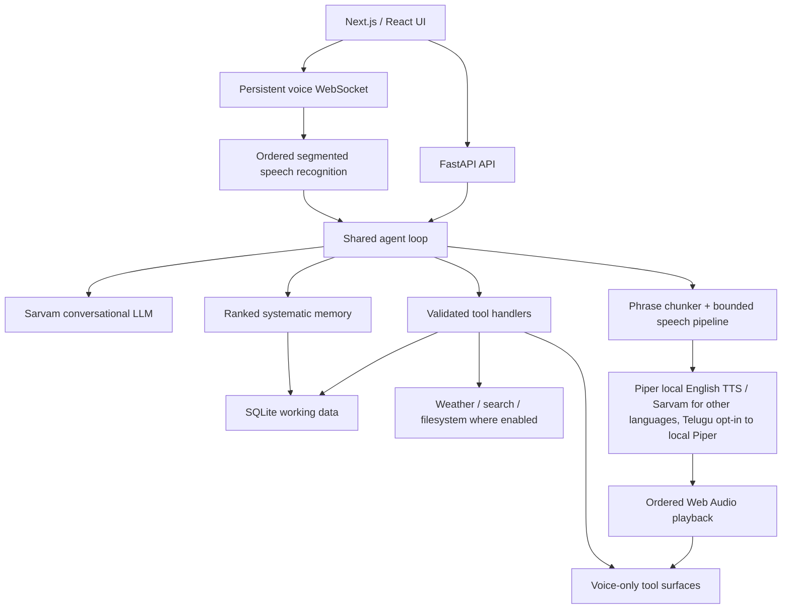

# JARVIS 3

**JARVIS 3.0.0 — Systematic Memory Generation**

A private, voice-first personal command center for Windows, Android, and the web.
It combines conversation, editable tasks, weekly routines and college schedules,
ideas, persistent memories, reminders, location-aware weather, and web research.

Architecture reviewed against the source on **2026-09-10**. Version **3.0.0** is
the generation boundary for the systematic memory architecture: typed memory,
ranked retrieval, temporal validity, review, correction history, action recall and
the readable Markdown vault now operate as one local-first system. See the
[JARVIS 3.0 release note](docs/releases/3.0.0.md).

An open-source variant is being built alongside this app under
[`jarvis-oss/`](jarvis-oss/README.md), replacing the Supabase-backed sync
mirror with SLDT (server-independent encrypted sync over a GitHub repo you
own) and BYOK provider credentials. It does not modify this app or its data
path. SLDT is now usable from this app's own Settings screen (Sync backend →
SLDT) — see [`jarvis-oss/README.md`](jarvis-oss/README.md) for the project
overview and [`jarvis-oss/sldt/README.md`](jarvis-oss/sldt/README.md) for
full status.

## Run and build

From the repository root in PowerShell:

```powershell
.\run.ps1 -Setup
# Set SARVAM_API_KEY in backend/.env, then:
.\run.ps1
```

The web UI uses port 3000; FastAPI normally uses `127.0.0.1:8000`.
To run the two processes separately, use separate terminals:

```powershell
cd backend
.\.venv\Scripts\python.exe -m uvicorn main:app --reload --port 8000
```

```powershell
cd frontend
npm run dev
```

Native builds run from `frontend/`:

| Command | Result |
| --- | --- |
| `npm run build:native` | Static web assets in `frontend/out` |
| `npm run desktop` | Tauri development window plus Next development server |
| `npm run desktop:build` | Windows release bundles under `src-tauri/target/release/bundle` |
| `npm run android` | ARM64 Android debug APK through the project build script |
| `npm run android:install` | Build and install on an authorized ADB device |
| `npm run android:run` | Build/install/launch through the project script |

Windows native builds require the Rust/MSVC toolchain. Android additionally requires
Android SDK/NDK/JDK and the pinned Chaquopy dependencies/custom wheel in the project.
Use PowerShell for the native build scripts. Do not run desktop and Android builds
concurrently: they share the Next output directory.

An installed Windows app can be available from Start > JARVIS and
`%LOCALAPPDATA%\JARVIS\app.exe`. This checkout currently has its runnable release
executable at `frontend/src-tauri/target/release/app.exe`; the installer path was
not present during the September 7 restart. The desktop launcher starts the repository's Python
backend if port 8000 is free; it is not a self-contained Python distribution.
`JARVIS_BACKEND_DIR` selects a moved checkout. An already-running backend is reused,
so restart that process when testing backend changes.

An existing installed APK/executable does not automatically receive source edits.
Rebuild/reinstall the relevant native package to update its bundled frontend;
Android also bundles the Python backend. The September 7 Android update includes
the voice pipeline and mobile layout changes. Restarting the existing Windows
release does not update its bundled frontend; a new Windows release was not built.

## Mobile interface

An independent mobile redesign is available at **`/mobile/`** for comparison
with the existing `/` interface. It is now a voice-first pocket application:
Assistant, My day and Library are three full-height spaces, not a five-tab
dashboard. Sage/sea-glass surfaces support light and deep-green dark themes.
The assistant has a large voice control, a typing entry point and one upcoming
event. My day is a timeline with task/reminder shortcuts; Library uses notebook
covers and has a Reminders tile. Detail screens have back navigation; record editors are bottom sheets.
Task editing, reminders, notes, connections and voice use the existing services;
no sample records are inserted into the app. Light/dark/system appearance is a
local preference. Both routes share `useCommandCenter` for data ownership,
startup, refresh, native notifications and agent handoff. The default native
launch route is not changed by this redesign. `PocketVoice` is a new presentation
of the existing voice session, with readable captions, language/voice choices,
mute/send, stop reply and the existing half-duplex default. Main spaces slide
together with their dock selection at a constant rate (320ms per adjacent space).
Interrupted transitions resume from the visible position, and each space keeps
its scroll position. The user-supplied glass loop decorates the home, chat and
voice screens. Voice motion follows listening/thinking/speaking state and real
audio level; background loops pause when hidden. Reduced-motion/transparency
fallbacks remain. Settings has grouped destinations, separate detail pages and
appearance previews, using the existing settings handlers. Chat has a glass
composer, distinct user messages, readable replies and confirmation before clearing.
See `docs/mobile-pocket.md` for motion, artwork and verification details.

For an isolated design preview, run `node tests/mobile-desk-fixture.mjs` from
`frontend/`, then run the dev server with
`NEXT_PUBLIC_API_BASE=http://127.0.0.1:8101`. Its development-only banner labels
sample records. The fixture uses memory only and makes no provider or cloud
requests. Do not use that API override for a production/native build.

Phones and tablets below 1,024 px use a dedicated navigation bar: Tasks, Schedule,
Voice, Notes, and Chat. The workspace uses a shared JARVIS mark, midnight surfaces,
pale blue actions, editorial headings and a quieter connection/sync area. Inter
is the reading font and Space Grotesk is the heading font; font files are bundled,
with system fallbacks if a font variable is unavailable. `product.css` owns the
workspace design system, with separate rules for compact and wide layouts.

The entire board page scrolls, including its heading. Tasks show actual remaining,
active and overdue counts, plus a focus card with Start/Complete and Edit actions.
Focus takes the first active task in the selected sort order, or the first open
task if none is active; it is a deterministic presentation, not an AI suggestion.
The focus record appears once, with other tasks below. Search or status filters
show the matching list instead. Sorting is also available on phones. Wide layouts
can place the focus beside the list. Failed status changes surface an error.

The daily brief remains expandable. Weekly schedules have a weekday selector on
mobile and a timeline-style agenda; desktop keeps the full week. COLLEGE and
ROUTINE entries repeat weekly. BLOCK entries are concrete sessions with required
start and end times, appear nearest-first, temporarily replace overlapping
ROUTINE time, and expire with a durable deletion when their end passes. A fourth
segment, Reminders, lists every pending one-off reminder with add/edit/delete —
the same manual controls as the other three segments, on both platforms.

Notes is a page workspace rather than a mixed record feed. Long-term memory,
Temporary memory and Other are always present; every page can be renamed, and
additional permanent pages can be added or removed. Memory views separate active
knowledge, rules, episodes, goals, learned patterns and inferred items awaiting
review. Temporary memories require an expiry and are durably deleted when it
passes. Custom-page deletion moves its entries to Other so deleting a container
never silently destroys its notes.
Chat has a distinct welcome screen, prompt shortcuts, calmer conversation
spacing and a rounded composer.

Record editors keep the title and Save/Delete actions visible while fields
scroll. Schedule fields follow the selected kind: weekly times for routines and
classes, concrete start/end date-times for one-off blocks. Changing which fields
are visible does not erase their draft values. Deletion still requires
confirmation. Connections settings and chat share the mobile spacing and
readable input sizes. Android uses light system-bar icons against the app's dark
canvas, even in system light mode.

Navigation uses native view-transition snapshots where supported, with a CSS
entrance fallback. Controls have brief press feedback; task rows animate position
changes and departures, and editors fade/scale on open and close. Rapid navigation
skips the previous transition. Reduced-motion preferences bypass snapshots and
disable decorative movement. Motion never delays network actions or voice audio.

The voice HUD retains its sphere, voice-only tool surfaces, selected voice/language
and speech pipeline. Its top controls share clearer spacing and larger targets.
A microphone button disables the physical input track and changes to a muted
icon. Pressing it while speaking closes the captured audio as one ordered
utterance immediately, so recognition and the answer begin without waiting for
the silence timer. Unmuting resumes the same voice session.

## Current architecture

For the proposed next-generation agent runtime, see the detailed
[agentic integration playbook](docs/agentic-integration-playbook.md): 32 chapters,
36 ordered implementation packets, smaller-model execution and coding handoffs,
verification gates and rollback procedures. This is a plan, not shipped behavior.



| Layer | Main implementation | Responsibility |
| --- | --- | --- |
| UI and navigation | `frontend/src/app/page.tsx`, `components/` | Chat, boards, editors, settings, voice mode |
| Voice presentation | `VoiceMode.tsx`, `three/JarvisCore.tsx`, `surfaces/` | Sphere, floating readouts, staged motion, captions |
| Microphone/session | `frontend/src/lib/realtime.ts` | VAD, WAV segments, endpoint timing, controls, generation filtering |
| Playback | `frontend/src/lib/speechQueue.ts` | Ordered decoding, PCM/WAV scheduling, cancellation, played-packet acknowledgements |
| API/lifecycle | `backend/main.py`, `backend/app/api/` | HTTP/SSE/WebSocket routes, startup/shutdown |
| Agent | `backend/app/llm/agent.py`, `prompts.py` | History, contextual prompt, model events, tool cycles |
| Memory intelligence | `services/memory.py`, `frontend/src/lib/memory.ts` | Markdown records, type/validity/provenance, candidate review, ranked retrieval and named action history |
| Tools | `backend/app/llm/tools.py`, `tools_system.py` | Input validation and actual actions |
| Computer control | `tools_ui_automation.py`, `tools_browser.py`, `tools_os_control.py` | Windows UI Automation, browser DOM control, OS-level process/clipboard/hotkey control — see [docs/computer-control.md](docs/computer-control.md) |
| Speech services | `services/speech.py`, `voice_pipeline.py` | Shared pronunciation/pace policy, bounded synthesis and delivery |
| Provider adapters | `backend/app/providers/` | Separate chat, STT, TTS protocols; Sarvam implementations |
| Local persistence | `backend/app/db/` | SQLite WAL, serialized writer, read pool, migrations and CRUD |
| Mobile persistence | `frontend/src/lib/localdb.ts`, `agentBridge.ts` | IndexedDB authority; seed/drain bridge to agent SQLite |
| Sync | `services/sync.py`, `frontend/src/lib/syncClient.ts` | Timestamp-based cross-device replication and tombstones |
| Native shells | `frontend/src-tauri/` | Windows Tauri launcher; Android WebView + Chaquopy Python runtime |
| Optional Sentinel | `native/jarvis-sentinel/` | Windows C++ hotkey/microphone capture; separate HTTP entry point |

The [architecture review](docs/architecture.md) includes the PDF comparison,
protocol details, retained behavior, measurements, and remaining work.

## Conversation and tools

Typed chat uses `POST /api/chat` with SSE events. Voice uses
`/api/voice/session` and the **same agent and tool handlers**. Short typed prompts
use the provider's faster cacheable completion path; prompts of 4,000 characters
or more stream progressively so a large answer does not remain invisible until
the final token. Voice remains incremental. Typed turns have a 240-second
whole-turn ceiling, an 8-second SSE work heartbeat and an 80-second client
inactivity deadline. Every server path emits a terminal event, so a provider or
network stall becomes a visible error instead of leaving “Working…” forever.

The agent places the current question after context/reminders, keeps bounded
history at tool-cycle boundaries, and includes the wider weekly schedule when
needed. Tool results are persisted with their actual roles. Prompts constrain
spoken answers, language, and unsolicited clock replies.

## Systematic memory

Memory is no longer a recency-ordered text dump. Each durable record has one
role: WORKING, EPISODIC, SEMANTIC, PROCEDURAL, PROSPECTIVE or REFLECTIVE. It also
carries active/review/superseded/archive state, confidence, importance, temporal
validity, source, evidence count, tags, pinning and bounded correction history.
Existing memory rows migrate losslessly: their original content remains the
Markdown body and receives conservative type defaults.

The synced `content` value is a full Markdown document with fixed,
YAML-compatible front matter. This preserves compatibility with the existing
Supabase `memories` table and Android IndexedDB store; no remote schema change is
required. Desktop also materializes a readable, generated Markdown vault beside
its SQLite database. The database remains authoritative because it provides
atomic edits, expiry, stable identities, pending writes and deletion tombstones.
The vault is a projection and should be edited through JARVIS.

Retrieval runs locally before every model call. It combines exact phrases,
Unicode token overlap, tags, fuzzy concept similarity, memory type, temporal
validity, confidence, importance, recency and pinning, then applies a diversity
penalty so near-duplicates do not consume the prompt budget. Confidence and
importance rank relevant candidates; they cannot make an unrelated fact enter
the prompt. Active high-importance procedures receive a protected floor. Only
the top eight relevant memories are injected; `search_memory` reaches the rest
and can also retrieve recent named actions.

Explicit “remember this” requests become active immediately. High-signal facts,
preferences, goals and standing rules stated without a save request enter a
30-day review state and do not affect answers until approved. Repeated evidence
raises candidate confidence without creating duplicates. Working memories get
an eight-hour default expiry. Meaningful tool calls enter a local named action
ledger for 90 days, providing episodic recall without putting every click or
animation into long-term memory. Prospective commitments with concrete dates
continue to live in tasks, schedules and reminders rather than being duplicated.

Semantic vectors remain an optional future rank signal. Normal recall does not
depend on a remote embedding request, a native Android vector extension or an
additional provider, preserving offline operation and voice latency.

There are 21 core tools for tasks, schedules, memories/ideas, brief generation,
weather, search/fetch, reminders, notification policy and voice/language selection —
including bulk deletion for tasks, schedule entries, and memories/ideas alike, each
gated by a two-step, count-verified confirmation.
Six shell/filesystem tools plus 27 computer-control tools (Windows UI Automation,
browser DOM control, OS-level process/clipboard/hotkey control — see
[docs/computer-control.md](docs/computer-control.md)) are offered only when desktop
system tools are enabled. Tool calls remain sequential; destructive actions are not
speculated or moved into parallel execution by the voice pipeline.

Task deletion uses actual matching records and confirmation-count checks. UI
editing resolves stable record UIDs. Voice tool surfaces carry structured
results, including deletion confirmation/receipt data. These handlers and the
surface contract are unchanged by the streaming implementation.

Schedule edits use the current event name or course code plus its current weekday
as identity. A numeric row ID is optional and may only be copied from tool output;
the handler verifies it against the supplied identity before changing anything.
College Block 1–4 maps to 09:30–11:00, 11:10–12:50, 13:40–15:00 and
15:30–17:30. Academic period labels such as “3–4” are never parsed as 03:00–04:00.
Ambiguous or cross-day updates are refused without mutating another class.

## Voice pipeline

1. The client captures mono audio with echo cancellation/noise suppression,
   performs energy-based VAD, retains 320 ms pre-roll, and sends 16 kHz WAV
   segments after 700 ms of silence (or at the clip length limit).
2. An ordered input worker transcribes segments. The socket control loop remains
   available during recognition. Damaged/failed segments invalidate the partial
   utterance so a truncated command cannot be executed.
3. The turn timer uses elapsed time since speech ended: 1,200 ms for a
   complete-sounding transcript and 4,000 ms for ambiguous/incomplete speech.
   Transcription time overlaps that deadline; it does not start another full
   wait. Fresh speech cancels a pending silence timer.
4. The agent streams text into the existing phrase chunker. Two synthesis jobs
   can overlap, each with at most eight buffered output packets. A separate
   sender delivers them in phrase order even while a model/tool is waiting.
5. New clients request `?audio=pcm16`. Speech streams from Sarvam as mono signed
   16-bit little-endian PCM and is relayed in 100 ms packets. At most 20 packets
   remain unacknowledged, approximately two seconds of PCM lookahead. WAV
   fallback packets retain their complete-phrase duration.
6. Web Audio schedules consecutive packets on its audio clock. Captions reveal
   once at the start of their phrase. The current surface presentation listens
   to the existing playback state; its layout/animation is not rewritten here.
7. The microphone stays muted until generation **and** queued playback finish,
   including gaps between packets. The existing optional barge-in switch remains.
   Stop/interrupt discards active audio, pending decoding and reveal timers;
   generation IDs reject obsolete turn events.

`JARVIS_STREAMING_TTS=false` restores the phrase-WAV provider path. Old clients
that do not negotiate PCM also receive WAV. If streaming fails before any audio
for a phrase is emitted, it falls back to WAV; after partial audio, it reports the
failure rather than replaying the phrase. No new Python or npm dependency is
required for this path. Voice/language choices and number pronunciation pass
through the same speech policy as before.

This is an incremental migration, **not yet continuous microphone streaming or
partial ASR**. It does not claim the PDF's 300-800 ms end-to-end target.

## Storage, synchronization, and platform behavior

Desktop uses SQLite as its authoritative store. Android stores user records in
IndexedDB and seeds the embedded SQLite working copy for the agent, then drains
agent mutations back into IndexedDB. Do not swap these authorities or point both
sync engines at the same working copy.

Tasks, schedules, memories, ideas and note pages have stable UIDs, `updated_at`
timestamps, a pending-change queue and deletion tombstones. Local edits are saved
immediately before any network operation. A tombstone dominates copies at or
before its deletion time, so deleted rows cannot reappear after reopening or
syncing. A genuinely newer edit can deliberately recreate a row. The mobile
agent bridge drains before reseeding its disposable SQLite copy and accepts only
strictly newer agent rows, so an old working copy cannot overwrite newer phone
data. Preferences, conversation history, reminders and announcement delivery
have separate storage paths and are not all part of the five-table record mirror.

Mobile exposes a dedicated manual sync action and attempts to publish pending
changes when hidden or closed. The operating system may stop a hidden WebView
before that best-effort network work finishes, so manual sync is the reliable
explicit boundary. Pull conflict handling uses `updated_at`; the newer version
wins. Desktop currently has a backend startup/periodic sync loop when enabled.

The desktop scheduler watches schedules/reminders and queues announcements.
Scheduler and shell/filesystem tools are disabled in client-owned Android mode.
Android receives a native alarm plan whenever the local dashboard changes. Exact
AlarmManager broadcasts notify at weekly COLLEGE/ROUTINE starts, one-off BLOCK
starts, precise task due times, and voice-created reminder times even after the
WebView, Python runtime and app are closed. The plan survives app updates and is
restored after reboot, clock or timezone changes. Android 13+ notification
permission must remain enabled. A remote change must first reach this phone by
manual sync before Android can schedule it.

The persisted notification policy filters that plan before it reaches Android
and also gates the desktop scheduler. Its default is **deadline tasks only**.
JARVIS can independently enable COLLEGE, ROUTINE, one-off Blocks, all reminders
or deadline tasks; disable everything; and allow or mute one named task, schedule
entry or reminder by stable identity. Specific mutes beat allows. An explicit
“remind me” request enables that reminder alone. The phone caches the last policy
so a temporary backend startup delay cannot restore broader alarm defaults.

Reminder creation resolves an unqualified 12-hour time to the next sensible
occurrence. At 16:39, “5:15” becomes 17:15 that day rather than 05:15 in the
past. The tool also receives the user's original time words so explicit AM/PM
wins, and a correction triggers a fresh tool call instead of an argument.
Location comes from client geolocation, a named place, or the location service's
fallback. Weather uses Open-Meteo; search uses DuckDuckGo plus optional Wikipedia
summaries. Existing source availability and location accuracy limits still apply.

## Configuration and diagnostics

See `backend/.env.example` and `backend/app/core/config.py` for the full settings.
Secrets belong in the ignored backend environment or existing device settings;
do not put them in this README or commit them.

| Setting | Purpose |
| --- | --- |
| `SARVAM_API_KEY` | Provider authentication |
| `SARVAM_CHAT_MODEL`, `SARVAM_VOICE_MODEL` | Typed/voice model selection |
| `SARVAM_STT_MODEL`, `SARVAM_TTS_MODEL` | Existing recognition/synthesis models |
| `JARVIS_STREAMING_TTS` | Enable negotiated incremental speech; default true |
| `SARVAM_TTS_PACE`, `SARVAM_TTS_TEMPERATURE` | Existing voice controls |
| `JARVIS_ENGLISH_TTS` | Engine for English speech: `piper` (local, default) or `sarvam` (cloud). Non-English besides Telugu is always Sarvam. |
| `JARVIS_PIPER_MODEL`, `JARVIS_PIPER_PACE` | Piper voice path (default `models/piper/en_US-ryan-high.onnx`) and global speed nudge |
| `JARVIS_PIPER_TELUGU_MODEL` | Telugu Piper voice path (default `models/piper/te_IN-padmavathi-medium.onnx`), used only when the Telugu engine is switched to `piper` |
| `JARVIS_ENGLISH_LLM` | Model for English REPLY TEXT: `gemini` (default, falls back to Sarvam per turn on failure) or `sarvam`. Non-English is always Sarvam's whole stack. |
| `GEMINI_API_KEY`, `GEMINI_MODEL` | Gemini auth and model id (default `gemini-3.5-flash-lite` — see [docs/gemini-chat.md](docs/gemini-chat.md)) |
| `JARVIS_CLIENT_OWNED_DATA` | Android IndexedDB/SQLite bridge mode |
| `JARVIS_DB_PATH` | SQLite location |
| `JARVIS_SYSTEM_TOOLS`, `JARVIS_SCHEDULER_ENABLED` | Desktop capabilities |
| `JARVIS_SYNC_ENABLED`, `JARVIS_SYNC_INTERVAL` | Desktop replication loop |
| `NEXT_PUBLIC_API_BASE` | Optional frontend backend-address override |

A packaged build (desktop/Android) doesn't need either key in `backend/.env`
at all — Settings → Provider key / Gemini key sends both to the runtime at
connect time (`POST /api/local/credentials`), held in memory only, never
written to disk. This is genuine BYOK: Sarvam's key has worked this way for a
while, and Gemini's key gained the same path so a public build can ship with
neither key baked in and still let each user supply their own.

Useful routes: `/api/health`, `/docs`, `/api/dashboard`, `/api/chat/history`,
`/api/records/...`, `/api/location`, `/api/voice/config`, `/api/local/...`,
and `/api/announcements/...`. Exact request schemas are exposed by FastAPI.

`GET /api/voice/metrics` reports p50/p90/p99 in milliseconds over the last 100
samples **per stage in the current backend process**. Empty stages mean no
measurements, not zero latency. Stages are recognition, commit-to-first-text,
commit-to-first-audio-sent, TTS-first-packet, and client speech-end-to-playback.
These clocks are measured separately; do not subtract timestamps across devices.
The metrics contain no transcript/audio and reset when the backend restarts.

Android Python logs are in app-private `files/jarvis/jarvis.log` and logcat
(`JarvisPy`). Inspect logs from the installed build being tested. Native assets
and Python code must both be current before attributing a device result to a fix.

## Verification

Focused offline checks for this architecture change:

```powershell
cd backend
.\.venv\Scripts\python.exe -B tests/voice_pipeline_test.py
```

```powershell
cd frontend
npx tsx tests/speechQueue.test.ts
npx tsx --tsconfig tsconfig.json tests/endpointing.test.ts
npx tsc --noEmit --incremental false
npm run build:native
```

Other existing tests cover CRUD, deletion, schedules, sync, languages and tools.
Some files named `latency_test.py`, `segment_test.py` and integration tests make
live provider requests; read their headers before running them. Never create
probe records in the user's real data to test the voice pipeline.

Checks completed on September 7:

- Offline voice pipeline: 12 backend regressions passed; frontend speech queue
  checks passed; 14 endpointing checks and 16 existing audio checks passed.
- Native frontend compilation/type checks passed. Two existing React hook
  dependency warnings remain in Chat and VoiceMode.
- Packaged UI preview used isolated fixtures with real API writes blocked.
  Tasks, schedule, notes, chat and connections were inspected. Widths 320, 360,
  390, 430, 768 and 1,280 px had no horizontal page overflow and loaded Inter.
  The editor retained visible actions at 320 × 500 px and switched schedule
  fields with the selected kind. No browser runtime errors were reported.
- ARM64 debug APK built, installed as an update with `adb install -r`, and launched
  on the connected phone. The phone showed Connected and the redesigned board.
  A subsequent Android-only contrast correction compiled and was installed too;
  its system-bar appearance has not yet been visually confirmed on the device.
  Voice listening/end-to-end latency acceptance is still pending; installation
  and a screen check do not establish voice quality.

Checks completed on September 9:

- Backend lifecycle, scheduler, records and sync suites passed (9, 36, 46 and
  39 checks). Frontend schedule policy and sync suites passed (4 and 39 checks),
  including stale-row resurrection and stale mobile-agent working-copy cases.
- TypeScript validation and the production Next.js build passed. The two existing
  Chat/VoiceMode hook dependency warnings remain warnings, not build failures.
- The 281 MB arm64 debug APK was built, installed over the existing Android app
  with app data preserved, launched, and sampled for startup errors. The embedded
  backend seeded schema-v5 data including `note_pages`; no app crash appeared in
  that startup sample. A subsequent build compiled and installed the native alarm
  receiver and microphone control. Android reports notification, exact-alarm and
  boot permissions granted, the merged manifest contains both receivers, and the
  native alarm-plan preference was created on-device without inspecting its data.
  Actual timed delivery and microphone behavior still need user testing.

A single live streaming TTS probe returned its first 24 kHz PCM packet in about
1,505 ms and the complete short clip in 1,651 ms. This is one transport check,
not a percentile benchmark, a comparison against the old implementation, or a
microphone-to-answer measurement. On-device listening checks remain necessary.

## Maintenance and latest changes

### 2026-09-21: Continuous mobile navigation, Settings, Chat and voice artwork

- Replaced abrupt tab remounts with retained horizontal pages and a synchronized
  linear dock. Travel takes 320ms per space, including distance-aware retargeting.
  Inactive pages cannot receive focus. Added Library's Reminders shortcut.
- Added the user-supplied transparent sea-glass PNG without generating/editing
  artwork. Voice has continuous float/orbits, thinking dots and real-level scale;
  no change to voice providers, session lifecycle or interruption controls.
- Added pocket-only Settings navigation and appearance previews, and redesigned
  Chat's intro, messages and composer. Existing handlers remain shared with the
  desktop defaults. Removed the desktop installed-path diagnostics widget from
  the mobile chat screen; it remains in the desktop interface.
- Validation: 15 motion-controller assertions and 18 voice-presentation assertions
  passed, along with TypeScript and focused lint. Browser fixtures verified
  Library/reminders, runtime connection testing, light/dark appearance, masked
  provider fields, streamed replies, stop and retained drafts. Voice animation
  was inspected in an isolated visual fixture, not a real microphone session.
  Native-ready static build results and installation boundary are recorded in
  `docs/mobile-pocket.md`. No new APK has been installed for this change.

### 2026-09-20: Softer continuous glass motion

- Added 6-12 second, low-amplitude float/drift/reflection cycles to the pocket
  voice control, a 580ms sliding dock selection and softer staggered entrances.
  Motion uses transforms/opacity, not animated blur or layout measurements.
- Ambient loops pause in hidden documents and behind an open voice session;
  reduced motion disables animation/transition, reduced transparency removes
  animated reflections. No new dependencies or voice-engine changes.
- TypeScript and whitespace checks passed. Browser inspection confirmed live
  animation names/timings, dock navigation and no horizontal overflow at 390px.
  This motion follow-up was not rebuilt or installed as an Android APK.

### 2026-09-20: Voice-first glass mobile redesign

- Replaced the previous `/mobile/` dashboard composition with Assistant,
  My day and Library, focused detail screens, notebook covers, bottom-sheet
  editors and a matching pocket voice presentation. Existing data/audio
  services and the default desktop presentation remain unchanged.
- Added short press/selection/screen transitions, reduced-motion and
  reduced-transparency fallbacks, plus light/dark/system appearance.
- Verified TypeScript, 12 offline voice-presentation assertions, fixture task
  creation, reminder/notebook entry points, retained chat drafts, both themes,
  no 320px horizontal overflow and visible editor actions at 320x500.
- `npm run build:native` passed. Existing Chat/VoiceMode hook warnings remain.
  No APK install or real voice-turn validation in this redesign pass.
- User-requested illustrations are pending supplied images; first prompt is
  in `docs/mobile-pocket.md`. No images were generated.

### 2026-09-20: Independent mobile desk design

- Added `/mobile/` with a new Today agenda, compact task controls, persistent
  voice access, five-destination navigation and scoped light/dark themes.
- Reused record editors and extracted the existing page controller without
  changing its data/voice behavior. Chat stays mounted after first visiting it
  so drafts and in-flight replies survive navigation.
- Verified TypeScript, task creation/search against disposable in-memory
  fixtures, reminder editor opening, draft retention, and 320-pixel layouts
  including visible editor actions at 320 × 500. No real records were modified.
- This is a parallel web route. No Android APK installation is implied.
- The final native static web export passed with `/mobile/` and its bundled
  font. Two existing hook-dependency warnings remain in Chat and VoiceMode.

For every app change, update the relevant README sections and append a short
entry here describing the resulting behavior. Update `docs/architecture.md` when
a boundary, protocol, dependency, provider, storage policy or platform behavior
changes. Record checks actually run and distinguish source changes from installed
builds. Repository guidance in `AGENTS.md` makes this part of future agent work;
there is no background process automatically rewriting documentation.

- **2026-09-19 — Sign-in result page redesigned.** The page the browser lands
  on after Google/MCP sign-in (`app/connectors/pages.py`) now uses JARVIS's
  tokens and brand mark, shows the connected account and a chip per granted
  service, animates a tick (reduced-motion respected), and has a failure
  variant with Google's reason. Previewed both variants in the browser pane.

- **2026-09-19 — Google connector verified live with the built-in client.**
  The user created a "Desktop app" OAuth client (project voice-agent-new) and
  it was installed as the git-ignored `builtin_google.json`. A real sign-in
  through `/api/connectors/google/start` (isolated backend) returned a refresh
  token with gmail+calendar+drive granted; read-only calls then worked:
  Gmail search listed 10 recent emails, Calendar list returned (0 events in
  the next week), Drive search succeeded after the Drive API was enabled in
  the project. Findings fixed: `/google/start` 500'd (response annotated as
  str-only while returning a bool); a disabled API now reports "the Google
  Drive API is not enabled in the project..." instead of a generic 403. The
  test token was deleted afterwards. Android rebuilt/installed with the
  built-in client bundled. Not yet done: sign-in from inside the installed
  apps, and publishing the OAuth app (Testing mode expires tokens after 7 days).

- **2026-09-19 — Fixed: clicking anything found by `browser_inspect` failed.**
  Inspect registered the parsed accessibility-snapshot dict instead of a
  Playwright locator, so every inspect -> click failed with "'dict' object
  has no attribute 'click'" (only `browser_find` ids worked). Each inspected
  element now registers `get_by_role(role, name=exact).nth(k)`. Verified live:
  inspect example.com, click `[e1.2]` "Learn more" -> iana.org "Example
  Domains"; system_tools_test 109 passed. Live MCP discovery also checked
  (read-only): Notion and Linear support one-click sign-in with automatic
  registration; GitHub's MCP needs a personal access token (no automatic
  registration).

- **2026-09-19 — One-click connectors: MCP sign-in and a built-in Google
  client slot.** New `backend/app/connectors/mcp_oauth.py` implements the MCP
  authorization spec: discovery from the server's 401 / RFC 9728 metadata,
  RFC 8414 server metadata, automatic registration (RFC 7591), browser
  sign-in with PKCE S256 + `resource` (RFC 8707) via
  `/api/connectors/mcp/oauth/start|callback|result`, token refresh on expiry
  or 401, and rotated tokens surfaced at `/api/connectors/mcp/rotated` for the
  client to re-seal and sync (Settings and a 5-minute page timer collect
  them). Settings' MCP form now leads with "Sign in & save"; API keys are the
  fallback. Google: `google.builtin_client()` reads a git-ignored
  `backend/app/connectors/builtin_google.json` (or env), so a build that ships
  one shows only "Connect Google"; own-client stays under Advanced. Offline
  connectors_test now 35 checks (5 new for MCP sign-in against fake servers);
  `tsc` clean. Not yet tried against a real OAuth MCP server or with a real
  built-in Google client.

- **2026-09-19 — Typed laptop turns use DeepSeek v4-pro; bracketed element ids
  accepted; Supabase `connectors` table created.** New
  `OPENROUTER_DESKTOP_MODEL` (default `deepseek/deepseek-v4-pro`) applies to
  typed turns when the computer-control tools are on; voice keeps nano
  (English) / Gemini 2.5 Flash (Telugu/Hindi). Chosen on a 5-task multi-step
  laptop benchmark (isolated DB, read-only tasks): v4-pro 5/5 (19s median),
  gpt-4.1-mini 4/5, deepseek-v4-flash 3/5 (invented a line count); an
  earlier 6-task easy set had nano 5/6 and most others 6/6. Live routing
  check: typed -> v4-pro, English voice -> nano, Telugu voice -> Gemini, all
  answers correct. The benchmark exposed `browser_click` failing on ids
  written as `[e3.2]` (as inspection prints them); ElementRegistry now
  strips brackets. The `connectors` table from `docs/supabase/connectors.sql`
  was applied to the jarvis-sync project. Tests: agent_context_budget,
  identity_turn, smoke, system_tools (109), connectors (30) pass. Android
  rebuilt/installed with the connectors UI; desktop runs from source.

- **2026-09-19 — Connectors, phase 2 (frontend): Settings > Connectors.**
  Sync passphrase, Google card (client id/secret, service toggles,
  Connect/Disconnect: the laptop backend opens Google's consent page in the
  real browser), and MCP servers (add by URL + optional auth header, or by
  command on the laptop; Test lists tools; per-tool on/off; Remove).
  `lib/connectorCrypto.ts` seals secrets with AES-256-GCM under a
  PBKDF2-SHA-256 (310k) key from the passphrase; `lib/connectors.ts` keeps
  connectors in localStorage with their own last-write-wins Supabase sync
  (separate `connectors` table, `deleted` flag; kept out of the record sync
  so the agent bridge and dashboard never see it) and hands the opened set to
  `/api/connectors/configure` on every connect. Verified in a browser preview
  against an isolated backend (throwaway DB, no Supabase): passphrase, add +
  test + save a local MCP server, live chat turns (read-only tool ran; write
  tool asked first), per-tool toggle, removal (runtime 0 tools, row marked
  deleted, secret wiped); crypto round-trip / wrong-passphrase / unique
  envelope checked in Node; `tsc` clean; connectors_test 30/30. **Pending:**
  creating the Supabase `connectors` table (`docs/supabase/connectors.sql`),
  the user's Google Cloud OAuth client and a live sign-in, and native
  desktop/Android builds.

- **2026-09-19 — Connectors, phase 1 (backend): built-in Google connector and
  MCP client.** New `backend/app/connectors/` (design: `docs/connectors.md`).
  Google: OAuth installed-app sign-in with PKCE via the local backend
  (`/api/connectors/google/start|callback|result`), refresh tokens handed
  back to the client, access tokens refreshed in memory; tools
  `gmail_search/read/draft/send`, `calendar_list_events/create_event/
  delete_event`, `drive_search/read`. MCP: a dependency-free client for
  Streamable HTTP (both devices) and stdio (laptop only); tools appear as
  `mcp__<server>__<tool>`. Sending mail, deleting events, inviting guests and
  any MCP tool not marked read-only need the user's yes (`confirmed=true`);
  external content is wrapped as untrusted. Connector tools route on their
  own keywords. `/api/connectors/configure` takes definitions + secrets from
  the client, memory only; every connector endpoint refuses non-loopback
  callers. Offline `tests/connectors_test.py` (30 checks: fake MCP over
  HTTP/SSE, a real stdio MCP process, fake Google APIs, confirmation gates,
  loopback guard) plus existing suites pass. **Not usable yet:** the Settings
  UI, synced/encrypted storage and a live Google sign-in are phase 2-3.

- **2026-09-19 — Cost cuts: paid web plugin off, voice backups only on real
  stalls, one-sentence spoken replies.** Key usage was $1.17 of $5 ($0.50 in
  one day, much of it test runs). Three leaks fixed: (1) OpenRouter's paid
  web-search plugin ($0.014/request on Gemini, $0.01 on nano, charged every
  round) switched on for any "weather", "right now", "latest", "news" or
  "current" -- now `OPENROUTER_WEB_PLUGIN` (default off); JARVIS's own free
  `get_weather`/`web_search` cover it, and DuckDuckGo search now retries once
  on an empty page. (2) Audio hedging fired when a clip had not *finished* in
  2.5s, so long Grok sentences (0.7s to start, ~3.9s to finish) were billed
  twice (7 of ~50 phone turns); it now fires only when no first byte arrived.
  (3) Voice replies: one sentence when that covers it, two at most, no
  restating details (Grok TTS is $15/M characters, the largest per-turn
  cost). Measured on Gemini through the real agent: Telugu and Hindi 4/4
  actions saved, 0 script leaks, one-sentence replies. Offline:
  openrouter_transport (39, 2 new), agent_context_budget, identity_turn, smoke
  pass. Desktop uses these on next backend start; Android rebuilt/installed.

- **2026-09-19 — Telugu/Hindi replies: casual Tenglish/Hinglish, answered by
  Gemini 2.5 Flash.** A native speaker said Telugu replies felt "over Telugu",
  ungrammatical, and full of bookish words. The reply-language instructions
  (`app/core/languages.py`) now ask for the code-mixed way people talk:
  everyday words (reminder, meeting, time, free, done, boss) stay English in
  Latin script, only the grammar is Telugu/Hindi, native parts in native script
  only, with worked examples and a formal-word blacklist. gpt-4.1-nano still
  wrote wrong words (uncle for mom), leaked Hindi letters into Telugu and
  romanized 2 of 5 Hindi replies, so non-English replies now use
  `OPENROUTER_INDIC_MODEL` (default `google/gemini-2.5-flash`, $0.30/$2.50 per
  M tokens vs nano's $0.10/$0.40); English stays on nano. Measured through the
  real agent on an isolated database: Gemini 2/2 actions saved, 0 script leaks,
  0 romanized, ~1.7s median first output in both languages; a routing check
  confirmed te-IN and hi-IN go to Gemini and en-IN to nano. Offline tests
  passed (agent_context_budget, openrouter_transport, identity_turn, smoke).
  Android APK rebuilt and installed; the user confirmed on the phone that the
  Telugu quality is now great.
- **2026-09-19 — Gemini replies now cached (Telugu/Hindi cheaper and faster).**
  The phone log showed 0% prompt-cache hits on every Telugu turn and 5-6s
  "think" time. Gemini on OpenRouter caches reliably only with an explicit
  `cache_control` breakpoint (probe: 0, 0, 6130 cached without; 6587/6589 on
  every call with), so `OpenRouterChat` now marks the byte-stable persona
  system message for `google/` and `anthropic/` models; OpenAI-family requests
  are unchanged. Real agent turns then measured 97-99% cached and ~1.1-1.5s to
  the first token when warm; a cold first turn after idle is still ~4s. Gemini
  requests also send `reasoning` (thinking off unless the turn asked for an
  effort) as a guard; it reported 0 reasoning tokens either way. Offline:
  openrouter_transport (33, 6 new), agent_context_budget, smoke pass. APK
  rebuilt and installed. Phone re-test: 95% cached, but search turns still
  took 8-10s to first audio (Gemini ~4s per round on the phone vs ~1s median
  on desktop; the search itself ~1.5s). `OpenRouterChat` now logs one
  `chat round:` line per model call (first output, complete, tools, cached)
  so the next phone log shows which round is slow. Also seen: Telugu queries
  hit English Wikipedia and get the wrong article for the knowledge card
  (results panel currently off; DuckDuckGo results the model reads are fine).
- **2026-09-19 — Gemini turns ~1s again: the clock was breaking its cache.**
  Per-round logs plus OpenRouter's `/generation` records showed Google itself
  spending 3.6-4.7s on every phone call and billing cache storage each time:
  OpenRouter folds every system message into Gemini's single system
  instruction, so the live state block (with the clock) sat inside the cached
  block and each turn that crossed a minute built a new cache. For `google/`
  and `anthropic/` models, system messages after the persona are now sent as
  user-role notes labelled `[JARVIS system note -- app context, not spoken by
  the user]`. Measured with the state changing each call: as system
  3.9/3.9/3.8/3.9s, as notes 3.9/1.2/0.8/0.8s; real agent turns 40s apart:
  0.9-1.6s with no cache-write charge, except one rebuild when the ~5 minute
  cache expired (~3.5s). Tool reliability unchanged (9/9 saved either way; one
  earlier single-run miss not reproduced). Offline: openrouter_transport (36),
  agent_context_budget, identity_turn, smoke pass. APK rebuilt and installed;
  not yet re-tested on the phone.
- **2026-09-19 — Gemini: implicit caching instead of an explicit breakpoint.**
  The phone re-test after the clock fix still showed ~3.2-4.0s Google-side
  per call, and `/generation` costs showed a new explicit cache created (and
  storage billed) on almost every phone call. With the clock now out of the
  system instruction, Gemini's implicit caching works: turns 40s apart gave
  ~87% cached, no write charges, 1.0-1.6s first output on every turn. So
  `cache_control` is now sent only for `anthropic/` models
  (`_EXPLICIT_CACHE_PREFIXES`); the system-to-user-note conversion stays for
  both (`_MERGED_SYSTEM_PREFIXES`). Offline: openrouter_transport (37),
  agent_context_budget, smoke pass. APK rebuilt and installed. Phone re-test
  (Telugu, 6 turns incl. a search): Gemini rounds 1.1-1.5s first output
  (was 3.4-4.7s), plain turns 1.1-1.3s think / ~2.6s to first audio; one
  Google-side outlier of 9.9s (0 reasoning tokens) on a single call.

- **2026-09-19 — Speech recognition now listens in the selected language; Telugu
  recognition fixed (Grok STT).** Two bugs stacked: `realtime.py` never passed
  the selected language to the recognizer, so Whisper guessed per segment
  (the same Telugu clip came back as French, Tamil script, Hindi script, or an
  English translation), and the language auto-switch then changed the whole
  session to the wrong guess -- its confidence guard never ran because
  OpenRouter reports no confidence. New `JARVIS_VOICE_STRICT_LANGUAGE` (default
  on) passes the session language to every transcription (websocket and
  `/api/voice/transcribe`) and disables the auto-switch. Measured on the same
  Telugu clips: Whisper Turbo 3% (no language) / 19% (with), Whisper large-v3
  56%, **Grok STT 100%**, gpt-transcribe 99%, gpt-4o(-mini)-transcribe 97-98%,
  Deepgram Nova-3 99%, Chirp 3 90%, MAI-Transcribe-2 92%; Hindi and English
  90-99% on the accurate ones. Default STT is now `x-ai/grok-stt-1.0`
  (~$0.10/hour of speech) with `openai/gpt-transcribe` as a different-vendor
  fallback (`OPENROUTER_STT_FALLBACK_MODEL`) -- exercised live when a
  congested connection timed out on xAI. 27 transport checks pass.

- **2026-09-19 — Hindi now speaks with Grok Voice; backup voices for Hindi and
  Telugu.** A native speaker said Hindi sounded "Englishish": the cause was
  Kokoro's American `af_sky` voice reading Hindi with English pronunciation
  rules (the same line took 13.9s vs 6-7s with a Hindi voice). Samples from
  Kokoro's four Hindi voices, Gemini 3.1 Flash TTS, Fish Audio and Grok were
  put in a blind listening test; the user picked Grok "eve" for both Hindi and
  Telugu. `get_hindi_tts_provider` (`providers/__init__.py`) now returns Grok.
  Grok returned 502 on every request twice the same day while healthy minutes
  later, so `OpenRouterTTS` gained a `fallback` voice used on server errors or
  unreachable service (not on 4xx): Hindi falls back to Kokoro `hf_alpha`,
  Telugu to Gemini `Kore` (PCM wrapped as WAV; Gemini rejects mp3). Cost:
  Hindi rises from ~$0.05 to ~$1.23 per 1,000 replies. Verified: 25 transport
  checks (fallback on 502, none on 400, Gemini WAV), live synthesis of both
  voices and both fallbacks, smoke/voice/audio tests pass.

- **2026-09-19 — Audio timing instrumentation; desktop autonomy roadmap.**
  Every OpenRouter STT/TTS call now logs time-to-first-byte vs complete, bytes
  and generation id (`providers/openrouter.py`, `_post_timed`), separating a
  slow provider from a slow download to the device. A live 29s TTS on the phone
  was followed by a session where the phone and a concurrent desktop probe both
  measured 1-2.5s (turns at 3.2-3.5s to first audio), consistent with a
  transient upstream slowdown rather than the phone. Added
  `docs/desktop-autonomy.md`: what desktop JARVIS can do today, where a
  multi-step job like "install and set up an app" breaks, and a phased plan.
  Planning doc only; no autonomy changes implemented.

- **2026-09-18 — Android APK cut from 529 MB to 44 MB.** Measured breakdown:
  the UI was ~2 MB; ~206 MB was the on-device Piper/sherpa-onnx voice
  (models, espeak data, onnxruntime), disabled since the cloud-only switch but
  still bundled -- and `MainActivity` still loaded the 106 MB model into memory
  at every launch. Removed `JarvisTts.kt`, its `MainActivity` bridge and the
  sherpa-onnx AAR dependency; the `assets/piper` models were moved (not
  deleted) to `D:	tscachendroid_piper_backup`. `window.JarvisTts` is now
  absent, which `nativeTts.ts` already treats as unavailable. The Rust library
  was a dev build with full debug info (130.6 MB); `build-android.mjs` now sets
  `CARGO_PROFILE_DEV_DEBUG=false`/`CARGO_PROFILE_DEV_STRIP=true` for the phone
  build only (12.6 MB; desktop `tauri dev` unaffected; same package name so
  on-device data survives). The script also deletes the previous APK before
  packaging: debug packaging patches the old file in place and left ~118 MB of
  dead space. Verified: fresh APK 44.4 MB, installed, app launches, backend
  healthy (`/api/health` ok) with the existing database.

- **2026-09-18 — Voice mode now wakes speech recognition too; Wikipedia UA.**
  Live check of the hedging build: once warm, simple turns reached first audio
  in 2.4-3.0s and action turns in 4.5-5.9s (STT 1.3-2.3s, TTS ~1-1.9s), every
  action real. The first minute after opening voice mode was still slow across
  the board (TTS warm-up 7.3s, first STT 11.2s) and hedged duplicates were just
  as slow -- a cold upstream, not random spikes. `app/api/realtime.py` now warms
  STT (0.5s of silence) alongside TTS when voice mode opens. Separately, the
  phone got 403 from Wikipedia while desktop got 200 with the same identifier;
  `WIKI_UA` in `app/services/search.py` now carries a real contact URL per
  Wikimedia's policy (not verified to clear the phone's 403). A raw null byte
  briefly written into `realtime.py` during this edit was caught before build
  (the file would not have imported); all source was scanned clean. Offline
  suite unchanged (48 + 2 known harness-only). Installed on device.

- **2026-09-18 — Voice audio no longer stalls for 13s on a slow TTS call.**
  Live after switching to gpt-4.1-nano: the reminder was saved for real, but
  the spoken reply sat silent while one Kokoro `/audio/speech` call took 13.0s
  (STT 2.2s, thinking + tool 3.5s). Direct probes of the same endpoint:
  5.7s on the first request after a long idle, then 1-2s. Two fixes in
  `app/providers/openrouter.py` / `app/api/realtime.py`: (1) hedged requests on
  the audio endpoints -- if TTS hasn't answered in 2.5s (STT: 4.0s; normal
  ranges from device logs are 0.8-2s and 2-3.8s), an identical second request
  is sent and the first success wins (`OPENROUTER_TTS_HEDGE_SECONDS`,
  `OPENROUTER_STT_HEDGE_SECONDS`); a normal-speed answer never sends a
  duplicate; not used for chat. (2) Opening voice mode synthesizes one
  throwaway word in the session language, so the voice model is awake before
  the first real reply. Verified: `tests/openrouter_transport_test.py` now 20
  checks (stuck TTS answered in 0.22s instead of 3s; fast TTS sends one
  request); voice/audio/smoke tests pass. Installed on device; live timing to
  be confirmed.

- **2026-09-18 — Root-caused and fixed "OpenRouter stream failed ()"; found
  that qwen-2.5-7b fakes most actions.** Every live failure stopped at exactly
  ~10.0s: our own hardcoded 10s connect timeout on a stalled mobile TLS
  handshake, happening because chat/STT/each TTS language had separate HTTP
  clients and httpx drops idle connections after 5s — so nearly every request
  re-handshook. `app/providers/openrouter.py` now uses one shared client
  (`OPENROUTER_KEEPALIVE_SECONDS=60`, `OPENROUTER_CONNECT_TIMEOUT=4`), retries
  once on transport errors/429/5xx, retries the chat stream only if no output
  was produced yet, logs exception types, and sends a stable `session_id`
  (live: follow-up turn cache 0.2% -> 85.8%). Voice mode keeps the connection
  warm while open (`app/api/realtime.py`). The voice websocket no longer
  requires a Sarvam key under the cloud stack; the startup banner reports the
  resolved providers (`main.py`). `agent.py` logs "UNBACKED ACTION CLAIM"
  when a reply claims an action without a tool call. Measured through the real
  agent with database checks: qwen-2.5-7b performed 1 of 12 requested actions
  and claimed success on 11; prompt changes could not fix it; gpt-4.1-nano did
  11/12 with no false claims. Model not changed yet (user's decision).
  Verified: `tests/openrouter_transport_test.py` (16 checks), full offline
  suite green. Installed on device; see chat for live checks.

- **2026-09-18 — Fixed the actually-serious version of the reminder bug: JARVIS
  verbally claimed a reminder was set when it never called the tool.** Live
  repro: user said "remember me to sleep at 11pm tonight"; JARVIS replied
  "got it boss reminder is set to 11pm to sleep"; the reminders API showed
  no new row was ever created. Two stacked causes. (1) The "remember to"
  bigram fix from earlier today required the words adjacent -- "remember
  **me** to sleep" doesn't match it, so `set_reminder` wasn't offered at
  all; widened to `remember(?:\s+\w+){0,2}\s+to` in
  `app/llm/tool_routing.py`, which now catches "remember to", "remember me
  to", "remember you to" while still leaving genuine memory saves
  ("remember that I like tea", "remember my address") alone. (2) The more
  important one: even with the tool missing, Qwen still told the user it
  had completed the action -- nothing in the prompt forbade claiming success
  without a backing tool call. `VOICE_SYSTEM_PROMPT`
  (`app/llm/prompts.py`) now explicitly says: never say something is set,
  added, saved or done unless the corresponding tool was actually called
  this turn and returned success; if the tool isn't available, say so and
  ask the user to repeat the request rather than confirming an action that
  didn't happen. This is the more load-bearing fix of the two -- routing
  keywords can never be proven exhaustive, so the model claiming false
  success on a routing miss is worse than the miss itself. Source changes
  only; rebuild/reinstall before live.

- **2026-09-18 — Fixed a second, different tool-routing miss for reminders:
  "remember to X" only matched the `memory` keyword group, not `reminder`.**
  The 2026-09-16 fallback-to-all revert only protects a turn with *zero*
  keyword matches; "remember to call mom tomorrow" is not zero matches, it's
  a *wrong* one -- `memory`'s "remember" fired, `set_reminder` was never
  offered, and Qwen replied in text with no tool call (confirmed live from
  the log: `tool router: 2 routed: ['generate_proactive_brief',
  'search_memory']`, 22 completion tokens, no tool_calls). Added `remember
  to` (the bigram, not bare "remember") to the `reminder` group in
  `app/llm/tool_routing.py` -- narrow enough that "remember that I like my
  coffee black" (a genuine memory save) still routes to `memory` only, not
  both. Source change only; rebuild/reinstall before live.

- **2026-09-16 — Reverted the tool router's no-match default from "zero
  tools" to "every core tool" after it broke a real request live.** The
  router shipped earlier today defaulting to zero tools on no keyword match,
  explicitly chosen to hit the user's "0 tools for ordinary conversation"
  target. Confirmed from the log the same day: "remind me..." didn't match
  any keyword pattern, `tool router: no-match(zero) -> 0 tool(s) offered`
  fired, and Qwen replied in plain text instead of calling `set_reminder` --
  a real, silent feature failure, not a hypothetical one. `jarvis_tool_routing_fallback_all`
  now defaults to `true` (`core/config.py`); a missed keyword now costs the
  full core-tool-set tokens on that turn instead of silently dropping the
  feature. Also broadened the `reminder` keyword group (added "notify me",
  "don't let me forget", "nudge me") so more common phrasings hit the cheap
  path directly rather than relying on the fallback. `tests/agent_context_budget_test.py`
  updated to assert the new default. Source change only; rebuild/reinstall
  before live.

- **2026-09-16 — Switched STT to Whisper v3 Turbo; fixed the globe still
  reacting to a tool panel that was supposed to be fully off.** Verified
  live before switching (per this project's standing rule, never guess a
  model id): `openai/whisper-large-v3-turbo` transcribed a real test clip
  successfully on OpenRouter's `/audio/transcriptions` and came back at
  ~44% of plain `whisper-large-v3`'s cost for the same clip. Now the default
  via new `OPENROUTER_STT_MODEL` setting (`core/config.py`,
  `providers/openrouter.py`). Separately: disabling the voice-mode tool
  panel earlier this session only hid `SurfaceLayer`'s render
  (`{false && voiceOpen && ...}` in `frontend/src/app/page.tsx`) but left
  `panelOpen={surface !== null}` wired to `VoiceMode`, so the globe kept
  shrinking/dimming on every tool result as if a panel were opening, with
  nothing visible to show for it -- exactly what the user reported ("tool
  driven ui is gone, it still pulling jarvis globe up"). `panelOpen` is now
  hard-`false` alongside the panel disable, with both changes cross-referenced
  in comments so they get reverted together. Source changes only; rebuild
  both platforms before either fix is live.

- **2026-09-16 — Voice-pipeline token/latency optimization pass: history
  window, dynamic tool routing, verified prompt caching.** Full report kept
  in the session; summary here. Real measurements first: the true Android
  baseline is 21 "core" tools / ~6,092 tokens (not 56/~10,700 -- that number
  was measured against the desktop venv's default settings, where
  `system_tools_enabled` is true; Android forces it off via
  `jarvis_android`, so all 35 desktop-only "system" tools were never part of
  the real mobile problem). Changes:
  (1) `JARVIS_LLM_HISTORY_MESSAGES` (default 6, new setting in
  `core/config.py`) caps what `_load_history` (`llm/agent.py`) sends to the
  model, decoupled from `JARVIS_HISTORY_LIMIT` (still 40) which only bounds
  the DB fetch and the UI transcript scrollback -- changing the shared
  constant would have shrunk the visible chat history too.
  (2) New `app/llm/tool_routing.py`: deterministic keyword router over the
  21 core tools, grouped into tasks/schedule/notes/memory/web/settings/
  reminder/record. No match -> zero core tools by default
  (`jarvis_tool_routing_fallback_all=false`, flip to restore the safer
  "send everything" fallback without a code change). A match returns the
  union of every matched group's tools, so compound requests naturally get
  more than one group. Asserts at import time that every core tool belongs
  to a group, so a future new tool can't silently become unroutable.
  `openai_tools()` (`llm/tools.py`) gained an optional `names` filter that
  narrows only "core" tools -- "system" tools always pass through
  unfiltered, so this doesn't touch desktop's separate tool set.
  (3) Verified prompt caching LIVE against the real endpoint (not assumed):
  two identical-prefix chat completions measured `cached_tokens` 5/1428 then
  1427/1428 -- 99.9% -- and confirmed this holds under `stream:true` with
  `stream_options.include_usage:true` too, contradicting an old in-code
  comment claiming the provider never caches streaming requests (that
  measurement predates OpenRouter and this flag). `_extract_usage`
  (`providers/openrouter.py`) now pulls `prompt_tokens_details.cached_tokens`
  out of the usage payload -- a flat `int`-only filter was silently dropping
  it, since it's one level nested. `agent.py`'s per-turn usage log now
  reports a real cache-hit percentage when the field is present, and says
  `CACHE METRIC UNAVAILABLE` rather than fabricating one when it isn't.
  (4) Router timing (`tool_router_ms`) and selection logged per turn.
  Added `tests/agent_context_budget_test.py`: asserts `_load_history` never
  exceeds the 6-message cap and returns the *most recent* messages, asserts
  full router coverage of core tools, and asserts a no-match route offers
  zero core tools. Deliberately NOT done this pass, with reasons: shrinking
  `VOICE_SYSTEM_PROMPT`/`VOICE_TURN_REMINDER` text (real, measured ~2,050
  tokens, but that prompt's comments document multiple past live
  regressions from careless edits -- needs its own careful pass, not a
  blind trim bundled into this one); provider/session affinity investigation
  (OpenRouter's docs for this weren't checked this session); routing over
  the 35 desktop-only "system" tools (separate, unmeasured surface). Source
  changes only; rebuild/reinstall Android before any of this is live there.

- **2026-09-16 — Found and fixed why token usage was invisible, while
  investigating a real "why 500k credits" report.** No code path anywhere
  ever logged per-turn token usage -- `agent.py`'s `run_turn` computed
  `usage_total` but only handed it to callers inside the final "done" event;
  `realtime.py` (voice) has no branch for `kind == "done"` at all and
  silently dropped it, `chat.py` (typed) only forwarded it to the client.
  Worse, voice turns always stream, and OpenAI-compatible streaming omits
  `usage` from every chunk unless `stream_options: {include_usage: true}` is
  set -- which `OpenRouterChat.stream` never did, so voice usage would have
  logged empty even after adding a log line. Fixed both: added that flag to
  `app/providers/openrouter.py`'s streaming payload, and one
  `logger.info("agent turn usage: %s", ...)` in `agent.py` right before the
  "done" event, so it fires for both text and voice turns going forward.
  Measured the real static cost per turn while at it: `openai_tools()`
  (`app/llm/tools.py`) serializes to ~10,700 tokens across 56 tool
  definitions, sent in full on *every* turn regardless of whether a tool is
  used -- more than 4x the size of `VOICE_SYSTEM_PROMPT` + `VOICE_TURN_REMINDER`
  (~2,050 tokens) combined, and neither is sent with any `cache_control`
  hint to OpenRouter, so nothing about that ~12,750-token static floor is
  discounted on repeat requests the way Sarvam's prompt caching was designed
  to be (see `SYSTEM_PROMPT`'s own docstring). At `JARVIS_HISTORY_LIMIT=40`
  messages, this recurring floor easily accounts for the reported volume
  over many turns; verified live against OpenRouter's own `/api/v1/credits`
  endpoint that real spend to date is $0.137 on a $5 balance, not something
  urgent, but the fixed logging now gives an actual per-turn number instead
  of an estimate for whatever comes next. No prompt-caching fix implemented
  yet -- that would need testing whether OpenRouter/Qwen honors any cache
  hint at all, not assumed. Source changes only; rebuild/reinstall before
  live.

- **2026-09-16 — Logged the one voice-turn error path that was completely
  silent.** Investigating a live "sometimes it just fails" report:
  `/api/voice/metrics` (already-existing instrumentation) showed real p50/p90
  numbers across 14 real turns (STT 2.4s/7.0s, LLM reply 2.8s/7.3s, TTS first
  packet a comparatively steady 1.3s/1.7s) — the tail spikes on STT and the
  LLM call are the actual source of "sometimes so much latency", not TTS.
  One of those 14 turns also went completely silent in the log: STT
  succeeded, then nothing for 10s, then the turn just ended -- traced to
  `app/api/realtime.py`'s `elif kind == "error":` branch, which forwards a
  provider failure (chat timeout, rate limit, etc.) straight to the client
  with no `logger` call at all, so a real on-screen error left zero trace to
  diagnose after the fact. Added a `logger.warning` there; the *next*
  real error will actually be visible in logcat instead of guessed at.
  Source change only; rebuild/reinstall before live.

- **2026-09-16 — Kokoro/Grok voice now paces up, and the voice-mode tool-result
  panel is temporarily disabled for latency testing.** `OpenRouterTTS` never
  sent a speed parameter at all (silently accepted but unused `pace` arg);
  live-tested against the real endpoint before adding anything (identical
  text at `speed=1.3` measured 3.85s -> 3.15s via ffprobe, so the field is
  real, not guessed) and wired a new `OPENROUTER_TTS_SPEED` setting (default
  1.15) into the `/audio/speech` payload. Separately, `frontend/src/app/page.tsx`
  now force-disables the `SurfaceLayer` (the HUD panel that pops up for
  weather/tasks/etc. results) while `voiceOpen` — `{false && voiceOpen && (...)}`
  — at the user's request, so nothing else competes with timing the raw voice
  round trip. This is scaffolding for the user's own testing, not a
  permanent UX change: re-enable by removing the `false &&` once testing is
  done. Source changes only; rebuild/reinstall Android, restart the desktop
  dev server, before either is live.

- **2026-09-16 — OpenRouter audio retry now also covers transient HTTP status
  (429/5xx), not just dropped connections.** Follow-up to the same-day
  timeout/retry work below, after the user kept seeing intermittent
  "openrouter stt request failed" even with that fix in place. The original
  retry only covered transport failures (timeout/connect/read/protocol
  errors); a real error *response* from OpenRouter (rate limited, momentary
  5xx on a shared gateway) fell straight through to the user with no retry.
  `_post_with_retry` (`app/providers/openrouter.py`) now retries once more,
  after a 400ms backoff, on 429 or any 5xx status; any other 4xx (bad
  payload, bad model, bad key) is still never retried since a retry cannot
  fix those. Also corrected a wrong claim made earlier in this same
  investigation: end-of-speech detection in this app is NOT manual/stop-word
  only -- `frontend/src/lib/realtime.ts` already implements real two-tier
  energy-based VAD (700ms to close a transcription segment while still
  listening, 1.2s/4s adaptive turn-end depending on whether the sentence
  sounds finished), and per-stage latency (STT/TTFT-ish/TTS-first-packet/
  end-to-playback, p50/p90/p99) is already tracked at `/api/voice/metrics`
  (`app/services/voice_metrics.py`). Neither needed building; a proposed
  large self-hosted-inference pipeline rewrite (assuming local GPU control
  over Whisper/Qwen/Kokoro) was declined in favor of these two targeted
  fixes, since the app is intentionally cloud-API-only with no self-hosted
  models to tune. Source change only; rebuild and reinstall before live.

- **2026-09-16 — Fixed the real cause of "speech was interrupted by a synthesis
  error": OpenRouterTTS was passing the app's own Sarvam-style voice id
  (e.g. `"priya"`) straight through as Kokoro/Grok's `voice` parameter.**
  Live logcat during a reproduction showed STT and chat both returning 200,
  and only `/audio/speech` returning 400 ("Provider returned 400") — the
  timeout/retry fix below was a real but secondary improvement; this was the
  actual, 100%-reproducing bug. `speaker` in this codebase only ever holds a
  Sarvam voice id, a different namespace from Kokoro's (`af_sky`, ...) or
  Grok's (`eve`) own voice names, and there is no UI path to choose a real
  voice for these languages under the cloud stack anyway (VoiceMode already
  hides "Speaking voice" for English/Hindi/Telugu). Fixed in
  `OpenRouterTTS.synthesize` (`app/providers/openrouter.py`) by always using
  the model's own default voice instead of the passed-through `speaker`.
  Also added a small guard to `VOICE_SYSTEM_PROMPT`
  (`app/llm/prompts.py`) after a live report of the model answering "you're
  talking to Anthropic's Claude Sonnet 4-6" when asked what LLM it is —
  confirmed via `.env`/Android default (`OPENROUTER_MODEL=qwen/qwen-2.5-7b-instruct`)
  that Qwen is genuinely what's configured and answering; the prompt had no
  guidance for this specific question and the small model fabricated a
  plausible-sounding wrong vendor name instead of deflecting. The prompt now
  explicitly forbids naming any specific vendor/model it wasn't actually told
  it's running on. Source changes only in this entry; rebuild and reinstall
  before either fix is live on device.

- **2026-09-16 — OpenRouter audio calls get their own timeout and a transient-failure retry.**
  Live use surfaced two real symptoms on mobile: STT calls failing with
  "OpenRouter STT request failed" and voice replies dropping a phrase with
  "Speech was interrupted by a synthesis error" — both traced to
  `OpenRouterSTT.transcribe`/`OpenRouterTTS.synthesize` sharing the 30s chat
  timeout for base64-audio payloads over a phone's slower, less stable
  uplink, with no retry on a dropped connection. Added `OPENROUTER_AUDIO_TIMEOUT`
  (default 45s, separate from `OPENROUTER_CHAT_TIMEOUT`) and one automatic
  retry on `httpx` timeout/connect/read/protocol errors in
  `app/providers/openrouter.py` (`_post_with_retry`) — a genuine transport
  blip now recovers instead of failing the phrase or transcription outright.
  Separately confirmed (not changed): OpenRouter's `/audio/speech` and
  `/audio/transcriptions` are request/response only, no streaming — so
  "very slow, no streaming" for Kokoro/Grok-via-OpenRouter voices is an
  accurate report of a real limitation, not a bug. The existing per-sentence
  chunking (`MAX_CHUNK_CHARS`, first-chunk-fast-path) plus the 2-slot speech
  pipeline already overlap a phrase's playback with the next phrase's
  synthesis, which is the available mitigation short of a provider with real
  audio streaming (Soniox, already scaffolded in `soniox_tts.py` for a later
  Telugu switch, is the only provider in this codebase that does).
  Source change only in this entry; rebuild and reinstall on device before
  the fix is live there.

- **2026-09-15 — Runtime release controls added (P33).** A closed-by-default
  feature-flag policy now distinguishes new-run admission from existing-run
  inspection/cancellation. Domain writes, sensitive effects, background jobs,
  persistent browser profiles, parallel work and Android execution are all off
  unless a reviewed release explicitly enables them.

- **2026-09-15 — Held-out runtime evaluation harness added (P32).** The
  fixture harness reports total, supported, unsupported and matched expectations
  by task family. It requires a known-bad expected failure and leaves unsupported
  capabilities visible instead of silently passing/skipping them. This is not a
  model benchmark or installed-path test.

- **2026-09-15 — Runtime scheduling/device/delegation/telemetry contracts added
  (P27–P31).** New fixture-only contracts deduplicate runtime schedule occurrence
  keys, preserve language in a submitted-job acknowledgement, explicitly report
  Android’s foreground-only/no-desktop-control limits, bound read-only child-run
  admission, and retain a bounded redacted diagnostic event buffer. Existing
  reminders, realtime voice, Android lifecycle, execution and production logs
  are unchanged.

- **2026-09-15 — Mock account-scoped integration boundary added (P26).** The
  fixture adapter issues account-bound, idempotent draft receipts; rejects the
  wrong account and untrusted remote instruction text; and refuses every future
  operation after revocation. It has no network transport, credentials or real
  external-account connection.

- **2026-09-15 — Browser and desktop-control safety contracts added (P24–P25).**
  Browser observations are scoped to a named profile/tab/generation and reject
  stale targets, missing targets and any default user profile. The fixture
  desktop worker serializes inspection, checks exact process/window identity
  and supports a hard pause. Neither module launches a browser, attaches an
  existing profile, performs UI Automation or runs an installer.

- **2026-09-15 — Reviewed local skill registry added (P23).** Skills now have
  immutable manifest hashes, workflow/version references, declared effect
  classes, supported platforms and runtime-component requirements. The first
  `fixture-inspect` skill is read-only and appears only when its dependencies
  are ready. A manifest change requires re-review. No remote marketplace,
  downloaded executable skill, package install or installer skill exists.

- **2026-09-15 — Task-scoped provenance context added (P22).** The runtime
  context builder keeps durable run/step/evidence facts explicit and accepts
  only provenance-labelled memory snippets. Deleted snippets are excluded,
  corrections remain attributable, and compaction deduplicates by stable memory
  identity. It does not query, mutate or restore the personal-memory database.

- **2026-09-15 — Capability-based model qualification added (P21).** The
  runtime now has offline role/capability contracts and a downgrade gate:
  candidate routes must meet context/structured-output requirements, have a
  qualifying held-out completion rate, and show zero unauthorized actions or
  false-success findings. Missing qualified routes fail honestly rather than
  silently switching to a paid/cloud model. This does not alter Gemini, Sarvam
  or any live provider configuration.

- **2026-09-15 — Evidence-backed verification added (P20).** Runtime schema
  v6 records evidence payload hashes/timestamps separately from verification
  results. The first deterministic verifier accepts only a fresh non-empty
  observation; a worker/model claim without that observation fails, and stale
  evidence is explicitly marked stale. This is fixture-only verification, not
  proof of any installer, browser, package or personal-data action.

- **2026-09-15 — First reviewed workflow registry added (P19).**
  `fixture-inspect@v1` is a host-owned, read-only workflow with one typed
  `query`, fixed non-empty-observation acceptance criterion, a single allowed
  fixture tool and zero repair attempts. Unsupported workflow names and
  scope-expanding input fields are refused. It is not an arbitrary model plan,
  shell installer, browser task or enabled API workflow.

- **2026-09-15 — Closed-by-default durable run API and status surface added
  (P17–P18).** `/api/agent` is available only after explicit local pairing;
  without `JARVIS_AGENT_PAIRING_SECRET`, its pairing endpoint returns disabled.
  Paired principals can create a runtime session, submit idempotent fixture-safe
  runs, inspect only their own runs, replay ordered events by cursor and request
  cancellation. The new compact chat-side status surface never shows a false
  success state: it explicitly reports that the runtime is unpaired until a
  configured local launcher enables it. API fixtures cover unauthenticated and
  cross-principal rejection, duplicate submission, event cursor replay and
  changed-request conflicts; TypeScript typecheck passes. No real tool,
  personal-data command delivery, installer or background worker was enabled.

- **2026-09-15 — Ownership-aware domain-command outbox added (P16).** Runtime
  schema v5 adds `domain_commands`, which is a durable handoff to the
  authoritative backend/client personal-data owner—not a shortcut around it.
  Commands are keyed by a stable operation ID, retain target/revision/approval
  references, reject changed duplicate content, and remain pending until the
  owner records a terminal applied/already-applied/conflict/rejected/unavailable
  acknowledgement. The isolated fixture verifies idempotent delivery and ACK
  behavior only. It does not mutate tasks, schedules, memories or IndexedDB.

- **2026-09-15 — Managed runtime process handles added (P15).** Runtime schema
  v4 adds durable managed-process and resource-lease records. The internal-only
  process service accepts explicit host argv (never model text), records an
  owner-generation, PID plus creation identity, working directory and bounded
  D:-configurable output paths before starting. Named resource leases reject
  concurrent users; cancellation refuses a changed PID identity and, on
  Windows, retains a kill-on-close Job Object for the owned process tree. A
  harmless fixture covers bounded output, resource contention, stale-identity
  refusal and cancellation. No package/model installation, installer launch,
  HTTP endpoint or legacy-tool wiring was added.

- **2026-09-15 — Exact-effect approval gate added to the durable runtime
  (P14).** The control-plane schema is now v3 and stores pending/granted/
  denied/expired/invalidated/consumed approvals independently of personal
  records. An approval is bound to a canonical hash of the host-built operation
  ID, tool/version, effect class, scope, target, content hash and
  preconditions; it is principal- and run-scoped, expires, and is atomically
  consumed once immediately before dispatch. A changed effect invalidates its
  prior grant rather than silently reusing it. Local pairing tokens establish
  the caller identity in memory; authorization to the owning runtime session
  and human approval are distinct gates. The new offline approval fixture
  covers grant/consume, replay, changed recipients, cross-run misuse, forged
  `confirmed=true`, expired grants and pairing authentication. This packet adds
  no runtime HTTP endpoint, approval screen, write-capable adapter, package
  installation, native build or user-data access; those remain later packets.

- **2026-09-15 — Ownership, recovery and cancellation added to the durable
  worker (P13).** Admission now claims a run atomically (`RuntimeRepository.
  claim_run`), bumping `owner_generation` so a stale or competing worker's
  writes are rejected rather than merged — every run/step transition can be
  fenced to that exact generation, and (for steps) to the run still being in
  a specific status, which is also how cancellation works: `request_cancel`
  needs no lease and no polled flag, it just flips `status` so the owning
  worker's next fenced write fails on its own. A worker that loses a write
  this way never forces a different outcome — it reconciles once (finalizing
  CANCELLED, marking an in-flight step UNCERTAIN with whatever was actually
  observed, never silently COMPLETED) and stops. `reclaim_stale_run` lets a
  restarted worker take over a run whose lease expired, but only then — an
  active lease refuses takeover outright. `ReadOnlyWorker.recover_stale_runs`
  applies the playbook's recovery matrix for this fixture-only worker: resume
  a queued step normally, safely re-run a step with no committed result
  (read-only + deterministic, so this is the one case where a blind re-run is
  actually correct), or just finalize a run whose step already verified
  before the crash. Thirteen new fault-injection checks
  (`agent_runtime_lease_test.py`) cover competing admission, stale
  generation, expired-vs-active lease reclaim, restart recovery, and
  cancellation both before any action and racing an in-flight one; all
  existing P10–P12 checks (24) still pass unchanged. Deliberately out of
  scope: an OS-level single-instance process lock (10.3) — there is no real
  background worker process yet for one to guard, so building it now would be
  untestable; the DB-generation fence is what's proven here. Still not wired
  into chat/API/frontend/scheduler.

- **2026-09-14 — First durable read-only worker completed (P12).** A bounded
  fixture workflow now durably queues, starts, creates one step, observes,
  verifies and finalizes through atomic state/event transitions. Missing evidence
  fails honestly and terminal reruns execute nothing. Five worker checks and six
  repository regressions pass; this worker is not yet exposed through the UI/API.

- **2026-09-14 — Runtime migrations and verified restoration added (P11).**
  Runtime schema upgrades now hold an exclusive transaction, advance versions
  monotonically and roll back interrupted DDL. Quiesced backups use SQLite's
  backup API and produce checksum/version manifests; restore verifies checksum
  and integrity before atomic replacement. All 24 runtime contract/storage/
  migration checks pass against temporary files only.

- **2026-09-14 — Separate durable runtime database added (P10).** Agent-control
  state now has an isolated, versioned SQLite schema for sessions, runs, steps
  and ordered events. It uses WAL, `synchronous=FULL`, foreign keys and refuses
  newer unsupported schemas without wiping them. The transactional repository
  deduplicates identical submissions, rejects changed content under a reused
  client ID, and commits state with its event atomically. Thirteen offline store
  checks pass; the store is not yet connected to an execution worker.

- **2026-09-14 — Durable agent-runtime contracts established (P09).** Added
  strict, versioned run-request, proposal and tool-receipt contracts under a
  separate control-plane package. Unknown authority claims, version coercion and
  model approval claims are rejected; the offline contract suite passes 6
  checks. No worker, migration, provider request or personal-data mutation was
  added.

- **2026-09-14 — First-contact credential handoff is retryable.** Client-owned
  runtimes mark their first handshake complete only after both credentials and
  working-copy seed endpoints acknowledge it; a backend that is still starting
  can retry on refresh. Frontend type-check passed. No native build/install or
  user-data mutation was performed.

- **2026-09-14 — Desktop backend readiness now uses the health endpoint.** The
  native watchdog verifies JARVIS’s `/api/health` response rather than a bare
  TCP connection, and counts starts that never become healthy as failures before
  retrying. `backend.rs` passed targeted Rust formatting checks; no desktop
  build/install was run, so packaged behavior still needs a later local test.

- **2026-09-14 — Tool-loop limits now produce a final answer.** When every
  permitted tool round is used, JARVIS makes one final provider pass with no
  tools, reports from completed receipts, and refuses any further requested
  action. The offline bounded-loop regression passes 5 checks. No live provider
  request, build, installation or user-data mutation was performed.

- **2026-09-14 — Cancelled shell commands no longer leave Windows children.**
  Owned commands now use a Windows kill-on-close job in addition to the existing
  process-tree fallback; cancellation cleans up the job/readers then remains a
  cancellation for the caller. The new child-process regression passes 3 checks
  and the full offline system-tools suite passes 109. No live provider request,
  build, installation or user-data mutation was performed.

- **2026-09-14 — Computer searches now report honest failures.** Targeted UI
  and browser inspect/find operations return an error outcome for missing
  windows/tabs, invalid selectors or no match, rather than a success with an
  error-shaped string. An offline missing-tab fixture passes 2 checks; the
  existing receipt-order fixture still passes 5. No live browser/provider call,
  build, installation or user-data mutation was performed.

- **2026-09-14 — Tool-result receipts survive immediate client interruption.**
  The agent saves each completed provider-format tool receipt before publishing
  its `tool_result` event, preventing an SSE disconnect at that event boundary
  from losing the transcript record of completed work. An offline fixture closes
  the real async generator at that point and passes 5 checks. No live provider
  request, build, installation or user-data mutation was performed.

- **2026-09-14 — Gemini multi-round tool replay preserves missing-ID calls.**
  Gemini function calls now receive backend-unique transcript IDs, so a later
  response cannot overwrite an earlier call's name or required thought signature.
  Added an offline two-round replay fixture; `gemini_provider_test.py` passes 20
  checks. No live provider request, build, installation or user-data mutation was
  performed.

- **2026-09-14 — Detailed agentic integration playbook (documentation only).**
  Added [step-by-step implementation guidance](docs/agentic-integration-playbook.md)
  covering current bug repairs, durable jobs, approval enforcement, ownership-aware
  data changes, browser/desktop tools, voice, Android limits, evaluation and using
  smaller coding/runtime models. Checked chapter links, packet references and JSON
  examples. No runtime features, dependencies, builds or installations changed.

- **2026-09-14 — Agentic reliability audit (diagnosis only).** Added
  [findings and staged upgrade plan](docs/agentic-audit-2026-09-14.md), including
  reproduced tool-ID, interruption, reporting and approval defects plus desktop
  readiness gaps. Offline Gemini tests passed 18 checks; reasoning routing passed
  20. No application changes, installs, live provider calls or native builds.

- **2026-09-13 — BYOK: Gemini's API key can now be supplied from Settings,
  same as Sarvam's already could.** Part of the open-source variant's second
  pillar (SLDT sync being the first) — a public build ships neither key, so
  both need to be user-suppliable, not just Sarvam's. Extended
  `POST /api/local/credentials` (`backend/app/api/localstore.py`) to accept
  `gemini_api_key` alongside the existing `sarvam_api_key`, generalizing the
  same desktop carve-out logic to both (a blank key from a first-contact call
  must not silently erase a key that's already working — this exact bug
  shipped once for Sarvam before that carve-out existed). `close_providers()`
  already tore down Gemini's cached client on every credentials update
  (it iterates every provider getter, not just Sarvam's), so no change was
  needed there. Added a "Gemini key (optional)" field to
  `SettingsPanel.tsx`, a matching `GEMINI_KEY_STORAGE` in
  `frontend/src/lib/agentBridge.ts`, and a `gemini_key_configured` field on
  `/api/health` (`HealthOut`) so Settings can show "the runtime has a Gemini
  key" the same way it already does for Sarvam. Verified: new
  `backend/tests/credentials_test.py` (25 assertions — both keys set
  independently and together, the carve-out preserved for both providers on
  desktop, both actually clearing on Android, omitting a key entirely
  leaving it untouched), the full existing `smoke_test.py` still passes, and
  `frontend`'s `npm run typecheck` is clean. Checked live against the user's
  actual running backend (real Sarvam/Gemini keys already configured): typed
  a fake Gemini key into the real Settings UI, confirmed the field's
  show/hide and persistence-on-save wiring work, then deliberately clicked
  **Cancel** rather than Save to avoid overwriting the live process's real
  in-memory keys — that specific mutation path is what the new automated
  test covers instead, against an isolated test server. Not yet touched:
  STT/TTS provider keys are Sarvam-only regardless of `JARVIS_ENGLISH_LLM`
  and unaffected by this entry; this only closes the LLM half of BYOK for
  Gemini specifically.

- **2026-09-13 — Telugu's local voice reaches Android, following the same
  on-device bridge English already uses (unverified on a device).** The
  desktop opt-in below now has an Android counterpart: `JarvisTts.kt`'s
  `SherpaTts` moved from a single hardcoded English voice to a small registry
  (`VOICES: Map<voiceId, VoiceSpec>`), so it now loads either
  `en_US-ryan-high` or `te_IN-padmavathi-medium` on demand, keyed the same way
  as the desktop settings. New `backend/tools/android/setup_piper_telugu.ps1`
  fetches Telugu's voice files (reusing the desktop copy already in
  `backend/models/piper/` when present) and derives its `tokens.txt` from the
  voice's own `phoneme_id_map` locally, since no ready-made sherpa-onnx bundle
  exists for it the way English's does — `espeak-ng-data` is shared and not
  re-fetched. The client now advertises readiness per voice
  (`english_tts=client`, `telugu_tts=client` on the voice WebSocket); the
  server's `_ClientPhrase` marker (`app/api/realtime.py`) now carries which
  language it's for, gating Telugu additionally on the `telugu_tts_engine`
  opt-in (English stays unconditional, as before) — so an Android device with
  the model provisioned still uses Sarvam for Telugu until the user flips the
  toggle. `nativeTts.ts`/`realtime.ts` thread a voice id and per-language pace
  through the existing streaming path; no change to how phrases are ordered,
  captioned or interrupted.
  Checked: backend imports and the 18-check `voice_pipeline_test` plus the
  full `smoke_test` pass; `npx tsc --noEmit` clean; `tokens.txt` derivation
  spot-checked against the existing English file's exact format (`symbol id`
  per line, sorted by id) and run for real against the Telugu voice (157
  symbols). **Not verified: an actual Gradle/Kotlin compile or an on-device
  run** — this machine has no Android SDK installed (`./gradlew
  compileArmDebugKotlin` failed on a missing SDK location, not a code error),
  so the Kotlin changes are reviewed by hand against the AAR's existing usage
  in this file, not compiler-checked. Build and test on a device before
  relying on this.

- **2026-09-13 — Telugu gets an opt-in local voice (Piper), Sarvam stays the
  default.** Adds `te_IN-padmavathi-medium` alongside the existing English
  Piper voice, so Telugu speech can run offline like English already does —
  but unlike English, Sarvam remains the default here since it already spoke
  Telugu before this existed; the user switches per-session with a HUD toggle
  next to the language picker (only shown while Telugu is selected). New
  preference `telugu_tts_engine` (`sarvam` | `piper`), read fresh on every
  synthesis call in `app.services.speech._provider_for` so a mid-session
  switch takes effect on the next reply with no reconnect. `GET /api/voice/config`
  now reports the current choice and `PUT /api/voice/telugu-tts-engine` sets
  it, mirroring the existing `/language` and `/voice` endpoints. `PiperTTS`
  (`app/providers/piper.py`) is now parametrized by model setting/language/
  fallback hint instead of only ever reading the English globals, so the same
  class serves both voices.
  Checked: backend imports cleanly; `PiperTTS.synthesize` produces a valid WAV
  for Telugu text end-to-end; `_provider_for('te-IN')` returns `SarvamTTS` by
  default and `PiperTTS` after the preference is set, verified against an
  isolated SQLite file, not the real database; frontend type-checks clean.
  Not run: a live voice-mode session in the browser exercising the new HUD
  toggle end-to-end, or the Android build (desktop-only, like English's Piper
  voice before Android got its own on-device bridge).

- **2026-09-13 — Filled real gaps in computer-control: filename search, RAM
  usage, disk usage, and a browser new-window fix.** User reported four
  specific agentic failures; root-caused each one against the actual tool
  registry rather than assumption (see `explanations.md`'s matching entry
  for the file:line evidence). Two tools were genuinely missing, one existed
  but never collected the data the question needed, one existed but had no
  way to express what was asked:
  - **`find_files`** (new, `tools_system.py`) — search by filename/glob
    (`*.exe`, `report*.pdf`), distinct from `search_files` (content grep,
    pre-existing), which is what silently returned nothing for "find my exe
    files" — it was searching file *contents* for the string "exe", not
    filenames. Defaults to the user's home directory (not JARVIS's own
    working directory, which is inside the repo). Time-bounded (12s) during
    the walk itself, not just after — an unmatched pattern over a huge tree
    would otherwise walk every file before reporting nothing.
  - **`disk_usage`** (new, `tools_system.py`) — answers "what's taking up my
    disk space" for the first time; no tool existed at all before. Drive
    totals via `shutil.disk_usage` (instant); a size ranking of immediate
    subfolders is the slower part and is time-bounded (25s) since it
    genuinely has to touch every file.
  - **`list_processes`** (`tools_os_control.py`) — previously only fetched
    `cpu_percent` (and that reading was always 0.0 in practice — psutil
    measures CPU delta since a process object's *previous* call, and
    `process_iter` creates fresh ones every call; fixed by priming with one
    pass and a 150ms gap before reading) and never fetched memory at all, so
    "what's using my RAM" was structurally unanswerable regardless of what
    the model tried. Added memory (RSS in MB) and a `sort_by`
    (memory/cpu/name) parameter, defaulting to memory.
  - **`launch_app`'s new `new_window` parameter** (`tools_os_control.py`) —
    "open chrome in a separate window" opened a tab because Chrome is
    single-instance: relaunching the exe with no arguments hands the
    request to the already-running process. Chrome/Edge/Firefox each have
    their own new-window command-line flag; `new_window=true` now appends
    the right one. Honest, not silent, for apps with no known flag (message
    says so rather than pretending it worked as asked).
  - Every new/changed tool's description was rewritten so the model is told
    which question it answers, not just what it technically does — the
    cross-cutting root cause across all four failures was tool descriptions
    that didn't cover the actual question being asked, not missing
    capability alone.
  - Checks: `system_tools_test.py` gained dedicated coverage for
    `find_files` and `disk_usage` (name-vs-content distinction, skip-dir
    behavior, nonexistent-root handling, folder-size ranking); a live
    `computer_control_test.py` (2026-09-12 line 610's "Agentic computer
    control" module) `list_processes`/`new_window` addition -- deliberately
    NOT launching a real chrome/edge in that test, since this machine's own
    Chrome is in active real use throughout dev sessions and a real
    new_window launch would dump an extra window on the real desktop; the
    flag mapping is checked directly instead. `smoke_test.py`'s "every
    registered tool has a probe" gained probes for both new tools. Full
    backend suite green (two unrelated pre-existing failures --
    `latency_test.py` live-network flakiness, `reminder_lead_test.py`'s
    date-crossing edge case -- reproduced in isolation and confirmed
    unrelated, same as prior entries this week). **Verified live against the
    real running backend, not just the offline suite**: sent real chat
    messages through `/api/chat` and confirmed the model actually calls the
    right new tool with a clean chat history for each of "find exe files
    with jarvis in the name" (`find_files`, found the real
    `C:\JarvisApp\Jarvis Desktop.exe`), "what app is using my RAM the most"
    (`list_processes`, real memory-sorted data), and a disk-space question
    (`disk_usage`, revealed this dev machine's C: drive is genuinely at 99%
    used, 1.1 GB free — a real, useful finding from testing, not a
    contrived example). **Not verified live**: the `new_window` flag itself
    against a real browser launch, for the safety reason above; covered by
    the unit-level flag-mapping check instead.
- **2026-09-13 — The actual cause of "Backend unreachable" / "localhost
  refused to connect" was neither of the two fixes below it — it was every
  manual build this whole investigation being a dev-mode binary mislabeled
  as production.** Tauri decides devUrl (`http://localhost:3000`) vs the
  bundled `frontendDist` at **compile time**, via a specific Cargo feature
  named `custom-protocol` on the `tauri` crate (`tauri-build`'s build
  script: `dev = !custom_protocol`) — this is completely independent of
  cargo's own `--release`/`--debug` profile, which only affects
  optimization, not this. `npm run desktop:build` (`tauri build`) passes
  `--features custom-protocol` automatically; a bare
  `cargo build --release`, which is what every manual rebuild in this
  investigation used, gets neither dev nor prod mode signaled and defaults
  to **dev** — producing a fully optimized release binary that still tries
  to load a Next.js dev server that was never running, failing instantly
  with a browser-level connection-refused page that looks exactly like a
  backend problem and is not one. `src-tauri/Cargo.toml` had no
  `[features]` section at all for this, unlike the standard Tauri
  scaffold. Added `custom-protocol = ["tauri/custom-protocol"]`
  (deliberately not `default = [...]` — that would also enable it for
  `tauri dev`, which needs devUrl for hot reload). **Always build a real
  release via `npm run desktop:build`; if you must use bare cargo for any
  reason, it is `cargo build --release --features tauri/custom-protocol`
  or the binary silently regresses to this exact failure.** Also explains
  why earlier fixes in this same investigation (the watchdog, then
  `JARVIS_BACKEND_DIR`) kept testing as "working" — every verification in
  this file so far tested the *backend* half of the app (curling
  `/api/health` directly), never actually loaded the webview's own UI, so a
  broken frontend load was invisible to every check that had been run.
- **2026-09-13 — The installed desktop app needs `JARVIS_BACKEND_DIR` set; it
  cannot reliably find `backend/` on its own.** `backend.rs`'s auto-discovery
  (`find_backend_dir`) walks up from the executable's own path and from the
  process's working directory looking for `backend/main.py`. That only
  succeeds when the exe lives inside (or is launched with its cwd inside)
  the repo checkout. An installed copy under
  `%LOCALAPPDATA%\Jarvis Desktop\` has no such relationship to
  `D:\Jarvis-2.0\backend` — a real double-click launch (cwd near the exe,
  not the repo) silently fails discovery and the UI just shows "Backend
  unreachable" with nothing in the log to explain why (the release build
  has no logging plugin at all — `tauri_plugin_log` is gated on
  `debug_assertions` in `lib.rs`). This had been masked in prior testing
  purely because the exe was being launched from a shell whose working
  directory happened to already be inside the repo. Fixed by setting
  `JARVIS_BACKEND_DIR=D:\Jarvis-2.0\backend` as a persistent **User**
  environment variable (`find_backend_dir` already checked this env var
  first — it just had never been set). A currently-running Explorer does
  not pick up a newly-set env var for processes it spawns until it restarts,
  so this also needed an Explorer restart to take effect immediately rather
  than at next login. **If the repo ever moves or the desktop app is
  reinstalled from a fresh machine, this env var needs to be set again** —
  it is not part of any installer here, just a manually-set User variable.
  Consolidated to a single install while at it: removed the older
  `%LOCALAPPDATA%\JARVIS\` copy (a stale pre-watchdog build) and its Start
  Menu shortcut/registry entry, replaced with one copy at
  `%LOCALAPPDATA%\Jarvis Desktop\Jarvis Desktop.exe` and a matching Start
  Menu shortcut. Verified by launching from `C:\Windows\System32` (a
  working directory with no possible coincidental relationship to the repo)
  and confirming `/api/health` still responded — isolates the env var, not
  path-walking luck, as what actually fixed it.

- **2026-09-13 — SLDT stage 6: usable from Settings, verified in a real
  browser.** Follows the stage-5 entry below. Added a "Sync backend"
  section to `frontend/src/components/SettingsPanel.tsx`: a user can now
  actually choose SLDT over Supabase, generate a new dataset or pair with
  an existing one via its recovery code, configure a GitHub repo, and pick
  direct or proxied writes — none of this was reachable from the app
  before this entry. Backed by a new `frontend/src/lib/sldtConfig.ts`
  (settings in `localStorage`, same trust level the Supabase URL/key
  already get there; the recovery code's secret half in `sessionStorage`
  specifically — not a bare variable, which the settings panel's own
  always-reload-on-save behavior would have wiped immediately after the
  user just entered it, and not `localStorage`, which would defeat the
  design's "re-derive each session" intent). `syncClient.ts` gained one
  optional field (`remote`) so `startAutoSync` can use an `SldtRemote`
  instead of always constructing a `SupabaseRemote`; every existing caller
  that omits it is unaffected. **Verified in a real browser, not just
  compiled:** ran the actual dev server, generated a genuine working
  recovery code through the UI, filled in a repo and a deliberately fake
  GitHub token, saved through a real page reload (everything — including
  the session-unlock state — persisted correctly across it), and watched
  the auto-sync effect make a real request to the real GitHub API that
  failed with 401, surfacing as a clean "Sync failed" banner through the
  exact same status pipeline a bad Supabase key already used — no crash,
  no special-casing needed anywhere. Test data cleared from the browser
  afterward. Also added a top-level `jarvis-oss/README.md` project
  overview, since this is headed for a public release and didn't have one
  yet. Full suite green: `jarvis-oss/sldt` (92 assertions/8 files),
  `jarvis-oss/proxy` (15), and `frontend`'s existing `sync.test.ts` (43,
  untouched) plus new `sldtRemote.test.ts` (13) and `sldtConfig.test.ts`
  (17); `npm run build` succeeds. See `jarvis-oss/sldt/README.md`'s "The
  settings UI" section for the full account.

- **2026-09-13 — SLDT stage 5: a proxy-free way to reach GitHub for
  desktop/Android.** Follows the stage-4 entry below. User asked directly
  whether the write proxy is actually needed — it isn't, for this app's
  actual shape: the proxy solves a browser-specific problem (a page served
  to arbitrary visitors can't hold a write-capable secret), and JARVIS's
  desktop/Android targets are the app's own binary on its own device
  holding its own credential — the same trust level the paid app already
  gives the Supabase service key on desktop (`backend/.env`, no proxy;
  only Android's *bundled backend* blanks that key, because an APK can be
  extracted, unlike a local install or a value entered into a running
  app's own settings). Added `createDirectGitHubStore` to
  `jarvis-oss/sldt/src/githubClient.ts`: reads and writes both go straight
  to GitHub's Contents API with a caller-held token, no proxy involved.
  `SldtClient` needed zero changes — it only ever depended on the generic
  `Store` interface, so which network path to use is entirely the
  caller's choice. Also closed a real test gap: `githubClient.ts` had no
  unit coverage before (only the stage-4 live round trip exercised it) —
  added `jarvis-oss/sldt/tests/githubClient.test.ts`, 16 assertions with
  `fetch` mocked, covering both paths' exact request shapes including sha
  handling (omitted for a new object, included for an update) and a 409
  surfacing as `ConcurrentWriteConflict`. Full `jarvis-oss/sldt` suite now
  92 assertions across 8 files, all green; `npx tsc --noEmit` clean. The
  proxy itself is unchanged and still exists for the one case it's
  actually for: a future hosted web build. See
  `jarvis-oss/sldt/README.md`'s "Two ways to reach GitHub" for the
  decision written out in full, and `jarvis-oss/proxy/README.md`'s updated
  framing.

- **2026-09-13 — SLDT stage 4: verified live against the real GitHub API,
  two real bugs fixed.** Follows the stage-3 entry below. Ran the whole
  chain for real — a throwaway public GitHub repo, a fine-grained PAT
  (`Contents: Read and write`, scoped to just that repo), the actual
  `jarvis-oss/proxy` running locally, two simulated devices — via
  `jarvis-oss/sldt/live-tests/githubRoundTrip.ts` (not part of `npm test`;
  makes real network calls). All 8 assertions pass: push, cross-device
  pull, delete, tombstone pull. Getting there fixed two real protocol bugs
  in `jarvis-oss/sldt/src/sync.ts`, neither catchable by a mocked test:
  (1) `publishFirstManifest` losing its manifest CAS write used to crash
  instead of retrying the way the normal pull/push path already does — a
  real risk any time two devices bootstrap at once, or (as actually
  happened live) when a storage read lags its own write; (2) the retry
  loop had no backoff and too small a budget, so five instant retries
  couldn't outlast GitHub's real propagation delay for a brand-new nested
  directory tree — now exponential backoff (250ms–8s) with an 8-attempt
  budget. Also documented, not fixed (because it can't be): a *stale read*
  that isn't detectably wrong is invisible to the protocol — the live
  test's mitigation is polling `sync()` again after a delay, exactly what
  any real deployment's periodic background pull already does. Added a
  regression test (`jarvis-oss/sldt/tests/sync.test.ts`) covering the
  crash scenario without needing live network — suite now 76 assertions
  across 7 files, all still green, alongside `jarvis-oss/proxy` (15) and
  the paid app's own untouched `frontend/tests/sync.test.ts` (43). Also
  hit (and worked around, test-side only) GitHub's unauthenticated rate
  limit from repeated manual `curl` debugging — production
  `githubClient.ts` is unchanged and still reads with no credential.
  Full diagnostic trail in `explanations.md`. See
  `jarvis-oss/sldt/README.md`'s "What the live round trip found".

- **2026-09-13 — SLDT stage 3: a Remote adapter for the paid frontend, not
  activated.** Follows the stage-2 entry below. Added `SldtClient`
  (`jarvis-oss/sldt/src/client.ts`), composing identity, IndexedDB
  persistence, and the sync engine into one façade, and
  `frontend/src/lib/sldtRemote.ts` — an implementation of `syncClient.ts`'s
  own `Remote` interface backed by that façade. **This is additive only:**
  no existing file imports `sldtRemote.ts`, so this app's shipping
  behavior is unchanged — confirmed by running the actual `next build`
  (via a temporary probe route, removed after proving the build, so no
  route shipped) and the existing `frontend/tests/sync.test.ts` (43
  assertions, still passing). Two changes were needed in
  `frontend/next.config.mjs` to make the cross-directory import work at
  all: `experimental.externalDir: true` (Next refuses by default to
  resolve modules outside the project directory) and a `webpack()` hook
  adding `resolve.extensionAlias` for `.js`-suffixed imports (this
  package's own convention, needed for it to run under Node/`tsx` without
  a build step) — both scoped narrowly and verified not to touch
  resolution of any of the app's own existing imports. New test:
  `frontend/tests/sldtRemote.test.ts` runs the adapter through the real
  `syncOnce(remote)` path against real `localdb.ts` rows, with a raw SLDT
  peer standing in for a second device — push, pull, and delete in both
  directions, 13 assertions, 0 network calls. Building it surfaced a real
  bug (fixed): a pull-only round with nothing locally pending never
  invalidated the adapter's cached sync result, so it would have silently
  kept reusing stale data and never actually pulled anything new — cache
  invalidation had only been wired to the push side, which such a round
  never touches. **Still no way for a user to actually pick SLDT** — no
  settings screen, no toggle; that remains open. See
  `jarvis-oss/sldt/README.md`.

- **2026-09-13 — SLDT stage 2: persistence and the write proxy.** Follows
  directly on the stage-1 entry below. Added
  `jarvis-oss/sldt/src/browserStore.ts` (IndexedDB persistence for the local
  object set, sync cursor, and non-secret identity — never the account
  secret — tested under `fake-indexeddb`, same technique
  `frontend/tests/sync.test.ts` uses for `localdb.ts`) and
  `jarvis-oss/sldt/src/githubClient.ts` (wires the `GitHubStore` abstraction
  to reality: direct unauthenticated reads from GitHub's public Contents
  API, writes routed through a proxy). Built that proxy at
  `jarvis-oss/proxy/` — the one stateless server-side component SLDT's
  design calls for: holds the GitHub PAT, accepts only an allowlisted
  `{path, content, sha, message}` request shape, restricts writes to a
  configured path prefix, rejects path traversal, and logs only field
  shapes/byte lengths, never values. Verified with `npm test` in both
  packages (12 + 15 new assertions, all mocked — no live network calls
  anywhere, no credits spent) and `npx tsc --noEmit` clean in both. **Not
  yet done:** the proxy has not been deployed anywhere and no code has made
  a real request to api.github.com; there is still no UI/app wiring and no
  façade composing persistence + network + sync into one call an app would
  make. See `jarvis-oss/sldt/README.md` and `jarvis-oss/proxy/README.md`.

- **2026-09-13 — Open-source variant scaffolded: SLDT sync core.** Started
  `jarvis-oss/`, a parallel open-source edition of the desktop/Android apps
  that swaps the paid app's Supabase mirror for SLDT — an encrypted sync
  protocol over a publicly addressable, "dumb" object store (GitHub Contents
  API in this stage), with no database or session server. This entry covers
  stage 1 only: `jarvis-oss/sldt/` is a standalone TypeScript library —
  Argon2id identity/key derivation, AES-256-GCM per-object encryption, a
  signed and hash-chained manifest with replay/rollback detection,
  deterministic (revision-then-deviceId) conflict resolution, tombstone
  deletes, and the CAS sync algorithm — with no UI, no proxy server, and no
  wiring into the frontend, desktop, or Android builds yet. Verified with
  `npm test` (5 files, 51 assertions, no network/no credits): first-device
  publish, cross-device pull, concurrent-edit convergence, delete
  propagation including a late-joining device not resurrecting a tombstone,
  wrong-key rejection, and corrupted-ciphertext handling that reports the
  bad object rather than crashing the sync cycle. `npx tsc --noEmit` is
  clean. Nothing in the existing paid app (`backend/`, `frontend/`,
  `native/`) was touched. See [`jarvis-oss/sldt/README.md`](jarvis-oss/sldt/README.md)
  for what's deferred (proxy, UI, BYOK, persistence wiring).

- **2026-09-13 — Desktop backend now survives its own crashes.** JARVIS's
  desktop app already auto-started its Python backend on launch
  (`backend.rs`), but only once — if the backend died mid-session (crash,
  OOM-kill, anything), the window was stuck showing "Backend unreachable"
  until the user closed and reopened the app. `backend::watch()` adds a
  background thread that checks every 3s whether the tracked child process
  is still alive; if not (and nothing else has taken the port — a developer's
  own `--reload` server is still left alone), it restarts the backend
  automatically. Gives up after 5 consecutive failed restarts so a
  genuinely broken environment degrades to the existing error banner instead
  of spinning forever; a restart that stays up for 10s resets that counter.
  The frontend needed no changes — `page.tsx`'s existing self-scheduling
  retry (1.5s/2.5s/4s/8s/15s backoff, `page.tsx:263`) already picks up a
  recovered backend on its own. Verified live, not just compiled: launched
  the actual release `app.exe`, confirmed it auto-started the backend,
  force-killed the backend process mid-session and watched a new one come up
  within seconds without touching the window, then confirmed a graceful
  window close (`CloseMainWindow`, not a hard process kill) still stops the
  backend cleanly with no orphan and no port conflict for the next launch.
  Known remaining gap, unchanged from before this fix: a *hard* kill of the
  whole app itself (Task Manager "End Task", a crash) still orphans the
  backend, since Windows does not kill child processes when a parent is
  force-terminated without a Job Object tying their lifetimes together —
  out of scope for this pass.

- **2026-09-13 — Fixed the multi-second silence after the first sentence in
  Android's on-device English voice.** Root-caused with real on-device
  measurement (not assumption): sherpa-onnx VITS inference on-phone costs
  roughly 40-70ms per character, so a normal ~100+ char follow-on chunk took
  several seconds to synthesize while the short opener chunk ahead of it only
  bought a second or two of playback — and `speechQueue.ts` plays chunks in
  strict arrival order, so a later chunk can never play early even once it
  finishes synthesizing. Two changes, both confirmed by an on-device A/B
  before landing: `JarvisTts.kt`'s `POOL_SIZE` dropped from 3 to 1 — 3-way
  concurrent synthesis measured 30-50% *slower* per character than solo, with
  no playback benefit, since a concurrently-built later chunk still can't
  play out of order; and `realtime.py` gained `NATIVE_TTS_MAX_CHUNK_CHARS`
  (96, same as the opener's merge cap), used in place of the Sarvam-tuned
  320-char `MAX_CHUNK_CHARS` whenever a session negotiates
  `english_tts=client` (Android's native bridge), so every chunk's synthesis
  time stays under the audio duration of the chunk playing ahead of it. Desktop
  Piper and Sarvam are unaffected — the smaller cap only applies on the
  client-TTS code path. Also fixed a real bug in the diagnostic tooling
  itself along the way: `{"type": "turn"}` announces a turn *starting*, not
  finishing (`{"type": "turn_end"}` is the real completion signal) — a
  throwaway harness that got this backwards reported zero audio for every
  turn until corrected. Checks: full backend suite green (`voice_pipeline_test.py`
  gained 3 new offline checks pinning `NATIVE_TTS_MAX_CHUNK_CHARS` and the
  `_split_sentences`/`_bound` custom-cap behavior; two unrelated pre-existing
  failures — `latency_test.py`, a flaky live-network test, and
  `reminder_lead_test.py`, a date-sensitive edge case — reproduced in
  isolation and confirmed unrelated to this change). Built and installed to
  the Android device with both changes; on-device confirmation of the
  combined fix against a real reproduction is the next step, not yet done as
  of this entry.

- **2026-09-12 — Gemini answers English chat, with Sarvam as its own
  fallback.** New `app/providers/gemini.py`: `EnglishChatProvider` tries
  Gemini first for any English reply (typed chat's default, or voice mode
  with English selected), and replays the same request on Sarvam if Gemini
  errors before yielding anything — with a 60s cooldown so an outage doesn't
  make every turn pay Gemini's timeout. Every other language is completely
  unaffected: still Sarvam's whole stack, chosen by `agent.py`'s own
  existing "the text console stays in English" rule. STT stays Sarvam and
  TTS stays Piper/Sarvam regardless of which model wrote the reply text.
  Google Search grounding is sent on every Gemini call alongside this app's
  own tools; a failed grounding attempt retries once without it, so the
  model still has `web_search`/`fetch_url` to reach for — this fired live on
  every test this session, since the project's Gemini key has no meaningful
  grounding quota yet. Verified against the real API before writing any
  provider code (Google's own docs and model names both drifted mid-session
  — `gemini-2.5-flash` already 404s for new keys) and verified through the
  real agent loop afterward: a plain English reply, a full multi-turn tool
  call with Gemini's required `thoughtSignature` correctly persisted and
  replayed, a deliberately broken Gemini falling back to Sarvam cleanly, and
  a Telugu turn confirmed never touching Gemini at all. New:
  `gemini-3.5-flash-lite` measured ~4s total per reply vs Sarvam's typical
  sub-second — the first thing to check if voice responsiveness ever
  regresses. `JARVIS_ENGLISH_LLM=gemini|sarvam`, `GEMINI_API_KEY`,
  `GEMINI_MODEL` in `.env` — see
  [docs/gemini-chat.md](docs/gemini-chat.md). Checks: 18 new offline checks
  in `tests/gemini_provider_test.py` (message translation, error mapping,
  the Sarvam fallback and its cooldown, against a stubbed transport); full
  backend suite green afterward (two existing tests —
  `identity_turn_test.py`, `integration_test.py` — updated to explicitly pin
  Sarvam, since both test Sarvam-specific behavior that a default English
  provider switch would otherwise silently stop exercising).
- **2026-09-12 — A real Reminders section: view, add, edit, delete, on both
  platforms.** `POST`/`GET`/`DELETE /api/reminders` already existed but were
  never wired to any UI; added the missing `PATCH /api/reminders/{id}` and
  built the actual section. Reminders are intentionally not one of the five
  synced record types (each device fires its own alarms off its own local
  backend), so this needed no `RecordsMode` local/backend branching — one
  REST path, identical on desktop and mobile. Placed as a fourth segment
  ("Reminders") inside the existing Schedule view's segmented control rather
  than a new mobile bottom-nav item, since `ScheduleBoard.tsx` is a single
  shared component already rendered on both platforms and mobile's nav is
  already at its documented 5-item cap. Editing the time on a reminder
  un-fires it and clears its `target_at` (the field only means something as
  the real moment an early-notice row stands in for; a manual time edit
  replaces that with a plain exact-time reminder). Checks: 12 new
  `smoke_test.py` checks for the full CRUD cycle plus both validation paths;
  full backend suite green; frontend typecheck and production build clean;
  verified live in the browser end to end (create, edit, delete, empty
  state) — caught and fixed one real issue this way (a stale running backend
  process needed a restart to serve the new route; not a code bug). Ships to
  Android automatically on the next `npm run android:install` — not yet
  installed on-device this pass.
- **2026-09-12 — Bulk delete for schedule entries and memories/ideas.** User
  asked why JARVIS still refused bulk operations on the schedule ("delete
  this block for the whole week") when tasks already had that. It genuinely
  didn't: `update_schedule_event`/`delete_record` only ever acted on one row,
  and a recurring COLLEGE/ROUTINE block is one row per weekday it repeats
  on, so removing it meant a separate confirmation per day. Added
  `bulk_delete_schedule` (filter by kind, name substring, and/or weekday —
  "clear my Study block for the whole week" or "wipe every ROUTINE entry"
  or "clear my Fridays" are each one call) and `bulk_delete_notes` (same
  shape, for memories and ideas — "forget everything about the old
  apartment" or "clear my archived ideas"), both reusing `bulk_delete_tasks`'s
  proven two-step, count-verified confirmation gate exactly (a stated count
  the user agrees to; a mismatched `expect_count` on the confirmed call
  refuses rather than deleting an unagreed set). Also updated the system
  prompt's deletion section, which previously named only `bulk_delete_tasks`
  as the example — the model had no way to know an equivalent existed for
  schedule/notes without being told, which is the concrete reason it kept
  claiming it couldn't. Checks: new dedicated test blocks in `smoke_test.py`
  for both tools (confirmation gating, wrong-count refusal, correct deletion,
  unrelated records surviving, unknown kind/category/status rejected) plus
  offline fixture-DB verification of the exact reported scenario (a 5-day
  recurring block deleted in one call). Full backend suite green.
- **2026-09-12 — Fixed desktop's own credentials handoff silently disabling
  voice mode on every launch.** `POST /api/local/credentials` (built for
  Android, where a packaged APK ships no real `.env` and the client must
  supply its own stored key) started running on desktop too once desktop
  adopted `jarvis_client_owned_data` for its sync architecture earlier the
  same day. Desktop's browser storage has never needed to hold a Sarvam
  key — it always came from `backend/.env` — so it sent an empty one on
  every app launch, and the backend obediently overwrote its correct key
  with blank, disabling voice within seconds every time with no visible
  error. Fixed in `localstore.py`: an empty incoming key is now a no-op
  when a real key is already configured and this isn't Android; a real key
  typed into Settings still works and takes priority; Android's own
  blank-means-clear behavior is unchanged. Verified live by restarting the
  installed app twice and confirming `api_key_configured`/voice `enabled`
  both stay `true` well past the startup handshake (previously flipped to
  `false` within seconds, reproducibly) — and confirmed the "Talk to
  JARVIS" voice launcher, invisible before the fix, now renders. Also
  cleaned up 4 leftover test-fixture rows in live Supabase data from an
  earlier, already-documented test-pollution incident, which the user had
  noticed as unexplained entries in their schedule.
- **2026-09-12 — Fixed `segment_test.py`'s real hang, not just its symptom.**
  User asked to investigate its intermittent test-suite failures. Root cause:
  its websocket loops called Starlette's `WebSocketTestSession.receive_json()`,
  a blocking call with no timeout of its own, inside a
  `while time.time() < deadline` loop — the deadline only gets checked
  *between* calls, so one call that never returns (a live-provider stall)
  hangs forever regardless of the deadline. Confirmed live, not assumed: two
  `segment_test.py` processes were still running, unkilled, ~40 minutes after
  an earlier test run — and their leftover lock on the shared temp SQLite
  file was independently causing every later run to fail immediately with
  `PermissionError` before doing anything, which is why the failure looked
  different (and "flaky") each time. Fixed in the test file only: each
  `receive_json()` call now runs in a bounded worker thread
  (`concurrent.futures`) with a real per-call timeout, a timeout is reported
  as a specific check failure instead of hanging, a locked leftover temp db
  falls back to a fresh path instead of crashing the next run, and the
  script force-exits (`os._exit`) instead of waiting on a thread blocked on
  a socket read that can never be cancelled. Verified by killing the stuck
  processes and running the fixed file twice — both times all 5 checks
  passed and the process count returned to baseline within 2 seconds, no
  orphan left behind.
- **2026-09-12 — Computer control: confirm-then-act gate on `close_app` and
  `browser_submit`.** These are the only two tools tagged `risk="high"` in
  the computer-control layer added earlier the same day — closing a process
  can drop unsaved work instantly with no save prompt, and submitting a form
  can post/search/log in/purchase, the category of action this app's own
  safety rules already require explicit confirmation for. Rather than a new
  UI widget, both reuse the existing two-step shape `run_command` and
  `delete_record` already established: the first call (no `confirmed=true`)
  resolves and describes exactly what would happen — the real process(es)
  `close_app` would kill, or the real element `browser_submit` would submit
  from — and does nothing; only a second call with `confirmed=true` acts. An
  invalid target (no matching process, an ambiguous name, an unknown/stale
  element reference) is refused with a plain error at the first step, before
  ever asking for confirmation. `close_app`'s target resolution was split out
  of the close logic itself (`resolve_close_targets`/`describe_close_targets`
  in `tools_os_control.py`) so the preview and the real close see identically
  resolved targets; `browser_submit` gained its own `describe_element()` in
  `tools_browser.py` for the same reason. Every other `medium`-risk
  computer-control tool (click, type, navigate, toggle, hotkeys, clipboard
  writes, launching an app) still executes immediately — deliberately not
  gated, matching how narrowly `run_command`'s own confirmation list is
  scoped and how a personal assistant needs to feel to actually be usable.
  Checks: an offline script exercising `execute_tool` directly confirmed (a)
  an unconfirmed `close_app` on a real target returns `CONFIRMATION
  REQUIRED` and changes nothing, (b) the same call with `confirmed=true`
  actually terminates the target process, (c) a `close_app`/`browser_submit`
  call with no valid target is a plain error, not a confirmation prompt.
  Full backend suite re-run clean afterward (`smoke_test`,
  `system_tools_test`, `computer_control_test`, and the rest — see
  explanations.md for the complete list).
- **2026-09-12 — Agentic computer control: UI Automation, browser, and OS-level
  automation.** JARVIS can now act on the machine itself, not just its own
  records: click and type into real Windows applications, drive a real browser
  tab, and launch/close processes, read/write the clipboard, and send hotkeys —
  gated by the same `system_tools_enabled` flag as the existing shell tools
  (off on Android). Three new modules under `backend/app/llm/`:
  `tools_ui_automation.py` (pywinauto/Windows UI Automation),
  `tools_browser.py` (Playwright/Chromium DOM), `tools_os_control.py`
  (psutil/pywin32 processes, clipboard, hotkeys, launching). A shared
  `tools_automation_common.py` gives both element-tree modules one reference
  scheme: `ui_inspect`/`browser_inspect` return short-lived `[e1.3]`-style ids
  instead of coordinates, which go stale automatically the moment the UI is
  re-inspected (`StaleReferenceError`) and are rejected outright if never
  issued (`ReferenceNotFoundError`) — the model is told to re-inspect rather
  than silently handed whatever now occupies that slot. Screenshots/vision are
  not the mechanism; every action resolves a real accessibility-tree/DOM
  element by role, name, text, or automation id first. 27 of the ~45 written
  functions are registered as LLM tools (the rest — `ui_scroll`,
  `ui_expand_collapse`, `ui_window_action`, multi-tab browser management, file
  upload — exist and work but aren't wired into the tool list yet, matching
  this codebase's existing discipline against per-turn prompt bloat). Every
  new `ToolSpec` carries a `risk: low|medium|high` field for a future
  permission-confirmation UI; nothing enforces it yet. Full details, example
  tool calls, and limitations: [docs/computer-control.md](docs/computer-control.md).
  New dependencies: `pywinauto`, `pywin32`, `psutil`, `playwright` (run
  `playwright install chromium` once after installing requirements).
  Real bugs found and fixed via live testing during this work, not
  assumed away: `pywinauto`'s `UIAWrapper` has no `.exists()` (fixed liveness
  check to use `.is_visible()`); the default `type_keys()` pacing corrupted
  text on modern Notepad's "Document" control (fixed pacing, added
  post-write verification); Playwright removed `page.accessibility.snapshot()`
  in the installed version, replaced with `locator.aria_snapshot()` plus a
  small regex parser; a clipboard `finally: CloseClipboard()` ran even when
  `OpenClipboard()` itself had failed, producing a masking error — fixed with
  a retry-then-guard helper.
  Checks: `tests/computer_control_test.py` (new, 24 checks against a real
  Notepad, Calculator, and live browser session — launch/inspect/type/verify/
  close, browser navigate/inspect/click/verify-URL-changed, and both
  reference-error scenarios) all pass when no ambiguous same-titled window is
  already open; `smoke_test.py` extended with wiring probes for the new tools.
  Full backend suite otherwise green (`reminder_lead_test`'s pre-existing,
  unrelated failure aside — see explanations.md). **Known limitation, found
  during testing, not fixed**: `SendInput`-based keystroke injection requires
  the target window to be the true OS foreground window; a background/
  automated caller or an ambiguous window-title match onto the wrong window
  can make `ui_set_text`/`ui_click` report a clean, specific failure rather
  than typing into the wrong place — verified this does not affect correctness
  when the target window genuinely has focus. Not yet exercised on a live
  desktop build (backend-only change; the Tauri desktop app spawns this same
  backend from source, so no rebuild should be required, but that has not
  been separately confirmed this pass).
- **2026-09-12 — Desktop is client-owned-data now; the backend sync engine
  is gone:** Desktop's Python backend used to own SQLite directly and sync
  it to Supabase on its own timer (`app/services/sync.py`), with no status
  visible in the UI. Mobile instead lets the WebView's IndexedDB own the
  data and syncs it client-side (`frontend/src/lib/syncClient.ts`), with a
  passive "Syncing…" banner. At the user's request, desktop now adopts
  mobile's architecture instead of just adding a banner to the old engine.
  Before flipping the flag: found that `jarvis_client_owned_data` was also
  standing in for "is this Android" in two unrelated places —
  `system_tools_enabled` (shell/filesystem/network tools) and
  `scheduler_enabled` (reminders) both turned off whenever it was true, for
  reasons that only apply to Android's sandboxed, foreground-only process
  and never applied to desktop. Flipping the flag naively would have
  silently disabled desktop's reminders and tool access. Fixed by
  introducing a separate `jarvis_android` flag (set only by
  `jarvis_server.py`, Android's own entry point) and rekeying those two
  properties on it instead — verified with two updated tests
  (`scheduler_test.py`, `system_tools_test.py`) that now explicitly assert
  a client-owned-data desktop keeps both, while Android still loses them.
  `main.py`'s lifespan already had the right conditional
  (`if settings.jarvis_client_owned_data: ...backend sync disabled`) — no
  backend startup code needed touching beyond removing the now-dead branch
  that used to start the old engine.
  `app/services/sync.py` trimmed from a full push/pull engine (482 lines,
  its own 32-check test suite) to just `SYNC_COLUMNS`, which
  `app/api/localstore.py`'s seed/drain bridge still needs. `sync_test.py`
  deleted — it tested code that no longer exists. Added
  `GET /api/local/sync-bootstrap`: desktop's `backend/.env` already had the
  real Supabase URL and service key in cleartext on that same machine; this
  endpoint hands them to the frontend once (only when localStorage is still
  empty, never overwriting a value the user has since changed) so desktop
  self-configures instead of requiring the same key to be copy-pasted a
  second time. Returns blanks on Android by design (its bundled `.env` never
  carries the service key), so mobile's existing manual entry in Settings is
  untouched.
  Verified live, not just read: started the actual backend from source with
  the new `.env` (`JARVIS_CLIENT_OWNED_DATA=true`), confirmed
  `/api/health` reports it and `/api/local/sync-bootstrap` returns the real
  credentials, then loaded the frontend against it and watched a genuinely
  empty IndexedDB pull real data from Supabase for the first time — the
  same Monday schedule (16 plans, 45 overlaps) the user's own desktop
  screenshot had shown earlier, this time synced client-side. Status went
  from nothing shown to "Syncing…" then "Connected", matching mobile
  exactly.
  Checks: backend suite 24/24 (both updated tests confirmed passing in both
  directions); frontend typecheck clean, all frontend tests passing. Rebuilt
  the desktop Tauri app and installed it with everything through this point
  — the earlier UI pass 1 build had gone stale once these sync edits landed
  on top of it, so this build carries both.
- **2026-09-12 — Desktop shell: two panes instead of three.** User feedback
  after pass 1: the permanent three-column layout (rail, console, work
  surface, all always visible) read as cluttered even with the Rail
  fixed. Folded Chat and the workspace (Task Board/Schedule/Notes) into one
  toggled content pane, reusing the exact one-pane-at-a-time mechanism
  mobile already used (`chatOpen`) instead of inventing a second one —
  desktop's `lg:flex`/`lg:block` overrides had been forcing both panes
  visible regardless of that state; removing them was most of the fix.
  Grid dropped from `[rail][console][1fr]` to `[rail][1fr]`. Rail gained a
  "Chat" destination (leads the list, same reasoning as it leading the
  console on a phone) so there is an explicit way back to it. Chat's own
  content already centers at a 760px max-width regardless of container
  width, so going full-pane needed no changes inside `Chat.tsx` itself.
  Checks: typecheck clean; live-verified in the Browser pane at 1440x900
  (Chat and each workspace view render full-pane and swap cleanly).
- **2026-09-12 — Desktop UI, pass 1 (nav + transition + smallest text):**
  User feedback: desktop looked bad, "some buttons are not even responsive,"
  layout busy, typography too small. Installed two design-audit skills
  (`taste-skill`, `redesign-skill`, from github.com/Leonxlnx/taste-skill) into
  `~/.claude/skills/` and used `redesign-skill`'s audit-first workflow.
  Live-tested the running app (not just read the code) and found the real
  cause of "not responsive": clicking a Rail nav item is instant and correct
  (verified via direct DOM checks after every click), but the page-transition
  crossfade faded the old and new view in and out *simultaneously* for
  ~180ms — and since Board/Schedule/Vault are structurally unrelated layouts
  captured as full-bleed snapshots at the same screen position, that window
  showed two different pages' headings and banners visibly overlapping,
  reading as broken rather than as motion. Changed the CSS transition from a
  crossfade to a sequential handoff (old exits over 120ms, new enters right
  after) — same total duration, no more double-exposure window.
  Also redesigned the desktop Rail: it was icon-only with no text (36px
  squares, hover-tooltip only), while the *mobile* bottom nav already labels
  every destination and says why in its own code comment ("icon-only
  navigation is consistently the worst-performing pattern for
  discoverability"). Brought that same reasoning to desktop — widened the
  rail (`76px` → `clamp(196px, 15vw, 236px)`) and rebuilt it as labelled rows
  (icon + "Task Board" / "Schedule" / "Notes & Ideas" / "Settings") with a
  visible "JARVIS" wordmark, matching the width desktop already had to
  spare. Raised the smallest, hardest-to-read text across the shared design
  system (9-10px eyebrows/meta labels → 11px) — applies to both platforms,
  verified mobile is unaffected.
  Checks: TypeScript typecheck clean; live-verified in the Browser pane at
  1440x900 (Rail navigation, all three views, settled state confirmed via
  direct DOM queries after each click) and at 375x812 (mobile unaffected);
  no console/build errors.
  **Scoped deliberately** — this is pass 1 of the user's own "one by one":
  Chat, TaskTable, ScheduleBoard and Notes still use the original visual
  language (small-caps eyebrows, dense metric rows, icon-only micro-controls)
  and were not touched this pass, so the app is visually inconsistent
  between the Rail/shell (upgraded) and the workspace panes (not yet) until
  a follow-up pass reaches them.
- **2026-09-12 — Deterministic identity intent, ahead of the LLM:** "Who are
  you / what are you / who made you / introduce yourself" style questions
  (typed or spoken, in any language JARVIS transcribes to English text) are
  now caught by `app.services.identity.detect_special_intent` — a regex
  classifier in the same style and for the same reason as
  `app.services.surfaces` (free, deterministic, runs on the latency path
  before the model) — and answered with one canonical, hand-written
  introduction (`identity.JARVIS_INTRODUCTION`, the single source of truth)
  instead of an LLM call. Wired into `agent.run_turn`, right after memory
  candidate capture and before the chat provider, history load, or panel
  detection — so "My name is Rahul, who are you?" still teaches JARVIS the
  name, but the question itself never reaches Sarvam. The matched reply is
  yielded as an ordinary `text` event and persisted to the transcript exactly
  like any other answer, so it plays through the existing TTS chunking
  pipeline unchanged and a follow-up question can still refer back to it.
  Deliberately anchored to "you"/"jarvis" as the object throughout ("who
  created **you**", "what is **jarvis**"), so it does not fire on "who is
  Yashwanth", "who created Python", or "what are you doing" — see
  `identity.py`'s docstrings for the full false-positive reasoning.
  Designed for one more canned intent to be added later (capabilities,
  creator/founder info, privacy, help, demo) as one more entry in
  `identity.py`'s intent list, with no other code to change.
  **Investigated, not implemented: caching the introduction's Piper audio.**
  Would only help the desktop Piper path — Android's on-device voice runs
  entirely client-side (see the 2026-09-12 entry above), so a server-side
  cache cannot reach it at all — and would mean re-deriving the introduction's
  chunk boundaries outside the normal streaming pipeline (or handing over one
  giant audio blob, re-introducing the whole-phrase-before-any-audio latency
  the same day's Piper streaming work just removed). Does not cleanly fit;
  not built. The real latency win — skipping the LLM round trip entirely — is
  already in place regardless.
  Checks: 89 offline classification checks (`identity_intent_test.py`, every
  MUST/MUST-NOT example in the spec plus embedded/case-variance/empty-input
  edges) and 9 offline wiring checks against a throwaway database with the
  chat provider swapped for one that raises if it's ever called
  (`identity_turn_test.py`) — both pass. Full backend suite otherwise green;
  `reminder_lead_test`'s past-instant-reminder case fails both with and
  without this change (confirmed via `git stash`), so it is pre-existing and
  unrelated. Backend-only change, installed on the Android device; not yet
  confirmed by voice on-device.
- **2026-09-12 — On-device Piper now streams sentence by sentence, synthesizing
  up to 3 phrases concurrently:** English voice replies on Android used to
  build each phrase's entire audio before any of it could play. A short
  opener bought only ~1.9s of playback, but the next phrase (once the reply
  ran past one line) took ~3-5s to build with nothing to fill the gap —
  measured on-device at 4.1-4.3s of dead air per boundary on a typical medium
  reply, which is the "yes boss......... [rushed]" / "parts parts" pattern the
  user reported. Sarvam-voiced languages never had this because the server
  streams audio while later text is still generating; Piper on the phone
  never got the same head start.
  Fixed in three steps, each measured on the real device before moving to the
  next: (1) `SherpaTts.stream`/`generateWithCallback` yields one sentence's
  PCM at a time instead of the whole phrase at once (`maxNumSentences = 1`),
  and `SpeechQueue.pushStream` plays each piece the instant it exists instead
  of waiting for the whole phrase — cut the gap to ~1.1s; (2) synthesis now
  runs up to 3 phrases concurrently on a fixed thread pool (2 inference
  threads each, so up to 6 of the phone's 8 cores at once — verified safe:
  ONNX Runtime documents `Session::Run` as safe for concurrent calls on one
  session, and the VITS `Generate()` path only reads model state) instead of
  one phrase waiting for the previous to fully finish — cut it further, to
  0-0.6s in most runs. The stall-detection timeout on the client no longer
  double-counts a phrase's queueing time behind others (it now fires only if
  the native worker stops making *any* progress for 20s, not per phrase), and
  one phrase's synthesis failure no longer aborts the rest of the reply.
  User-confirmed on-device: "almost 90% of times now jarvis is continuously
  speaking." The remaining ~10% is not yet root-caused — left as an open
  item, see explanations.md.
  Checks: TypeScript typecheck clean, full frontend test suite passing
  (`speechQueue.test.ts` extended with streamed-phrase coverage: gapless
  scheduling, half-duplex hold on an open stream, text still revealed when a
  stream produces no audio, `stop()` abandoning an open stream exactly once).
  Verified with real on-device measurements at every step (CDP against the
  live app, not simulated) — before/after timing numbers are in
  explanations.md. Built and installed on the physical device each step;
  the user confirmed the final build by ear.
- **2026-09-11 — Voice model failover:** On 2026-09-11 `sarvam-105b-conversations`
  (the voice model) began timing out on every request while `sarvam-105b`
  answered normally, so voice turns sat in "Working on it" forever: the old
  fallback retried the same unresponsive model. `SarvamChat` now gives a
  per-request model override 12s and a single attempt, then fails over to the
  configured chat model and skips the override for 180s. Measured against the
  live outage: first voice turn ~14s (was an indefinite hang), later turns
  0.6–0.8s. STT was measured unaffected (0.34–0.39s warm). After a credit
  top-up the same evening the conversations model answered in 0.4–0.6s, so the
  timeouts were most likely the balance running low — that model hung instead
  of returning 402. The failover covers either cause. Offline regression
  coverage in `tests/model_failover_test.py` (16 checks). Desktop backend
  suite: 23 of 24 passed; `segment_test` hung, and its last run was blocked by
  a Sarvam `402 No credits available` — the account ran out of credit during
  testing. Android build installed on the device; not confirmed by voice
  on-device, which needs credit.
- **2026-09-11 — Local English TTS (Piper):** English replies are now spoken by
  a local Piper neural voice (`en_US-ryan-high`, the high-quality tier) on the
  desktop backend instead of Sarvam: free, private, no per-call latency. Every
  other language still goes to Sarvam. Routed in `app.services.speech`; the
  engine is `app.providers.piper.PiperTTS`. Set `JARVIS_ENGLISH_TTS=sarvam` to
  keep English on the cloud. The model warms at startup and falls back to
  Sarvam if it is absent. Desktop-only so far — Android needs an arm64 build of
  the ONNX stack, tracked in explanations.md. Checks: 13-check piper_tts_test
  and the full backend suite pass in the desktop venv; not yet built or
  installed, not exercised on-device.
- **2026-09-11 — Overlap rule and agent handoff:** A one-off session inside a
  routine is no longer reported as an overlap; a session over a college class
  still warns (smoke_test covers both). Added `explanations.md` as the shared
  notes file between Codex and Claude Code, `CLAUDE.md` importing `AGENTS.md`,
  and a `.gitignore` rule for database backups. Checks: the smoke_test overlap
  checks pass; smoke_test memory search and integration_test
  `add_schedule_event` still fail (see `explanations.md`). Source change only;
  no build or install.

- **2026-09-10 — JARVIS 3.0.0:** Released the systematic-memory work as a full
  generation upgrade and aligned the web package, backend API, Tauri desktop
  package and Android package metadata on version 3.0.0. Replaced recency-dump
  memory injection with a systematic, local-first memory layer. Added typed
  Markdown front matter, lossless legacy
  migration, temporal validity, provenance, confidence/importance, candidate
  review, correction history, duplicate-resistant ranked retrieval, protected
  procedures, eight-hour working memory, 90-day named action episodes and a
  generated desktop Markdown vault. Added role filters and review controls to
  Notes while retaining the existing IndexedDB/SQLite/Supabase ownership and
  tombstone protocol. The isolated memory suite passed 15 checks, records passed
  46, backend sync passed 39, Python compilation, TypeScript and the production
  native web build passed. The frontend sync runner hit a host
  `uv_os_get_passwd` ENOMEM before loading the test. The final JARVIS 3 ARM64 APK
  built successfully, installed over the connected phone with app data preserved,
  launched, and reported Android versionName `3.0.0` with versionCode `3000000`.
  A new desktop executable was not packaged.

- **2026-09-10:** Added recovery for a Sarvam transport timeout before the first
  streamed answer event. This first repair did not address the separate
  speech-recognition stall reported afterward. Voice now reopens the
  provider connection and falls back to the existing retried completion path
  only when nothing has been emitted; an interrupted partial reply is never
  replayed, preventing duplicate speech and duplicate tool execution. Blank
  transport exceptions now identify their failure class in the visible error.
  Python compilation and the two-case offline transport regression check passed.
  The JARVIS 3 ARM64 APK rebuilt, installed with phone data preserved and
  relaunched; the embedded backend reported ready with the repaired provider.

- **2026-09-10:** Bounded the separate audio-recognition stage, which previously
  allowed three 90-second waits before the answer-turn deadline even started.
  Recognition now uses two short transport attempts within a 20-second total
  deadline; the voice input worker adds a 22-second outer deadline. A client
  27-second watchdog cancels abandoned input if the service stops responding.
  Failed recognition clears partial commands, reports an error and resumes
  listening. The voice HUD distinguishes recognition from answer generation.
  Logs record recognition start, transcript length and failed transport phase
  without storing audio or transcript text. All 15 isolated voice-pipeline tests,
  the client recognition-recovery test and TypeScript checking passed. The client
  test required running outside the sandbox after a Windows user-profile lookup
  error. The ARM64 APK built, installed with data preserved and launched. On the
  installed phone, fixture audio returned a transcript over the voice WebSocket
  in 1.10 seconds; speech synthesis returned a valid 62,098-byte WAV in 0.79
  seconds. These are separate transport checks, not a live microphone-to-speaker
  timing or a completed user voice conversation.

- **2026-09-07:** Reviewed the current application and the low-latency reference.
  Added negotiated streaming TTS with legacy WAV fallback, bounded concurrent
  speech stages, playback acknowledgements, generation-safe decoding/cancellation,
  responsive controls during ASR, speech-end-based endpoint timing, and bounded
  latency metrics. Preserved tool/record/sync/UI contracts and half-duplex default.
  Replaced the v1 README and added the architecture review and maintenance guidance.

- **2026-09-07:** Redesigned the mobile boards, navigation, chat, connections and
  editors with readable typography, consistent card spacing, visible editing
  controls, whole-page scrolling and a mobile weekday selector. Aligned tablet
  metadata with the mobile breakpoint, kept long pages from squeezing headings,
  added font fallbacks and kind-dependent schedule fields, and corrected Android
  system-bar contrast. Built and installed the Android update; browser fixture
  checks and a phone startup/screen check completed. Restarted the existing
  Windows release; no new Windows executable was packaged.

- **2026-09-09:** Made Android hand edits immediately IndexedDB-authoritative and
  hardened sync tombstones and the SQLite agent bridge so deleted records stay
  deleted and stale working-copy rows cannot overwrite newer phone data. Added
  recurring COLLEGE/ROUTINE scheduling plus nearest-first one-off BLOCK sessions
  that override routine time and expire after their end. Replaced the mixed
  Notes feed with renameable long-term, temporary, Other and custom pages;
  temporary memory expires durably and custom-page deletion preserves entries.
  Migrated the mirror schema to include expiry, page ownership and `note_pages`,
  built the Android package, installed it over the connected phone and launched it.

- **2026-09-09:** Added an explicit voice-mode microphone toggle. Muting disables
  the input track; muting during speech finalizes and submits the captured words
  as a complete ordered turn immediately. The HUD changes to a muted microphone
  and unmuting resumes capture inside the existing session.

- **2026-09-09:** Added closed-app Android notifications backed by AlarmManager.
  The client copies weekly and one-off schedules, precise task deadlines and
  voice-created reminders into a native persisted plan. Broadcast receivers show
  notifications without the WebView or Python process, repeat weekly entries,
  recover recent missed reminders, restore alarms after reboot/update/time
  changes, and reconcile delivered reminders when JARVIS next opens. Built and
  reinstalled the APK; Android permissions, merged receivers and on-device plan
  persistence were verified without reading personal record contents.

- **2026-09-09:** Fixed bare 12-hour reminder interpretation. The reminder tool
  now deterministically repairs the 16:39 + “5:15” case to 17:15, respects
  explicit AM/PM words, and keeps the past-time refusal for genuinely expired
  requests. Added five isolated regression checks for these cases, rebuilt the
  APK, installed it with existing app data preserved, and launched it.

- **2026-09-09:** Diagnosed the reported schedule conversation from the phone.
  Long DNS retries and a final Sarvam 402 explained the missing/never-ending
  replies; guessed row IDs and academic block labels misread as clock hours caused
  the timetable corruption. Added bounded typed-chat completion, explicit terminal
  events, interrupted-tool-cycle closure, verified name/course-and-weekday schedule
  targeting, and fixed college-block time mapping. Repaired the phone timetable to
  19 classes, removed four obsolete/duplicate rows, and persisted the result in
  Android's authoritative store. Eight isolated schedule-update checks and the
  TypeScript check passed; the ARM64 APK was built, installed with data preserved,
  and a full app restart confirmed 19 classes with no early-hour or duplicate rows.

- **2026-09-09:** Fixed large typed prompts remaining on “Working…”. The reported
  12,529-character turn completed three unintended note writes, then its silent
  final Sarvam request timed out. Large prompts now stream, slow model/tool gaps
  receive SSE heartbeats, the full turn has a bounded 240-second ceiling, and pasted
  context is not auto-saved unless requested. Added executable notification policy
  with deadline-tasks-only defaults, category switches, master off and named-item
  overrides for Android and desktop. Notification-policy checks passed (7),
  scheduler checks passed (36), Python compilation and TypeScript passed. The ARM64
  APK was packaged, installed with data preserved and launched; its live policy
  endpoint reported the expected deadline-tasks-only default.
